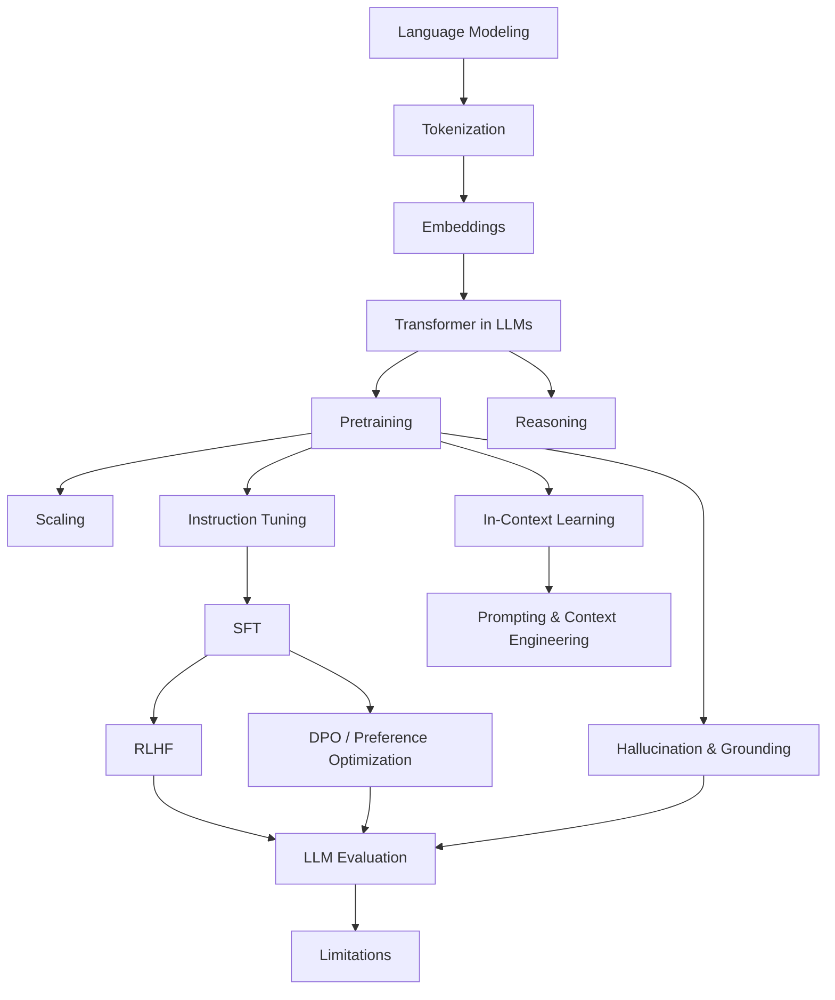

# Large Language Models Knowledge Layer

Folder này xây Large Language Models từ dependency đã có ở NLP, Deep Learning và Transformer. Mục tiêu không phải học cách gọi API, mà hiểu **LLM được tạo ra như thế nào, behavior sau post-training đến từ đâu, vì sao prompting/RAG/Agent hoạt động và giới hạn nào vẫn tồn tại**.

## Dependency Map



## Chapters

```text
00_from_language_models_to_llms.md
01_llm_tokenization.md
02_embeddings_and_semantic_space.md
03_transformer_inside_llms.md
04_pretraining.md
05_scaling_laws.md
06_instruction_tuning.md
07_supervised_fine_tuning.md
08_rlhf.md
09_preference_optimization_and_dpo.md
10_in_context_learning.md
11_prompting_and_context_engineering.md
12_reasoning_in_llms.md
13_hallucination_and_grounding.md
14_llm_evaluation.md
15_llm_limitations.md
```

## Reading Logic

Bốn chapter đầu giải thích input representation và computation core. `04–09` giải thích model lifecycle từ base model tới assistant-aligned model. `10–12` chuyển sang inference-time adaptation và reasoning. `13–15` tập trung reliability: hallucination, evaluation và structural limitations.

## Mental Model

```text
Raw text
→ tokenizer
→ token embeddings
→ Transformer computation
→ pretrained next-token model
→ instruction/SFT/preference post-training
→ runtime context
→ probabilistic generation
```

LLM application thực tế còn thêm retrieval, tools, memory, validation và monitoring. Vì vậy folder này kết thúc ngay trước `09_retrieval_and_rag/` và `10_agents_and_ai_systems/`.

## Core Distinctions

Một số distinction phải giữ xuyên suốt library:

```text
pretraining knowledge       ≠ current external truth
SFT                         ≠ preference optimization
RLHF                        ≠ factual verification
in-context learning         ≠ weight update
prompting                    ≠ security boundary
long context                 ≠ perfect memory
reasoning-like text          ≠ guaranteed faithful reasoning
low temperature              ≠ factuality
LLM                          ≠ complete AI system
```

## Next

Tiếp theo: [Retrieval & RAG](../09_retrieval_and_rag/README.md), nơi parameterized model được kết nối với external evidence và searchable knowledge.