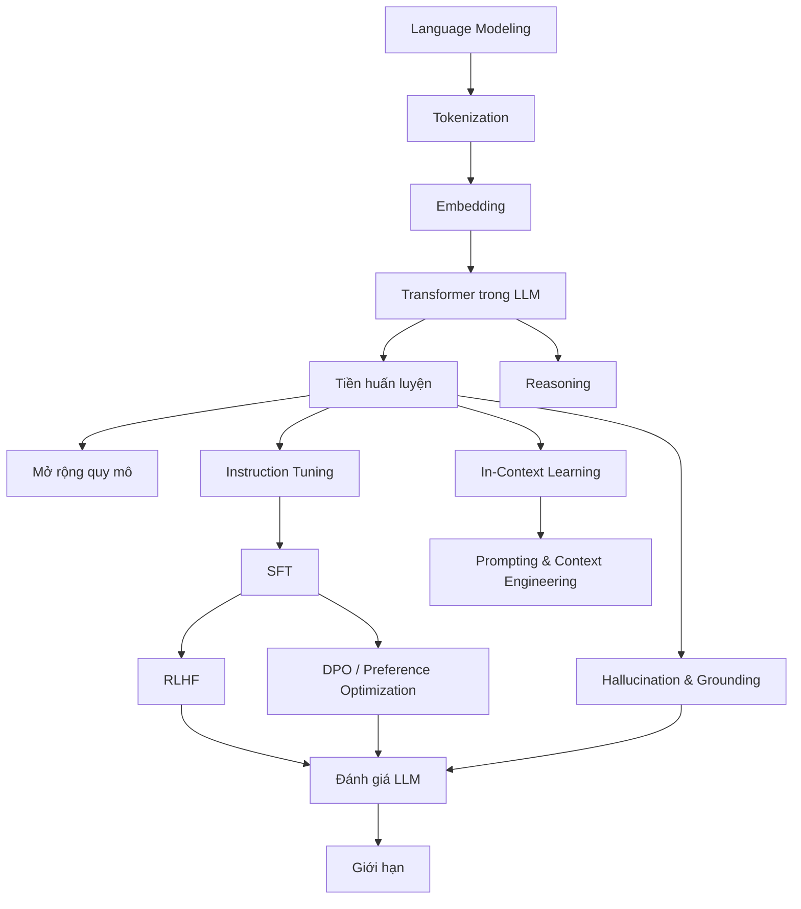

# Lớp kiến thức về mô hình ngôn ngữ lớn

Folder này xây dựng **mô hình ngôn ngữ lớn (Large Language Model — LLM)** từ các dependency đã có ở NLP, Deep Learning và Transformer. Mục tiêu không phải học cách gọi API, mà là hiểu **LLM được tạo ra như thế nào, hành vi sau hậu huấn luyện đến từ đâu, vì sao prompting/context engineering hoạt động, giới hạn của mô hình nằm ở đâu và khi nào phải nối LLM với hệ thống bên ngoài**.

## Kiến thức cần có trước

Tuyến trực tiếp:

```text
Neural Networks
→ Deep Learning Architectures
→ Attention
→ Transformer
→ NLP / Language Modeling
→ LLM
```

Nên đọc:

- [Attention](../06_deep_learning_architectures/04_attention.md)
- [Transformer](../06_deep_learning_architectures/05_transformer.md)
- [Language Models](../07_natural_language_processing/02_language_models.md)
- [Contextual Embeddings](../07_natural_language_processing/04_contextual_embeddings.md)

## Bản đồ phụ thuộc trong layer LLM



## Các chapter

```text
00_from_language_models_to_llms.md
01_llm_tokenization.md
02_embeddings_and_semantic_space.md
03_transformer_inside_llms.md
04_pretraining.md
05_scaling_laws.md
06_instruction_tuning.md
07_supervised_fine_tuning.md
08_rlhf.md
09_preference_optimization_and_dpo.md
10_in_context_learning.md
11_prompting_and_context_engineering.md
12_reasoning_in_llms.md
13_hallucination_and_grounding.md
14_llm_evaluation.md
15_llm_limitations.md
```

## Cơ chế cốt lõi

Một LLM decoder-only có thể được nhìn theo pipeline:

```text
văn bản
→ tokenizer
→ token embedding + position
→ nhiều Transformer block
→ logits
→ sampling / decoding
→ token tiếp theo
```

Khi huấn luyện, toàn bộ chuỗi có thể được xử lý song song dưới causal mask. Khi sinh, token mới phụ thuộc token trước, nên inference trở thành workload tuần tự có KV cache, prefill và decode.

## Trực giác toán học

LLM học phân phối có điều kiện:

\[
P(x_{1:T})=\prod_{t=1}^{T}P(x_t\mid x_{<t})
\]

Tiền huấn luyện tối thiểu hóa negative log-likelihood/cross-entropy trên token tiếp theo. Hậu huấn luyện sau đó điều chỉnh behavior để phù hợp instruction, preference hoặc policy tốt hơn.

Điểm quan trọng: **xác suất token không phải xác suất một mệnh đề là sự thật**. Vì vậy factuality cần evidence, retrieval, verifier hoặc tool bên ngoài khi task yêu cầu.

## Logic đọc

Bốn chapter đầu giải thích biểu diễn đầu vào và lõi tính toán. `04–09` giải thích vòng đời từ base model tới trợ lý đã hậu huấn luyện. `10–12` chuyển sang behavior trong lúc inference. `13–15` tập trung hallucination, evaluation và giới hạn.

## Implementation Model

Một ứng dụng LLM thực tế thường có thêm:

```text
API / request handling
prompt/context builder
retrieval
model serving
structured output parser
tool runtime
state / memory
verification
logging / evaluation
```

Do đó LLM là **core model**, không phải toàn bộ AI application.

## Trade-off chính

```text
model lớn hơn        → thường mạnh hơn nhưng tăng cost/latency
context dài hơn      → chứa nhiều dữ liệu hơn nhưng tăng cost/nhiễu
sampling đa dạng hơn → tăng diversity nhưng tăng variance
post-training mạnh   → cải thiện behavior nhưng có thể tăng over-refusal
RAG                  → tăng access tới external knowledge nhưng thêm failure stage
```

Không có cấu hình tốt nhất cho mọi use case.

## Failure mode quan trọng

```text
hallucination
instruction miss
prompt/context conflict
long-context degradation
retrieval/tool misuse
calibration kém
format/schema failure
unsafe behavior
cost/latency vượt budget
```

Đánh giá production phải đo cả phân phối failure chứ không chỉ capability benchmark.

## Các phân biệt cốt lõi

```text
tri thức từ pretraining       ≠ sự thật bên ngoài hiện tại
SFT                           ≠ preference optimization
RLHF                          ≠ factual verification
in-context learning           ≠ cập nhật trọng số
prompting                     ≠ ranh giới bảo mật
long context                  ≠ bộ nhớ hoàn hảo
văn bản giống reasoning       ≠ reasoning trung thực được bảo đảm
temperature thấp              ≠ factuality
LLM                           ≠ một hệ thống AI hoàn chỉnh
```

## Dependency tiếp theo

Sau LLM, không nhảy thẳng tới Agent. Tuyến tiếp theo là:

```text
LLM
→ Retrieval
→ Vector Search
→ RAG
→ Tool Calling
→ Agents
```

Cụ thể:

1. [Information Retrieval Foundations](../09_retrieval_and_rag/00_information_retrieval_foundations.md)
2. [Sparse & Dense Retrieval](../09_retrieval_and_rag/01_sparse_and_dense_retrieval.md)
3. [Vector Search](../09_retrieval_and_rag/03_vector_search.md)
4. [RAG Fundamentals](../09_retrieval_and_rag/05_rag_fundamentals.md)
5. [Tool Calling](../10_agents_and_ai_systems/01_tools_and_function_calling.md)
6. [Agents and AI Systems](../10_agents_and_ai_systems/README.md)

Đây là tuyến nối từ **mô hình dự đoán token** sang **hệ thống có evidence và khả năng hành động**.