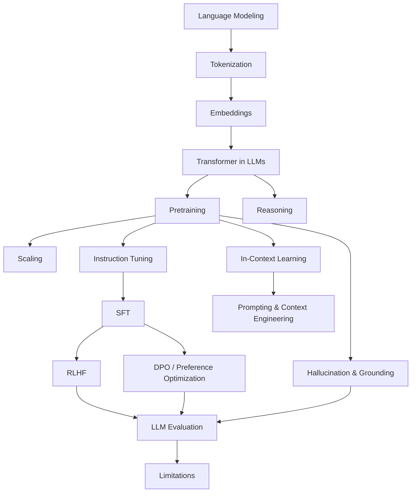

# Large ngôn ngữ (language / 언어) các mô hình (models / 모델들) kiến thức (knowledge / 지식) tầng (layer / 계층)

> **Mạch đọc:** Đọc **Large ngôn ngữ (language / 언어) các mô hình (models / 모델들) kiến thức (knowledge / 지식) tầng (layer / 계층)** như một mắt xích của lộ trình học (learning path / 학습 경로) hiện tại, không như một ghi chú tách rời. Nội dung đi từ **phụ thuộc (dependency / 의존성) Map** sang **Chapters**; điểm nối này chuẩn bị câu hỏi cho các mục sau thay vì dừng ở định nghĩa đầu tiên.


Folder này xây Large ngôn ngữ (language / 언어) các mô hình (models / 모델들) từ phụ thuộc (dependency / 의존성) đã có ở NLP, Deep học tập (learning / 학습) và Transformer. Mục tiêu không phải học cách gọi API, mà hiểu **LLM được tạo ra như thế nào, hành vi (behavior / 동작) sau post-training đến từ đâu, vì sao prompting/RAG/tác nhân (agent / 에이전트) hoạt động và giới hạn nào vẫn tồn tại**.

## Phụ thuộc (dependency / 의존성) Map

Sơ đồ hoặc danh sách này mô tả thứ tự phụ thuộc của các khái niệm. Hãy đọc theo mũi tên để biết phần nào là prerequisite, phần nào là ứng dụng và khi nào cần quay lại nền tảng.


```mermaid
flowchart TD
    LM[Language Modeling] --> TOK[Tokenization]
    TOK --> EMB[Embeddings]
    EMB --> TR[Transformer in LLMs]
    TR --> PRE[Pretraining]
    PRE --> SCALE[Scaling]
    PRE --> IT[Instruction Tuning]
    IT --> SFT[SFT]
    SFT --> RLHF[RLHF]
    SFT --> DPO[DPO / Preference Optimization]
    PRE --> ICL[In-Context Learning]
    ICL --> CTX[Prompting & Context Engineering]
    TR --> REASON[Reasoning]
    PRE --> HALL[Hallucination & Grounding]
    RLHF --> EVAL[LLM Evaluation]
    DPO --> EVAL
    HALL --> EVAL
    EVAL --> LIM[Limitations]
```


> **Chuyển mạch:** Từ **phụ thuộc (dependency / 의존성) Map**, ta sang **Chapters** để mở rộng cùng câu hỏi và dùng kết quả đó để khép lại mạch giải thích.

## Chapters

Sơ đồ hoặc danh sách này mô tả thứ tự phụ thuộc của các khái niệm. Hãy đọc theo mũi tên để biết phần nào là prerequisite, phần nào là ứng dụng và khi nào cần quay lại nền tảng.

```text
00_from_language_models_to_llms.md
01_llm_tokenization.md
02_embeddings_and_semantic_space.md
03_transformer_inside_llms.md
04_pretraining.md
05_scaling_laws.md
06_instruction_tuning.md
07_supervised_fine_tuning.md
08_rlhf.md
09_preference_optimization_and_dpo.md
10_in_context_learning.md
11_prompting_and_context_engineering.md
12_reasoning_in_llms.md
13_hallucination_and_grounding.md
14_llm_evaluation.md
15_llm_limitations.md
```


> **Chuyển mạch:** Từ **Chapters**, ta sang **Reading lô-gic (logic / 논리)** để mở rộng cùng câu hỏi và dùng kết quả đó để khép lại mạch giải thích.

## Reading lô-gic (logic / 논리)

Bốn chapter đầu giải thích đầu vào (input / 입력) biểu diễn (representation / 표현) và computation cốt lõi (core / 핵심). `04–09` giải thích mô hình (model / 모델) vòng đời (lifecycle / 생명주기) từ cơ sở (base / 기반) mô hình (model / 모델) tới assistant-aligned mô hình (model / 모델). `10–12` chuyển sang inference-time adaptation và lập luận (reasoning / 추론). `13–15` tập trung độ tin cậy (reliability / 신뢰성): hallucination, evaluation và structural limitations.


> **Chuyển mạch:** Từ **Reading lô-gic (logic / 논리)**, ta sang **mô hình tư duy (mental model / 사고 모델)** để mở rộng cùng câu hỏi và dùng kết quả đó để khép lại mạch giải thích.

## Mô hình tư duy (mental model / 사고 모델)

Phần này chốt mental model thành một chuỗi có thể dùng lại: bối cảnh → cơ chế → quan sát → giới hạn → quyết định. Hãy đọc sơ đồ như công cụ suy luận, không như một khẩu hiệu tách khỏi chapter.

```text
Raw text
→ tokenizer
→ token embeddings
→ Transformer computation
→ pretrained next-token model
→ instruction/SFT/preference post-training
→ runtime context
→ probabilistic generation
```

LLM ứng dụng (application / 애플리케이션) thực tế còn thêm retrieval, tools, bộ nhớ (memory / 메모리), kiểm tra hợp lệ (validation / 검증) và monitoring. Vì vậy folder này kết thúc ngay trước `09_retrieval_and_rag/` và `10_agents_and_ai_systems/`.


> **Chuyển mạch:** Từ **mô hình tư duy (mental model / 사고 모델)**, ta sang **cốt lõi (core / 핵심) Distinctions** để mở rộng cùng câu hỏi và dùng kết quả đó để khép lại mạch giải thích.

## Cốt lõi (core / 핵심) Distinctions

Một số distinction phải giữ xuyên suốt thư viện (library / 라이브러리):

```text
pretraining knowledge       ≠ current external truth
SFT                         ≠ preference optimization
RLHF                        ≠ factual verification
in-context learning         ≠ weight update
prompting                    ≠ security boundary
long context                 ≠ perfect memory
reasoning-like text          ≠ guaranteed faithful reasoning
low temperature              ≠ factuality
LLM                          ≠ complete AI system
```


> **Chuyển mạch:** Từ **cốt lõi (core / 핵심) Distinctions**, ta sang **Next** để mở rộng cùng câu hỏi và dùng kết quả đó để khép lại mạch giải thích.

## Next

Tiếp theo: [Retrieval & RAG](../09_retrieval_and_rag/README.md), nơi parameterized model được kết nối với external evidence và searchable knowledge.
