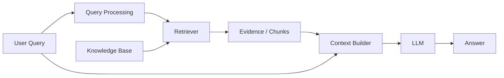

# Retrieval-Augmented Generation (RAG) Fundamentals

**Retrieval-Augmented Generation (RAG / 검색 증강 생성)** là architecture trong đó model không chỉ dựa vào parameters mà còn nhận **external evidence được retrieve tại inference time**. Mục tiêu cốt lõi là làm cho generation được grounded vào knowledge có thể cập nhật, kiểm soát và truy vết.

## Core Architecture



Một production system thường thêm reranking, metadata filters, citation handling, validation và observability.

## Vì sao RAG tồn tại?

LLM weights có limitations:

```text
knowledge cutoff
không có source provenance native
khó update một fact riêng lẻ
private enterprise data không nằm trong pretraining
```

RAG externalize knowledge. Thay vì retrain model mỗi khi document thay đổi, update knowledge base/index.

## RAG không làm model “học” documents

Retrieved documents chỉ tồn tại trong current context. Weights không tự update.

```text
RAG → temporary evidence conditioning
Fine-tuning → persistent parameter update
```

Đây là distinction quan trọng khi design knowledge lifecycle.

## Ingestion Path vs Query Path

RAG có hai pipelines khác nhau.

### Ingestion

```text
source documents
→ parse
→ clean
→ segment/chunk
→ enrich metadata
→ embed/index
```

### Query

```text
user query
→ rewrite/filter
→ retrieve
→ rerank
→ select context
→ generate
→ cite/verify
```

Nếu ingestion sai, query-time model khó sửa.

## Retrieval-Generation Interface

Context builder phải trình bày evidence cho LLM theo format rõ:

```text
Source 1 [policy_v5, section 3]
...

Source 2 [faq_2026]
...
```

Metadata nên preserve source identity. Nếu chỉ concatenate text, citation/provenance sau đó rất khó.

## Context Is a Budget

Suppose model context window is 32k tokens. System phải allocate cho:

```text
system prompt
conversation history
user query
retrieved evidence
few-shot examples
output reserve
```

Retrieve top-50 chunks rồi nhét tất cả thường làm noise tăng. Reranking/context selection quan trọng.

## Retrieval Failure Modes

### Miss

Correct evidence không được retrieve.

### Distractor

Wrong but similar chunk được retrieve.

### Partial evidence

Chunk chứa một nửa answer nhưng thiếu condition/exception.

### Stale evidence

Old version rank cao hơn current version.

### Unauthorized evidence

Security filter fail — đây là critical incident, không chỉ quality issue.

## Generation Failure Modes

Even with perfect evidence, LLM có thể:

- ignore source;
- combine chunks sai;
- invent unsupported details;
- cite wrong source;
- fail conflicting evidence resolution.

Vì vậy retrieval quality và generation groundedness cần separate evals.

## Query Rewriting

User query thường conversational:

```text
"còn trường hợp đó thì sao?"
```

Retriever cần standalone query dựa conversation context. LLM có thể rewrite:

```text
"What is the refund policy for annual subscription cancellation after 7 days?"
```

Rewrite improves retrieval nhưng có risk alter intent. Logging both original and rewritten query is useful.

## Multi-Query Retrieval

Complex question có multiple aspects. Generate several search queries rồi merge results tăng recall.

```text
question
→ subquery A
→ subquery B
→ subquery C
→ retrieve + merge
```

Cost tăng và query expansion có thể drift.

## Metadata-Aware Retrieval

Structured filters nên derive từ user/application state:

```text
product = user's product
country = KR
version = active
permission_scope = authorized
```

LLM can propose filter values, but application should validate them against allowed schema.

## Citation Pattern

Safer pattern uses source IDs provided by retriever:

```text
[DOC-17:S3]
```

LLM cites IDs; renderer resolves URL/title. Do not let model invent arbitrary URLs.

## “Answer from Sources Only”

Prompting model to only use evidence reduces unsupported claims but is not hard guarantee. Add answerability check:

```text
Do retrieved sources contain sufficient evidence?
```

If no, abstain or broaden retrieval.

## RAG vs Long Context

If corpus small enough, putting all docs into long context may remove retrieval miss risk but increases cost/noise and still has attention limitations.

RAG scales better and provides explicit source selection.

Long-context and RAG can complement each other: retrieve documents, then provide larger full sections.

## RAG vs Fine-Tuning

Use RAG for:

```text
changing knowledge
private documents
citation/provenance
large factual corpora
```

Use fine-tuning for:

```text
persistent behavior
format/style
task specialization
```

Often combine both.

## RAG vs Search UI

RAG synthesizes answer. Traditional search returns documents. Generation is useful but creates synthesis risk.

For legal/audit contexts, UI may show answer + source excerpts + direct links so user can verify.

## Minimal RAG Pseudocode

```python
query = rewrite(user_query, history)
candidates = retrieve(query, filters=user_scope)
ranked = rerank(query, candidates)
context = select_context(ranked, token_budget=8000)
answer = llm.generate(user_query, context)
return validate_and_attach_sources(answer, ranked)
```

Each function is a separate engineering problem.

## Mental Model

> RAG là **evidence pipeline trước generation**. LLM chỉ đáng tin đến mức evidence đúng được retrieve, selected, represented và used faithfully.

## Common Misconceptions

### “RAG chỉ cần vector DB”

Không. Ingestion, chunking, retrieval, reranking, context building, versioning và evaluation đều quan trọng.

### “RAG cập nhật kiến thức của model”

Không update weights; nó inject evidence vào context.

### “Nếu retrieval đúng thì answer chắc chắn đúng”

Generator vẫn có failure modes.

## Knowledge Connection

RAG nối IR, embeddings, database systems, context engineering và LLM grounding.

Xem tiếp: [Chunking and Document Processing](./06_chunking_and_document_processing.md).