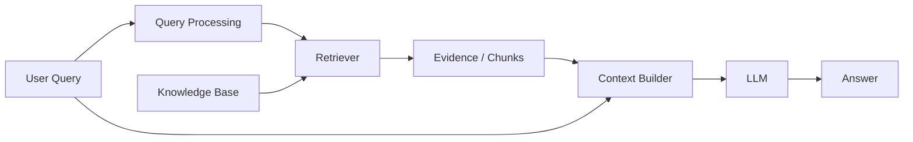

# Nền tảng Retrieval-Augmented Generation (RAG)

**Retrieval-Augmented Generation (RAG / 검색 증강 생성)** là kiến trúc trong đó mô hình không chỉ dựa vào tham số mà còn nhận **bằng chứng bên ngoài được truy xuất trong lúc suy luận**. Mục tiêu cốt lõi là làm quá trình sinh được grounding vào nguồn tri thức có thể cập nhật, kiểm soát và truy vết.

## Kiến trúc cốt lõi



Một hệ thống production thường bổ sung reranking, metadata filter, xử lý citation, validation và observability.

## Vì sao cần RAG?

Tri thức trong trọng số LLM có những giới hạn:

```text
có mốc dữ liệu huấn luyện
không có provenance nguồn tự nhiên
khó cập nhật riêng một fact
private enterprise data không nằm sẵn trong pretraining
```

RAG đưa tri thức ra ngoài mô hình. Thay vì retrain mỗi khi tài liệu đổi, hệ thống cập nhật knowledge base hoặc index.

## RAG không làm mô hình “học” tài liệu

Tài liệu retrieval chỉ tồn tại trong context hiện tại. Trọng số không tự cập nhật.

```text
RAG → điều kiện hóa tạm thời bằng evidence
Fine-tuning → cập nhật tham số bền vững
```

Sự phân biệt này rất quan trọng khi thiết kế vòng đời tri thức.

## Pipeline ingestion và pipeline query

RAG có hai đường xử lý khác nhau.

### Ingestion

```text
tài liệu nguồn
→ parse
→ làm sạch
→ segment / chunk
→ bổ sung metadata
→ embed / index
```

### Query

```text
query người dùng
→ rewrite / filter
→ retrieve
→ rerank
→ chọn context
→ generate
→ cite / verify
```

Nếu ingestion sai, mô hình ở query time thường không thể tự sửa triệt để.

## Giao diện giữa retrieval và generation

Context builder nên trình bày evidence cho LLM với format rõ ràng:

```text
Source 1 [policy_v5, section 3]
...

Source 2 [faq_2026]
...
```

Metadata cần giữ được danh tính nguồn. Nếu chỉ nối text thô, việc tạo citation và truy provenance về sau sẽ khó hơn nhiều.

## Context là một ngân sách hữu hạn

Giả sử context window là 32k token. Hệ thống phải phân bổ cho:

```text
system prompt
lịch sử hội thoại
query người dùng
evidence retrieval
few-shot examples
phần token dành cho output
```

Retrieve top-50 chunk rồi đưa tất cả vào prompt thường làm tăng nhiễu. Reranking và chọn context vì vậy rất quan trọng.

## Failure mode của retrieval

### Bỏ sót

Bằng chứng đúng không được retrieve.

### Nhiễu tương tự

Chunk sai nhưng rất giống về ngữ nghĩa được retrieve.

### Bằng chứng không đầy đủ

Chunk chứa một phần đáp án nhưng thiếu điều kiện hoặc ngoại lệ.

### Bằng chứng lỗi thời

Version cũ được xếp hạng cao hơn version hiện hành.

### Bằng chứng không được phép truy cập

Security filter thất bại. Đây là sự cố bảo mật nghiêm trọng chứ không chỉ là lỗi chất lượng.

## Failure mode của generation

Ngay cả khi evidence hoàn hảo, LLM vẫn có thể:

- bỏ qua nguồn;
- kết hợp các chunk sai;
- thêm chi tiết không được hỗ trợ;
- trích dẫn sai source;
- xử lý nguồn mâu thuẫn không đúng.

Vì vậy retrieval quality và groundedness của generation phải được đánh giá riêng.

## Viết lại query

Query hội thoại có thể rất phụ thuộc ngữ cảnh:

```text
"còn trường hợp đó thì sao?"
```

Retriever cần một query độc lập dựa trên conversation context. LLM có thể rewrite thành:

```text
"What is the refund policy for annual subscription cancellation after 7 days?"
```

Viết lại giúp retrieval nhưng có nguy cơ làm lệch ý định. Nên log cả query gốc và query đã rewrite.

## Multi-Query Retrieval

Câu hỏi phức tạp có thể chứa nhiều khía cạnh. Hệ thống có thể sinh nhiều subquery rồi hợp nhất kết quả để tăng recall:

```text
câu hỏi
→ subquery A
→ subquery B
→ subquery C
→ retrieve + merge
```

Đổi lại chi phí tăng và query expansion có thể gây query drift.

## Retrieval có metadata

Filter có cấu trúc nên được suy ra từ trạng thái user/application:

```text
product = sản phẩm của user
country = KR
version = active
permission_scope = authorized
```

LLM có thể đề xuất giá trị filter nhưng ứng dụng phải validate theo schema và quyền được phép.

## Mẫu citation an toàn hơn

Retriever nên cung cấp source ID có cấu trúc:

```text
[DOC-17:S3]
```

LLM trích dẫn ID đó, còn renderer ánh xạ sang URL và metadata đáng tin. Không nên để mô hình tự bịa URL.

## “Chỉ trả lời từ nguồn”

Prompt yêu cầu chỉ dùng evidence có thể giảm claim không được hỗ trợ nhưng không phải bảo đảm cứng. Hệ thống nên thêm bước kiểm tra khả năng trả lời:

```text
Nguồn retrieval có đủ bằng chứng để trả lời không?
```

Nếu không, nên abstain hoặc mở rộng retrieval.

## RAG và context dài

Nếu corpus đủ nhỏ, đưa toàn bộ tài liệu vào context dài có thể giảm rủi ro retrieval miss nhưng tăng chi phí, nhiễu và vẫn chịu giới hạn attention.

RAG scale tốt hơn vì chọn nguồn rõ ràng. Hai cách cũng có thể kết hợp: retrieve document phù hợp rồi đưa nguyên section dài vào context.

## RAG và Fine-Tuning

Nên dùng RAG cho:

```text
tri thức thay đổi
private documents
citation / provenance
corpus factual lớn
```

Nên dùng fine-tuning cho:

```text
hành vi bền vững
format / style
chuyên biệt hóa tác vụ
```

Trong thực tế thường kết hợp cả hai.

## RAG và giao diện Search

RAG tổng hợp câu trả lời; search truyền thống trả tài liệu. Generation tiện lợi nhưng thêm rủi ro tổng hợp sai.

Trong domain pháp lý hoặc audit, giao diện nên hiển thị answer + source excerpt + direct link để người dùng kiểm chứng.

## Pseudocode RAG tối thiểu

```python
query = rewrite(user_query, history)
candidates = retrieve(query, filters=user_scope)
ranked = rerank(query, candidates)
context = select_context(ranked, token_budget=8000)
answer = llm.generate(user_query, context)
return validate_and_attach_sources(answer, ranked)
```

Mỗi hàm ở đây là một bài toán engineering riêng.

## Mô hình tư duy

> RAG là **pipeline đưa bằng chứng vào trước generation**. Độ tin cậy của LLM bị giới hạn bởi việc evidence đúng có được retrieve, chọn, biểu diễn và sử dụng trung thực hay không.

## Những hiểu lầm thường gặp

### “RAG chỉ cần vector DB”

Không. Ingestion, chunking, retrieval, reranking, context building, versioning và evaluation đều quan trọng.

### “RAG cập nhật kiến thức trong trọng số mô hình”

Không. Nó đưa evidence vào context mà không tự cập nhật weights.

### “Retrieval đúng thì câu trả lời chắc chắn đúng”

Không. Generator vẫn có failure mode riêng.

## Liên kết kiến thức

RAG nối IR, embedding, database systems, context engineering và LLM grounding.

Xem tiếp: [Chunking and Document Processing](./06_chunking_and_document_processing.md).