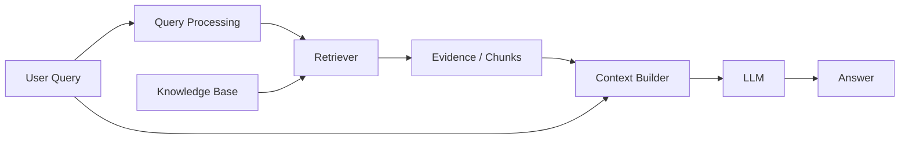

# Retrieval-Augmented Generation (RAG) Fundamentals

> **Mạch đọc:** Đặt **Retrieval-Augmented Generation (RAG) Fundamentals** trong bản đồ [README](./README.md) để thấy đơn vị sở hữu (owner / 오너) và vị trí của nó. Nội dung đi từ **cốt lõi (core / 핵심) kiến trúc (architecture / 아키텍처)** sang **Vì sao RAG tồn tại?**; điểm nối này chuẩn bị câu hỏi cho các mục sau thay vì dừng ở định nghĩa đầu tiên.


**Retrieval-Augmented Generation (RAG / 검색 증강 생성)** là kiến trúc (architecture / 아키텍처) trong đó mô hình (model / 모델) không chỉ dựa vào parameters mà còn nhận **bên ngoài (external / 외부) bằng chứng (evidence / 증거) được retrieve tại suy luận (inference / 추론) thời gian (time / 시간)**. Mục tiêu cốt lõi là làm cho generation được grounded vào kiến thức (knowledge / 지식) có thể cập nhật, kiểm soát và truy vết.

## Cốt lõi (core / 핵심) kiến trúc (architecture / 아키텍처)

Phần này chuyển khái niệm Computer Science thành cấu trúc, ví dụ hoặc quy trình có thể kiểm tra. Hãy xác định câu hỏi mà mục trả lời rồi nối kết luận với phần kế tiếp.


```mermaid
flowchart LR
    U[User Query] --> Q[Query Processing]
    Q --> R[Retriever]
    KB[Knowledge Base] --> R
    R --> E[Evidence / Chunks]
    E --> C[Context Builder]
    U --> C
    C --> L[LLM]
    L --> A[Answer]
```

Một môi trường vận hành (production / 운영 환경) hệ thống (system / 시스템) thường thêm reranking, siêu dữ liệu (metadata / 메타데이터) filters, citation handling, kiểm tra hợp lệ (validation / 검증) và khả năng quan sát (observability / 관측 가능성).

## Vì sao RAG tồn tại?

LLM weights có limitations:

```text
knowledge cutoff
không có source provenance native
khó update một fact riêng lẻ
private enterprise data không nằm trong pretraining
```

RAG externalize kiến thức (knowledge / 지식). Thay vì retrain mô hình (model / 모델) mỗi khi document thay đổi, cập nhật (update / 업데이트) kiến thức (knowledge / 지식) cơ sở (base / 기반)/chỉ mục (index / 인덱스).

## RAG không làm mô hình (model / 모델) “học” documents

Retrieved documents chỉ tồn tại trong hiện tại (current / 현재) ngữ cảnh (context / 맥락). Weights không tự cập nhật (update / 업데이트).

```text
RAG → temporary evidence conditioning
Fine-tuning → persistent parameter update
```

Đây là distinction quan trọng khi thiết kế (design / 설계) kiến thức (knowledge / 지식) vòng đời (lifecycle / 생명주기).

## Ingestion đường dẫn (path / 경로) vs truy vấn (query / 쿼리) đường dẫn (path / 경로)

RAG có hai pipelines khác nhau.

### Ingestion

Phần này chuyển khái niệm Computer Science thành cấu trúc, ví dụ hoặc quy trình có thể kiểm tra. Hãy xác định câu hỏi mà mục trả lời rồi nối kết luận với phần kế tiếp.

```text
source documents
→ parse
→ clean
→ segment/chunk
→ enrich metadata
→ embed/index
```

### Truy vấn (query / 쿼리)

Phần này chuyển khái niệm Computer Science thành cấu trúc, ví dụ hoặc quy trình có thể kiểm tra. Hãy xác định câu hỏi mà mục trả lời rồi nối kết luận với phần kế tiếp.

```text
user query
→ rewrite/filter
→ retrieve
→ rerank
→ select context
→ generate
→ cite/verify
```

Nếu ingestion sai, query-time mô hình (model / 모델) khó sửa.

## Retrieval-Generation giao diện (interface / 인터페이스)

Ngữ cảnh (context / 맥락) builder phải trình bày bằng chứng (evidence / 증거) cho LLM theo format rõ:

```text
Source 1 [policy_v5, section 3]
...

Source 2 [faq_2026]
...
```

Siêu dữ liệu (metadata / 메타데이터) nên preserve nguồn (source / 소스) định danh (identity / 식별자). Nếu chỉ concatenate văn bản (text / 텍스트), citation/provenance sau đó rất khó.

## Ngữ cảnh (context / 맥락) Is a ngân sách (budget / 예산)

Suppose mô hình (model / 모델) ngữ cảnh (context / 맥락) cửa sổ (window / 윈도우) is 32k tokens. hệ thống (system / 시스템) phải allocate cho:

```text
system prompt
conversation history
user query
retrieved evidence
few-shot examples
output reserve
```

Retrieve top-50 chunks rồi nhét tất cả thường làm noise tăng. Reranking/ngữ cảnh (context / 맥락) selection quan trọng.

## Retrieval thất bại (failure / 실패) Modes

### Miss

Correct bằng chứng (evidence / 증거) không được retrieve.

### Distractor

Wrong but similar chunk được retrieve.

### Partial bằng chứng (evidence / 증거)

Chunk chứa một nửa answer nhưng thiếu điều kiện (condition / 조건)/exception.

### Stale bằng chứng (evidence / 증거)

Old phiên bản (version / 버전) rank cao hơn hiện tại (current / 현재) phiên bản (version / 버전).

### Unauthorized bằng chứng (evidence / 증거)

Bảo mật (security / 보안) filter thất bại (fail / 실패) — đây là trọng yếu (critical / 중요) sự cố (incident / 인시던트), không chỉ chất lượng (quality / 품질) issue.

## Generation thất bại (failure / 실패) Modes

Even with perfect bằng chứng (evidence / 증거), LLM có thể:

- ignore nguồn (source / 소스);
- combine chunks sai;
- invent unsupported details;
- cite wrong nguồn (source / 소스);
- thất bại (fail / 실패) conflicting bằng chứng (evidence / 증거) resolution.

Vì vậy retrieval chất lượng (quality / 품질) và generation groundedness cần separate evals.

## Truy vấn (query / 쿼리) Rewriting

Người dùng (user / 사용자) truy vấn (query / 쿼리) thường conversational:

```text
"còn trường hợp đó thì sao?"
```

Retriever cần standalone truy vấn (query / 쿼리) dựa conversation ngữ cảnh (context / 맥락). LLM có thể rewrite:

```text
"What is the refund policy for annual subscription cancellation after 7 days?"
```

Rewrite improves retrieval nhưng có rủi ro (risk / 위험) alter intent. Logging both original and rewritten truy vấn (query / 쿼리) is useful.

## Multi-Query Retrieval

Complex question có multiple aspects. Generate several tìm kiếm (search / 검색) queries rồi merge results tăng recall.

```text
question
→ subquery A
→ subquery B
→ subquery C
→ retrieve + merge
```

Chi phí (cost / 비용) tăng và truy vấn (query / 쿼리) expansion có thể drift.

## Metadata-Aware Retrieval

Structured filters nên derive từ người dùng (user / 사용자)/ứng dụng (application / 애플리케이션) trạng thái (state / 상태):

```text
product = user's product
country = KR
version = active
permission_scope = authorized
```

LLM can propose filter values, but ứng dụng (application / 애플리케이션) should validate them against allowed lược đồ (schema / 스키마).

## Citation mẫu (pattern / 패턴)

Safer mẫu (pattern / 패턴) uses nguồn (source / 소스) IDs provided by retriever:

```text
[DOC-17:S3]
```

LLM cites IDs; renderer resolves URL/title. Do not let mô hình (model / 모델) invent arbitrary URLs.

## “Answer from Sources Only”

Prompting mô hình (model / 모델) to only use bằng chứng (evidence / 증거) reduces unsupported claims but is not hard guarantee. Add answerability check:

```text
Do retrieved sources contain sufficient evidence?
```

If no, abstain or broaden retrieval.

## RAG vs Long ngữ cảnh (context / 맥락)

If corpus small enough, putting all docs into long ngữ cảnh (context / 맥락) may remove retrieval miss rủi ro (risk / 위험) but increases chi phí (cost / 비용)/noise and still has attention limitations.

RAG scales better and provides tường minh (explicit / 명시적) nguồn (source / 소스) selection.

Long-context and RAG can complement each other: retrieve documents, then provide larger full sections.

## RAG vs Fine-Tuning

Use RAG for:

```text
changing knowledge
private documents
citation/provenance
large factual corpora
```

Use fine-tuning for:

```text
persistent behavior
format/style
task specialization
```

Often combine both.

## RAG vs tìm kiếm (search / 검색) UI

RAG synthesizes answer. Traditional tìm kiếm (search / 검색) returns documents. Generation is useful but creates synthesis rủi ro (risk / 위험).

For legal/kiểm tra (audit / 감사) contexts, UI may show answer + nguồn (source / 소스) excerpts + direct links so người dùng (user / 사용자) can verify.

## Minimal RAG Pseudocode

Trước khi đọc đoạn triển khai, hãy giữ invariant và complexity mà thuật toán phải bảo toàn. Code bên dưới là một cách hiện thực hóa; cần đối chiếu output, ownership và edge case với mô hình vừa học.

```python
query = rewrite(user_query, history)
candidates = retrieve(query, filters=user_scope)
ranked = rerank(query, candidates)
context = select_context(ranked, token_budget=8000)
answer = llm.generate(user_query, context)
return validate_and_attach_sources(answer, ranked)
```

Each hàm (function / 함수) is a separate kỹ thuật (engineering / 엔지니어링) bài toán (problem / 문제).

## Mô hình tư duy (mental model / 사고 모델)

> RAG là **bằng chứng (evidence / 증거) chuỗi xử lý (pipeline / 파이프라인) trước generation**. LLM chỉ đáng tin đến mức bằng chứng (evidence / 증거) đúng được retrieve, selected, represented và used faithfully.

## Dùng chung (common / 공통) Misconceptions

### “RAG chỉ cần véc-tơ (vector / 벡터) DB”

Không. Ingestion, chunking, retrieval, reranking, ngữ cảnh (context / 맥락) building, versioning và evaluation đều quan trọng.

### “RAG cập nhật kiến thức của mô hình (model / 모델)”

Không cập nhật (update / 업데이트) weights; nó inject bằng chứng (evidence / 증거) vào ngữ cảnh (context / 맥락).

### “Nếu retrieval đúng thì answer chắc chắn đúng”

Generator vẫn có thất bại (failure / 실패) modes.

## Liên kết kiến thức (knowledge connection / 지식 연결)

RAG nối IR, embeddings, cơ sở dữ liệu (database / 데이터베이스) các hệ thống (systems / 시스템들), ngữ cảnh (context / 맥락) kỹ thuật (engineering / 엔지니어링) và LLM grounding.

Xem tiếp: [Chunking and Document Processing](./06_chunking_and_document_processing.md).
