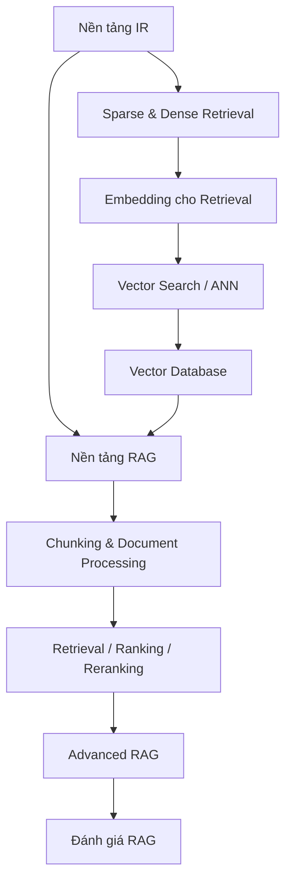

# Lớp kiến thức về Retrieval và RAG

Folder này giải thích **truy xuất thông tin (Information Retrieval — IR)** và **sinh có tăng cường truy xuất (Retrieval-Augmented Generation — RAG)** từ nền tảng tìm kiếm tới kiến trúc production. RAG không được xem như recipe `embed → vector DB → LLM`; nó là một **hệ thống bằng chứng (evidence system)** gồm ingestion, search, ranking, xây context, provenance, evaluation và security.

## Kiến thức cần có trước

Nên nắm:

- [LLM](../08_large_language_models/README.md)
- [Embeddings và semantic space](../08_large_language_models/02_embeddings_and_semantic_space.md)
- [LLM Evaluation](../08_large_language_models/14_llm_evaluation.md)
- [Vector và khoảng cách](../01_mathematical_foundations/01_linear_algebra_for_ai.md)

## Bản đồ phụ thuộc



## Các chapter

```text
00_information_retrieval_foundations.md
01_sparse_and_dense_retrieval.md
02_embeddings_for_retrieval.md
03_vector_search.md
04_vector_databases.md
05_rag_fundamentals.md
06_chunking_and_document_processing.md
07_retrieval_ranking_and_reranking.md
08_advanced_rag.md
09_rag_evaluation.md
```

## Cơ chế cốt lõi

Một pipeline RAG production có thể nhìn như:

```text
Nguồn dữ liệu gốc
   ↓
Parse / làm sạch / tạo cấu trúc
   ↓
Chunk + Metadata + ACL + Version
   ↓
Embedding / Lexical Index
   ↓
Xử lý Query
   ↓
Sparse + Dense Candidate Retrieval
   ↓
Reranking / Filtering / Diversity
   ↓
Chọn Context
   ↓
LLM Generation
   ↓
Citation / Verification / Abstention
   ↓
Evaluation + Monitoring
```

RAG hoạt động tốt khi **evidence đúng được đưa vào context đúng lúc** và LLM sử dụng evidence đó trung thực.

## Retrieval trước, Vector Search sau

Không nên đồng nhất Retrieval với Vector Search.

```text
Retrieval        = bài toán tìm evidence phù hợp
Sparse retrieval = dựa nhiều vào lexical matching
Dense retrieval  = dùng embedding
Vector search    = cơ chế tìm hàng xóm gần trong không gian vector
Vector database  = hệ thống lưu/index/query vector + metadata
RAG              = dùng retrieval để cung cấp evidence cho generation
```

Vector Search là một implementation mechanism quan trọng của dense retrieval, không phải định nghĩa của RAG.

## Trực giác toán học của Vector Search

Với query embedding `q` và document embedding `d`, một số similarity thường dùng:

\[
cos(q,d)=\frac{q\cdot d}{\|q\|\|d\|}
\]

hoặc inner product / Euclidean distance tùy embedding model và index.

Exact nearest-neighbor search có thể đắt khi corpus lớn, nên production thường dùng **tìm kiếm hàng xóm gần xấp xỉ (Approximate Nearest Neighbor — ANN)** như HNSW hoặc IVF để đổi một phần recall lấy latency và memory tốt hơn.

## Implementation Model

RAG không chỉ có online query path. Thường có hai pipeline:

### Offline / ingestion path

```text
source
→ parser
→ normalize
→ chunk
→ metadata / ACL
→ embedding
→ index build/update
```

### Online query path

```text
request
→ auth / tenant scope
→ query processing
→ retrieval
→ reranking
→ context assembly
→ LLM
→ citation / verifier
→ response
```

Tách hai path giúp hiểu rõ freshness, index lag và lỗi versioning.

## Các phân biệt quan trọng

```text
relevance khi retrieval  ≠ factual truth
embedding similarity     ≠ authorization
vector search            ≠ vector database
RAG                      ≠ cập nhật trọng số mô hình
retrieval candidate      ≠ final context
correct answer            ≠ grounded answer
newest source             ≠ authoritative source
long context              ≠ thay thế retrieval
```

## Trade-off chính

```text
chunk nhỏ   → retrieval chi tiết hơn nhưng mất context
chunk lớn   → giữ context tốt hơn nhưng tăng nhiễu/token
k lớn       → tăng recall nhưng tăng context noise
reranker    → tăng ranking quality nhưng tăng latency/cost
ANN mạnh    → giảm latency nhưng có thể mất recall
hybrid      → robust hơn nhưng pipeline phức tạp hơn
```

Không nên tune từng tham số riêng lẻ mà không nhìn end-to-end quality.

## Failure Mode

```text
parser làm mất cấu trúc
chunk boundary cắt evidence
embedding không phù hợp domain/ngôn ngữ
ANN không retrieve đúng neighbor
metadata filter sai
ACL bị bỏ qua
reranker loại evidence đúng
context budget làm rơi evidence
source stale
LLM hallucinate dù evidence đã có
citation không hỗ trợ claim
```

Mỗi failure thuộc một stage khác nhau và cần metric riêng.

## Nguyên tắc Production

Nếu câu trả lời sai, không nên bắt đầu bằng thay prompt. Trước hết hỏi:

```text
source có đúng và current không?
parse / chunk có giữ thông tin không?
retriever có lấy được evidence không?
vector search có làm mất recall không?
reranker có giữ evidence ở top không?
context builder có làm mất evidence không?
LLM có dùng evidence trung thực không?
citation có ánh xạ đúng source không?
ACL có được giữ xuyên pipeline không?
```

## Production Usage Pattern

Một enterprise RAG đáng tin thường thêm:

```text
versioned corpus
ACL-aware retrieval
hybrid search
reranking
context budget policy
citation mapping
abstention khi thiếu evidence
trace theo document/chunk ID
RAG eval suite
freshness monitoring
```

RAG không chỉ là retrieval quality; nó là **evidence lifecycle** từ nguồn tới final claim.

## Dependency tiếp theo

Sau RAG, tuyến production không nhảy trực tiếp vào “agent” như một khái niệm mơ hồ. Bước tiếp theo là:

```text
RAG
→ Tool Calling
→ Agent Loop
→ Agent State / Planning / Memory
→ Agent Evaluation
→ Reliable Agent Design
```

Đọc tiếp:

1. [Tool Calling](../10_agents_and_ai_systems/01_tools_and_function_calling.md)
2. [Agent Loop](../10_agents_and_ai_systems/02_agent_loop.md)
3. [Agent Evaluation](../10_agents_and_ai_systems/09_agent_evaluation.md)
4. [Reliable Agent Design](../10_agents_and_ai_systems/10_reliable_agent_design.md)

Sau đó tuyến tiếp tục qua [Evaluation / Reliability](../18_evaluation_reliability_interpretability/README.md), [AI Engineering](../15_ai_engineering/README.md), [LLMOps](../16_mlops_and_llmops/README.md) và [Security](../19_ai_safety_security_alignment/README.md).