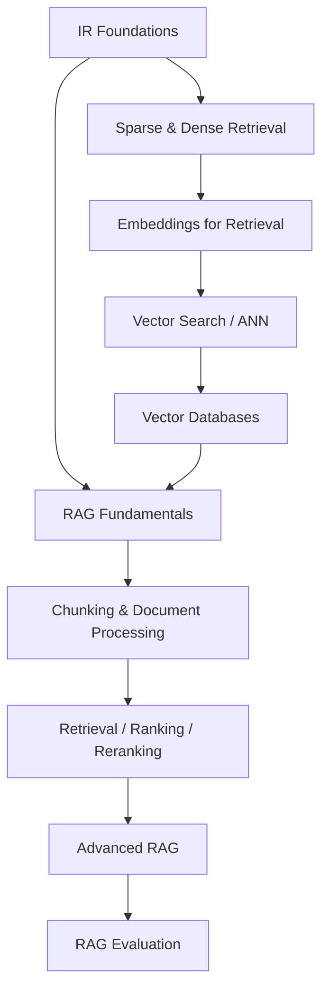

# Retrieval & RAG Knowledge Layer

Folder này giải thích Retrieval-Augmented Generation từ nền Information Retrieval tới production architecture. RAG không được coi như recipe `embed → vector DB → LLM`; nó là một **evidence system** gồm ingestion, search, ranking, context construction, provenance, evaluation và security.

## Dependency Map



## Chapters

```text
00_information_retrieval_foundations.md
01_sparse_and_dense_retrieval.md
02_embeddings_for_retrieval.md
03_vector_search.md
04_vector_databases.md
05_rag_fundamentals.md
06_chunking_and_document_processing.md
07_retrieval_ranking_and_reranking.md
08_advanced_rag.md
09_rag_evaluation.md
```

## Full Mental Model

```text
Source of Truth
   ↓
Parse / Clean / Structure
   ↓
Chunk + Metadata + ACL + Version
   ↓
Embedding / Lexical Index
   ↓
Query Processing
   ↓
Sparse + Dense Candidate Retrieval
   ↓
Reranking / Filtering / Diversity
   ↓
Context Selection
   ↓
LLM Generation
   ↓
Citation / Verification / Abstention
   ↓
Evaluation + Monitoring
```

## Important Distinctions

```text
retrieval relevance    ≠ factual truth
embedding similarity   ≠ authorization
vector search          ≠ vector database
RAG                     ≠ model weight update
retrieval candidate    ≠ final context
correct answer          ≠ grounded answer
newest source           ≠ authoritative source
long context            ≠ retrieval replacement
```

## Production Principle

RAG should be debugged by layer. Nếu answer sai, không bắt đầu bằng thay prompt. Trước hết hỏi:

```text
source có đúng không?
parse/chunk có giữ information không?
retriever có lấy evidence không?
reranker có giữ evidence ở top không?
context builder có drop evidence không?
LLM có use evidence faithfully không?
citation có map đúng source không?
```

## Next

RAG là một capability mà Agent có thể gọi như tool. Tiếp theo: [Agents and AI Systems](../10_agents_and_ai_systems/README.md).