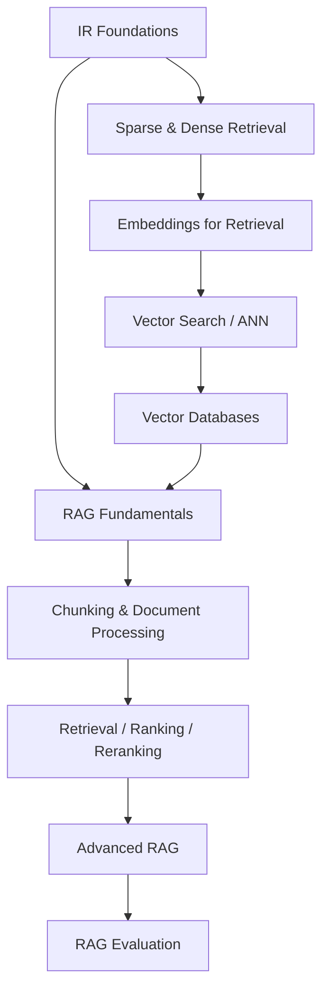

# Retrieval & RAG kiến thức (knowledge / 지식) tầng (layer / 계층)

> **Mạch đọc:** Đọc **Retrieval & RAG kiến thức (knowledge / 지식) tầng (layer / 계층)** như một mắt xích của lộ trình học (learning path / 학습 경로) hiện tại, không như một ghi chú tách rời. Nội dung đi từ **phụ thuộc (dependency / 의존성) Map** sang **Chapters**; điểm nối này chuẩn bị câu hỏi cho các mục sau thay vì dừng ở định nghĩa đầu tiên.


Folder này giải thích Retrieval-Augmented Generation từ nền thông tin (information / 정보) Retrieval tới kiến trúc vận hành (production architecture / 운영 아키텍처). RAG không được coi như recipe `embed → vector DB → LLM`; nó là một **bằng chứng (evidence / 증거) hệ thống (system / 시스템)** gồm ingestion, tìm kiếm (search / 검색), ranking, ngữ cảnh (context / 맥락) construction, provenance, evaluation và bảo mật (security / 보안).

## Phụ thuộc (dependency / 의존성) Map

Sơ đồ hoặc danh sách này mô tả thứ tự phụ thuộc của các khái niệm. Hãy đọc theo mũi tên để biết phần nào là prerequisite, phần nào là ứng dụng và khi nào cần quay lại nền tảng.


```mermaid
flowchart TD
    IR[IR Foundations] --> SD[Sparse & Dense Retrieval]
    SD --> EMB[Embeddings for Retrieval]
    EMB --> VS[Vector Search / ANN]
    VS --> VDB[Vector Databases]
    IR --> RAG[RAG Fundamentals]
    VDB --> RAG
    RAG --> CH[Chunking & Document Processing]
    CH --> RR[Retrieval / Ranking / Reranking]
    RR --> ADV[Advanced RAG]
    ADV --> EVAL[RAG Evaluation]
```


> **Chuyển mạch:** Từ **phụ thuộc (dependency / 의존성) Map**, ta sang **Chapters** để mở rộng cùng câu hỏi và dùng kết quả đó để khép lại mạch giải thích.

## Chapters

Sơ đồ hoặc danh sách này mô tả thứ tự phụ thuộc của các khái niệm. Hãy đọc theo mũi tên để biết phần nào là prerequisite, phần nào là ứng dụng và khi nào cần quay lại nền tảng.

```text
00_information_retrieval_foundations.md
01_sparse_and_dense_retrieval.md
02_embeddings_for_retrieval.md
03_vector_search.md
04_vector_databases.md
05_rag_fundamentals.md
06_chunking_and_document_processing.md
07_retrieval_ranking_and_reranking.md
08_advanced_rag.md
09_rag_evaluation.md
```


> **Chuyển mạch:** Từ **Chapters**, ta sang **Full mô hình tư duy (mental model / 사고 모델)** để mở rộng cùng câu hỏi và dùng kết quả đó để khép lại mạch giải thích.

## Full mô hình tư duy (mental model / 사고 모델)

Phần này chốt mental model thành một chuỗi có thể dùng lại: bối cảnh → cơ chế → quan sát → giới hạn → quyết định. Hãy đọc sơ đồ như công cụ suy luận, không như một khẩu hiệu tách khỏi chapter.

```text
Source of Truth
   ↓
Parse / Clean / Structure
   ↓
Chunk + Metadata + ACL + Version
   ↓
Embedding / Lexical Index
   ↓
Query Processing
   ↓
Sparse + Dense Candidate Retrieval
   ↓
Reranking / Filtering / Diversity
   ↓
Context Selection
   ↓
LLM Generation
   ↓
Citation / Verification / Abstention
   ↓
Evaluation + Monitoring
```


> **Chuyển mạch:** Từ **Full mô hình tư duy (mental model / 사고 모델)**, ta sang **Important Distinctions** để mở rộng cùng câu hỏi và dùng kết quả đó để khép lại mạch giải thích.

## Important Distinctions

Phần này kiểm tra ranh giới và failure mode của cơ chế vừa học. Hãy dùng nó để biết khi nào mô hình còn đúng, khi nào cần đổi chiến lược và bằng chứng nào phải thu thập.

```text
retrieval relevance    ≠ factual truth
embedding similarity   ≠ authorization
vector search          ≠ vector database
RAG                     ≠ model weight update
retrieval candidate    ≠ final context
correct answer          ≠ grounded answer
newest source           ≠ authoritative source
long context            ≠ retrieval replacement
```


> **Chuyển mạch:** Từ **Important Distinctions**, ta sang **môi trường vận hành (production / 운영 환경) Principle** để mở rộng cùng câu hỏi và dùng kết quả đó để khép lại mạch giải thích.

## Môi trường vận hành (production / 운영 환경) Principle

RAG should be debugged by tầng (layer / 계층). Nếu answer sai, không bắt đầu bằng thay prompt. Trước hết hỏi:

```text
source có đúng không?
parse/chunk có giữ information không?
retriever có lấy evidence không?
reranker có giữ evidence ở top không?
context builder có drop evidence không?
LLM có use evidence faithfully không?
citation có map đúng source không?
```


> **Chuyển mạch:** Từ **môi trường vận hành (production / 운영 환경) Principle**, ta sang **Next** để mở rộng cùng câu hỏi và dùng kết quả đó để khép lại mạch giải thích.

## Next

RAG là một capability mà Agent có thể gọi như tool. Tiếp theo: [Agents and AI Systems](../10_agents_and_ai_systems/README.md).
