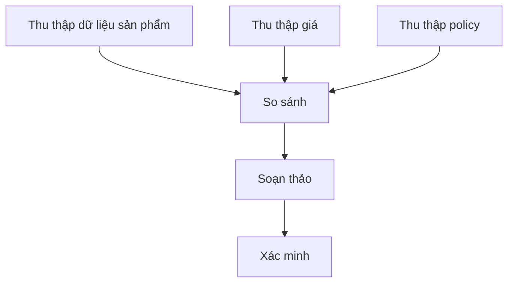

# Lập kế hoạch và phân rã tác vụ trong AI Agent

Một mục tiêu như “chuẩn bị báo cáo thị trường và gửi cho team” không phải một action đơn. Agent cần biến mục tiêu thành chuỗi subgoal có dependency. Đây là **lập kế hoạch (planning / 계획)** ở cấp ứng dụng.

Cần phân biệt hai nghĩa:

- **lập kế hoạch cổ điển (classical planning)**: state, action, precondition, effect và goal được mô hình hóa hình thức;
- **LLM planning**: mô hình sinh một chuỗi bước hoặc subtask được đề xuất từ context bằng ngôn ngữ tự nhiên.

Plan do LLM sinh có thể hữu ích nhưng không tự có bảo đảm về khả năng thực thi hoặc tính tối ưu.

## Vì sao cần phân rã?

Task dài tạo gánh nặng về tổ hợp và context. Phân rã biến bài toán lớn thành các đơn vị có thể quan sát và verify.

```text
Mục tiêu
├── thu thập bằng chứng
│   ├── nguồn A
│   └── nguồn B
├── phân tích
├── soạn thảo
└── kiểm tra và bàn giao
```

Subtask tốt nên có input, output và completion criterion rõ.

## Đồ thị phụ thuộc

Plan không nhất thiết là danh sách tuyến tính. Nhiều task có dạng DAG:



Biểu diễn dependency cho phép chạy song song những node độc lập.

## Lập kế hoạch phân cấp

Task decomposition thường có nhiều tầng:

```text
Deploy service
→ chuẩn bị artifact
→ cấu hình environment
→ deploy staging
→ validate
→ deploy production
```

Mỗi node có thể tiếp tục được phân rã khi cần. Không nên mở rộng toàn bộ cây quá sớm vì environment có thể thay đổi.

## Độ sâu Plan và bất định

Action gần thường được biết rõ hơn action xa. Vì vậy **lập kế hoạch theo chân trời cuốn chiếu (rolling-horizon planning)** hữu ích:

```text
lập vài bước gần đáng tin
→ thực thi
→ quan sát
→ mở rộng hoặc sửa plan
```

Cách này tốt hơn một mega-plan dài dựa trên nhiều giả định chưa kiểm chứng.

## Điều kiện trước và hiệu ứng

Ngay cả khi không dùng formal planner, tư duy precondition/effect giúp tránh action vô nghĩa.

Ví dụ:

```text
Action: merge_pull_request
Preconditions:
- PR tồn tại
- required checks đã pass
- policy approval được thỏa

Effects:
- target branch thay đổi
- trạng thái PR thành merged
```

LLM có thể đề xuất action, còn runtime nên kiểm precondition bằng tool và state.

## Xác minh Plan

Với plan được sinh, cần hỏi:

- action nào không có tool hỗ trợ?
- dependency nào bị thiếu?
- có bước không thể đảo ngược trước verification không?
- có approval bắt buộc không?
- output bước trước có đủ cho bước sau không?
- có cycle không?

Các constraint cấu trúc có thể được kiểm tra xác định.

## Phân rã tác vụ và Context Engineering

Mỗi subtask không cần toàn bộ global context. Context có scope giúp giảm nhiễu:

```text
mục tiêu toàn cục + artifact liên quan + local subtask state
```

Subagent nhận quá nhiều context không liên quan sẽ tốn token và khó tập trung vào thông tin quan trọng.

## Plan-and-Execute và Planning xen kẽ

**Plan-and-execute** tạo plan trước rồi thực thi. Phù hợp khi environment ổn định và task quen thuộc.

**Interleaved planning** xen lập kế hoạch với execution. Phù hợp khi tool result thay đổi bước tiếp theo.

Agent production thường dùng kiểu lai:

```text
plan thô → thực thi bước → kiểm kết quả → tinh chỉnh plan
```

## Search trong không gian Plan

Có thể sinh nhiều candidate plan rồi chấm theo cost, risk và xác suất thành công. Đây là cầu nối về classical search.

Nếu candidate plan `P` có:

\[
Score(P)=Utility(P)-\lambda Cost(P)-\mu Risk(P)
\]

runtime có thể chọn plan có trade-off tốt hơn thay vì dùng proposal đầu tiên.

## Failure mode khi phân rã

### Thiếu dependency

Agent viết report trước khi thu đủ evidence.

### Phân rã quá mức

Task nhỏ bị chia thành hàng chục microstep, làm tăng latency và failure surface.

### Phân rã chưa đủ

Một step quá rộng như “research everything” không có tiêu chí hoàn thành đo được.

### Cam kết quá sớm

Agent khóa vào một strategy trước khi inspect environment.

### Kế hoạch vòng tròn

Subtask A cần B, còn B lại phụ thuộc A.

## Critical Path

Trong plan DAG, **đường găng (critical path)** quyết định thời gian hoàn thành tối thiểu. Chạy song song task ngoài critical path không giảm latency nếu bottleneck vẫn nằm ở chuỗi tuần tự chính.

Tư duy project scheduling rất hữu ích cho agent orchestration.

## Planning ưu tiên Verification

Plan tốt thiết kế verification cùng action:

```text
sửa code → chạy test
update record → đọc lại record
gửi draft → xác nhận message id
```

Verification không nên chỉ được thêm ở cuối như một bước phụ.

## Thứ tự có nhận thức rủi ro

Nên ưu tiên action chỉ đọc hoặc có thể đảo ngược trước write không thể đảo ngược:

```text
inspect → simulate → validate → approve → mutate
```

Đây là tư duy tương tự transaction database và safe deployment.

## Ví dụ: migrate database schema

Plan yếu:

```text
change schema → deploy
```

Plan tốt hơn:

```text
kiểm tra cách schema đang được dùng
→ tạo migration tương thích ngược
→ test trên staging data
→ deploy migration
→ verify app cũ và mới đều tương thích
→ deploy app
→ monitor
→ dọn legacy column sau
```

Task decomposition cần constraint domain chứ không chỉ năng lực ngôn ngữ.

## Human Checkpoint

Plan có thể đánh dấu node cần approval:

```text
Research [auto]
Draft [auto]
Send external email [approval]
Production deploy [approval]
```

Approval nên là node rõ trong graph, không phải một câu nhắc mơ hồ.

## Lưu bền vững Plan

Nên lưu:

```text
subtask id
status
inputs
outputs
dependency ids
attempt count
verification status
```

Điều này hỗ trợ resume và debugging.

## Mô hình tư duy

> **Plan là giả thuyết có thể thực thi về cách đi từ state hiện tại tới goal; observation mới có quyền làm thay đổi giả thuyết đó.**

## Những hiểu lầm thường gặp

### “LLM viết checklist hay nghĩa là planning tốt”

Không. Checklist không bảo đảm dependency, executability hoặc validation.

### “Plan càng chi tiết càng tốt”

Không. Chi tiết quá xa trong tương lai dễ dựa trên giả định sai. Progressive decomposition thường tốt hơn.

### “Agent planning thay thế workflow engine”

Không. Workflow runtime vẫn rất hữu ích cho scheduling, persistence, retry và policy.

## Liên kết kiến thức

Planning nối [Classical Planning](../02_search_reasoning_and_planning/05_planning.md), agent loop và distributed workflow orchestration.

Xem tiếp: [Agent Memory](./04_agent_memory.md).