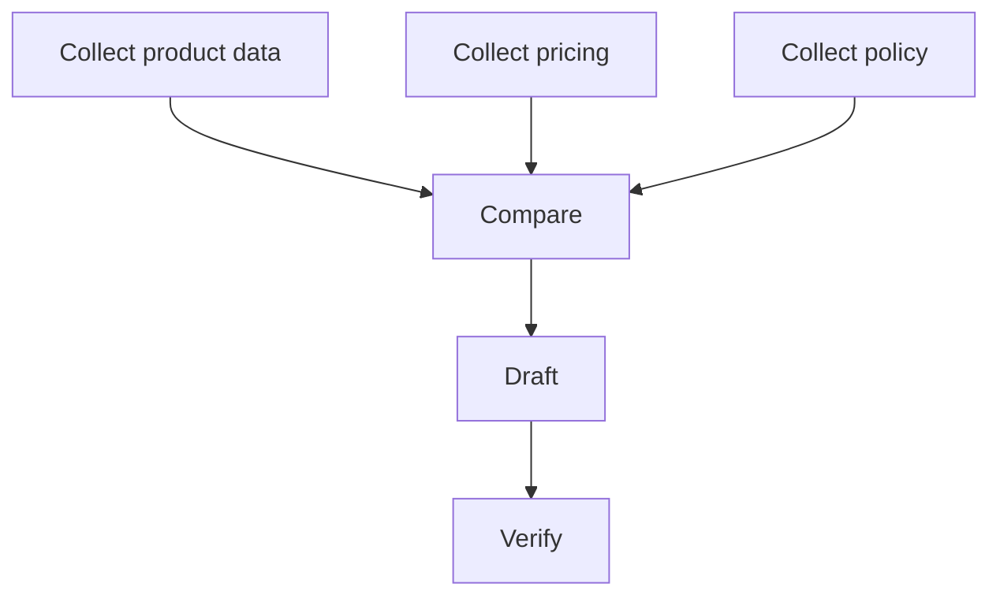

# Planning và Task Decomposition trong AI Agent

Một goal như “chuẩn bị báo cáo thị trường và gửi cho team” không phải một action đơn. Agent cần biến goal thành chuỗi subgoal có dependency. Đây là **planning (계획 / lập kế hoạch)** ở mức application.

Tuy nhiên cần phân biệt hai nghĩa:

- classical planning: state, action, precondition, effect và goal được mô hình hóa formal;
- LLM planning: model sinh một proposed sequence/subtasks từ natural-language context.

LLM plan hữu ích nhưng không tự có guarantee về executability hay optimality.

## Vì sao decomposition cần tồn tại?

Task dài tạo combinatorial và context burden. Decomposition biến problem lớn thành các units có thể quan sát và verify.

```text
Goal
├── gather evidence
│   ├── source A
│   └── source B
├── analyze
├── draft
└── validate & deliver
```

Subtask tốt nên có input, output và completion criterion rõ.

## Dependency Graph

Plan không nhất thiết là list tuyến tính. Nhiều task có DAG:



Represent dependency cho phép parallelize các node độc lập.

## Hierarchical Planning

Task decomposition thường hierarchical:

```text
Deploy service
→ prepare artifact
→ configure environment
→ deploy staging
→ validate
→ deploy production
```

Mỗi node lại decomposed khi cần. Không nên expand toàn bộ tree quá sớm vì environment có thể thay đổi.

## Plan depth và uncertainty

Near-term actions thường biết rõ hơn distant actions. Vì vậy **rolling-horizon planning** hữu ích:

```text
plan next few reliable steps
→ execute
→ observe
→ extend/revise plan
```

Đây tốt hơn một mega-plan dài dựa trên assumptions chưa kiểm chứng.

## Preconditions và Effects

Ngay cả khi không dùng formal planner, tư duy precondition/effect giúp agent tránh action vô nghĩa.

Ví dụ:

```text
Action: merge_pull_request
Preconditions:
- PR exists
- required checks pass
- approval policy satisfied

Effects:
- target branch changes
- PR state becomes merged
```

LLM có thể đề xuất action, runtime nên kiểm preconditions bằng tool/state.

## Plan Validation

Plan generated cần hỏi:

- action nào không có tool hỗ trợ?
- dependency nào bị thiếu?
- có bước irreversible trước verification không?
- có required approval không?
- output của step trước có đủ cho step sau?
- có cycle không?

Validation có thể deterministic cho structural constraints.

## Task decomposition và context engineering

Mỗi subtask không cần toàn bộ global context. Context scoped giúp giảm noise:

```text
Global goal + relevant artifacts + local subtask state
```

Khi subagent nhận quá nhiều unrelated context, attention bị phân tán và token cost tăng.

## Plan-and-Execute vs Interleaved Planning

**Plan-and-execute** tạo plan trước rồi làm. Tốt khi environment ổn định và task familiar.

**Interleaved planning** lập kế hoạch xen execution. Tốt khi tool results thay đổi next step.

Production agents thường hybrid:

```text
coarse plan → execute step → inspect → refine
```

## Search trong plan space

Có thể generate nhiều candidate plans rồi score theo cost/risk/success likelihood. Đây nối lại classical search.

Nếu candidate plan `P` có:

\[
Score(P)=Utility(P)-\lambda Cost(P)-\mu Risk(P)
\]

runtime có thể chọn plan trade-off tốt hơn thay vì first generated plan.

## Decomposition failure modes

### Missing dependency

Agent viết report trước khi collect đủ evidence.

### Over-decomposition

Task nhỏ bị chia thành hàng chục microsteps, tăng latency và failure surface.

### Under-decomposition

Một step quá rộng như “research everything” không có measurable completion.

### Premature commitment

Agent khóa vào một strategy trước khi inspect environment.

### Circular planning

Subtask A cần B, B lại cần A.

## Critical Path

Trong plan DAG, critical path quyết định minimum completion time. Parallelizing non-critical tasks không giảm latency nếu bottleneck ở một sequential chain.

Tư duy project scheduling hữu ích cho agent orchestration.

## Verification-first Planning

Plan tốt thiết kế verification cùng action:

```text
edit code → run test
update record → re-read record
send draft → confirm message id
```

Không nên thêm verification sau cùng như một afterthought.

## Risk-aware ordering

Ưu tiên reversible/read-only actions trước irreversible writes.

```text
inspect → simulate → validate → approve → mutate
```

Đây giống database transaction và safe deployment principles.

## Example: migrate database schema

Weak plan:

```text
change schema → deploy
```

Better plan:

```text
inspect schema usage
→ create backward-compatible migration
→ test on staging data
→ deploy migration
→ verify old/new app compatibility
→ deploy app
→ monitor
→ clean legacy column later
```

Task decomposition cần domain constraints, không chỉ linguistic ability.

## Human checkpoints

Plan có thể mark nodes cần approval:

```text
Research [auto]
Draft [auto]
Send external email [approval]
Production deploy [approval]
```

Approval là graph node, không phải vague instruction.

## Plan persistence

Persist:

```text
subtask id
status
inputs
outputs
dependency ids
attempt count
verification status
```

Điều này cho resumability và debugging.

## Mental Model

> **Plan là executable hypothesis về cách đi từ state hiện tại tới goal; observation mới có quyền sửa hypothesis đó.**

## Common Misconceptions

### “LLM viết checklist hay là đã planning tốt”

Checklist không đảm bảo dependency, executability hoặc validation.

### “Plan càng chi tiết càng tốt”

Chi tiết xa trong tương lai dễ dựa trên assumptions sai. Progressive decomposition thường tốt hơn.

### “Agent planning thay thế workflow engine”

Không. Workflow runtime vẫn hữu ích cho scheduling, persistence, retries và policy.

## Knowledge Connection

Planning nối [Classical Planning](../02_search_reasoning_and_planning/05_planning.md), agent loop và distributed workflow orchestration. Next: memory giúp agent reuse information across steps/tasks.

Xem tiếp: [Agent Memory](./04_agent_memory.md).