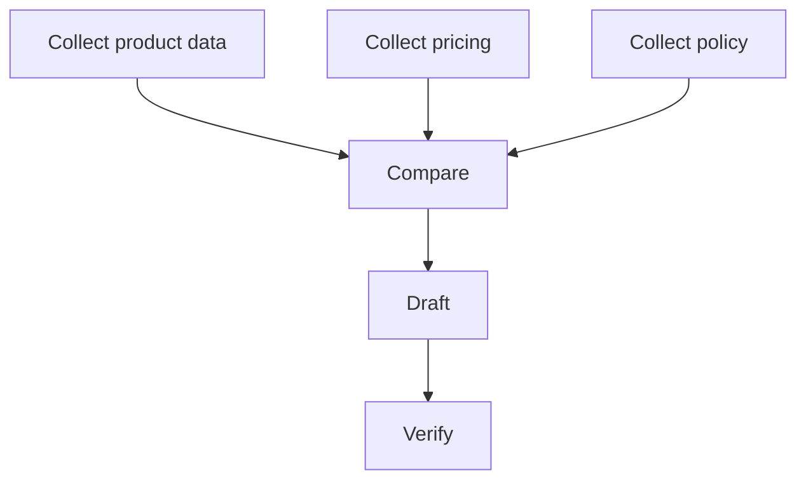

# Planning và tác vụ (task / 작업) Decomposition trong AI tác nhân (agent / 에이전트)

> **Mạch đọc:** [README](./README.md) là bản đồ owner của **Planning và task decomposition trong AI agents**. Route đi từ goal → subtasks → dependency graph → ordering/parallelism → replanning under failure, để kế hoạch nối được với hành động thực tế.

Một goal như “chuẩn bị báo cáo thị trường và gửi cho nhóm (team / 팀)” không phải một hành động (action / 동작) đơn. tác nhân (agent / 에이전트) cần biến goal thành chuỗi subgoal có phụ thuộc (dependency / 의존성). Đây là **planning (계획 / lập kế hoạch)** ở mức ứng dụng (application / 애플리케이션).

Tuy nhiên cần phân biệt hai nghĩa:

- classical planning: trạng thái (state / 상태), hành động (action / 동작), precondition, tác động (effect / 효과) và goal được mô hình hóa formal;
- LLM planning: mô hình (model / 모델) sinh một proposed chuỗi (sequence / 시퀀스)/subtasks từ natural-language ngữ cảnh (context / 맥락).

LLM plan hữu ích nhưng không tự có guarantee về executability hay optimality.

## Vì sao decomposition cần tồn tại?

Tác vụ (task / 작업) dài tạo combinatorial và ngữ cảnh (context / 맥락) burden. Decomposition biến bài toán (problem / 문제) lớn thành các units có thể quan sát và verify.

```text
Goal
├── gather evidence
│   ├── source A
│   └── source B
├── analyze
├── draft
└── validate & deliver
```

Subtask tốt nên có đầu vào (input / 입력), đầu ra (output / 출력) và completion criterion rõ.

> **Chuyển mạch:** Trong **Planning và tác vụ (task / 작업) Decomposition trong AI tác nhân (agent / 에이전트)**, **Phụ thuộc (dependency / 의존성) đồ thị (graph / 그래프)** tiếp nhận điểm tựa từ **Vì sao decomposition cần tồn tại?** nhưng đổi góc nhìn sang câu hỏi của chính nó; đọc liền hai mục để thấy mối quan hệ đó. Từ đây, **Hierarchical Planning** sẽ cho biết hệ quả hoặc giới hạn ấy hiện ra ở đâu.

## Phụ thuộc (dependency / 의존성) đồ thị (graph / 그래프)

Plan không nhất thiết là danh sách (list / 목록) tuyến tính. Nhiều tác vụ (task / 작업) có DAG:


```mermaid
flowchart TD
    A[Collect product data] --> D[Compare]
    B[Collect pricing] --> D
    C[Collect policy] --> D
    D --> E[Draft]
    E --> F[Verify]
```

Represent phụ thuộc (dependency / 의존성) cho phép parallelize các nút (node / 노드) độc lập.

> **Chuyển mạch:** Ở chặng này của **Planning và tác vụ (task / 작업) Decomposition trong AI tác nhân (agent / 에이전트)**, **Hierarchical Planning** tiếp nhận điểm tựa từ **Phụ thuộc (dependency / 의존성) đồ thị (graph / 그래프)** nhưng đổi góc nhìn sang câu hỏi của chính nó; đọc liền hai mục để thấy mối quan hệ đó. Từ đây, **Plan độ sâu (depth / 깊이) và bất định (uncertainty / 불확실성)** sẽ cho biết hệ quả hoặc giới hạn ấy hiện ra ở đâu.

## Hierarchical Planning

Tác vụ (task / 작업) decomposition thường hierarchical:

```text
Deploy service
→ prepare artifact
→ configure environment
→ deploy staging
→ validate
→ deploy production
```

Mỗi nút (node / 노드) lại decomposed khi cần. Không nên expand toàn bộ cây (tree / 트리) quá sớm vì môi trường (environment / 환경) có thể thay đổi.

> **Chuyển mạch:** Đặt trong câu hỏi lớn của **Planning và tác vụ (task / 작업) Decomposition trong AI tác nhân (agent / 에이전트)**, **Plan độ sâu (depth / 깊이) và bất định (uncertainty / 불확실성)** tiếp nhận điểm tựa từ **Hierarchical Planning** nhưng đổi góc nhìn sang câu hỏi của chính nó; đọc liền hai mục để thấy mối quan hệ đó. Từ đây, **Preconditions và Effects** sẽ cho biết hệ quả hoặc giới hạn ấy hiện ra ở đâu.

## Plan độ sâu (depth / 깊이) và bất định (uncertainty / 불확실성)

Near-term actions thường biết rõ hơn distant actions. Vì vậy **rolling-horizon planning** hữu ích:

```text
plan next few reliable steps
→ execute
→ observe
→ extend/revise plan
```

Đây tốt hơn một mega-plan dài dựa trên các giả định (assumptions / 가정들) chưa kiểm chứng.

> **Chuyển mạch:** Trong **Planning và tác vụ (task / 작업) Decomposition trong AI tác nhân (agent / 에이전트)**, **Preconditions và Effects** tiếp nhận điểm tựa từ **Plan độ sâu (depth / 깊이) và bất định (uncertainty / 불확실성)** nhưng đổi góc nhìn sang câu hỏi của chính nó; đọc liền hai mục để thấy mối quan hệ đó. Từ đây, **Plan kiểm tra hợp lệ (validation / 검증)** sẽ cho biết hệ quả hoặc giới hạn ấy hiện ra ở đâu.

## Preconditions và Effects

Ngay cả khi không dùng formal planner, tư duy precondition/tác động (effect / 효과) giúp tác nhân (agent / 에이전트) tránh hành động (action / 동작) vô nghĩa.

Ví dụ:

```text
Action: merge_pull_request
Preconditions:
- PR exists
- required checks pass
- approval policy satisfied

Effects:
- target branch changes
- PR state becomes merged
```

LLM có thể đề xuất hành động (action / 동작), thời gian chạy (runtime / 런타임) nên kiểm preconditions bằng công cụ (tool / 도구)/trạng thái (state / 상태).

> **Chuyển mạch:** Ở chặng này của **Planning và tác vụ (task / 작업) Decomposition trong AI tác nhân (agent / 에이전트)**, **Plan kiểm tra hợp lệ (validation / 검증)** tiếp nhận điểm tựa từ **Preconditions và Effects** nhưng đổi góc nhìn sang câu hỏi của chính nó; đọc liền hai mục để thấy mối quan hệ đó. Từ đây, **Tác vụ (task / 작업) decomposition và ngữ cảnh (context / 맥락) kỹ thuật (engineering / 엔지니어링)** sẽ cho biết hệ quả hoặc giới hạn ấy hiện ra ở đâu.

## Plan kiểm tra hợp lệ (validation / 검증)

Plan generated cần hỏi:

- hành động (action / 동작) nào không có công cụ (tool / 도구) hỗ trợ?
- phụ thuộc (dependency / 의존성) nào bị thiếu?
- có bước irreversible trước xác minh (verification / 확인) không?
- có required approval không?
- đầu ra (output / 출력) của step trước có đủ cho step sau?
- có cycle không?

Kiểm tra hợp lệ (validation / 검증) có thể deterministic cho structural các ràng buộc (constraints / 제약조건들).

> **Chuyển mạch:** Đặt trong câu hỏi lớn của **Planning và tác vụ (task / 작업) Decomposition trong AI tác nhân (agent / 에이전트)**, **Tác vụ (task / 작업) decomposition và ngữ cảnh (context / 맥락) kỹ thuật (engineering / 엔지니어링)** tiếp nhận điểm tựa từ **Plan kiểm tra hợp lệ (validation / 검증)** nhưng đổi góc nhìn sang câu hỏi của chính nó; đọc liền hai mục để thấy mối quan hệ đó. Từ đây, **Plan-and-Execute vs Interleaved Planning** sẽ cho biết hệ quả hoặc giới hạn ấy hiện ra ở đâu.

## Tác vụ (task / 작업) decomposition và ngữ cảnh (context / 맥락) kỹ thuật (engineering / 엔지니어링)

Mỗi subtask không cần toàn bộ toàn cục (global / 전역) ngữ cảnh (context / 맥락). ngữ cảnh (context / 맥락) scoped giúp giảm noise:

```text
Global goal + relevant artifacts + local subtask state
```

Khi subagent nhận quá nhiều unrelated ngữ cảnh (context / 맥락), attention bị phân tán và đơn vị từ (token / 토큰) chi phí (cost / 비용) tăng.

> **Chuyển mạch:** Trong **Planning và tác vụ (task / 작업) Decomposition trong AI tác nhân (agent / 에이전트)**, **Plan-and-Execute vs Interleaved Planning** tiếp nhận điểm tựa từ **Tác vụ (task / 작업) decomposition và ngữ cảnh (context / 맥락) kỹ thuật (engineering / 엔지니어링)** nhưng đổi góc nhìn sang câu hỏi của chính nó; đọc liền hai mục để thấy mối quan hệ đó. Từ đây, **Tìm kiếm (search / 검색) trong plan không gian (space / 공간)** sẽ cho biết hệ quả hoặc giới hạn ấy hiện ra ở đâu.

## Plan-and-Execute vs Interleaved Planning

**Plan-and-execute** tạo plan trước rồi làm. Tốt khi môi trường (environment / 환경) ổn định và tác vụ (task / 작업) familiar.

**Interleaved planning** lập kế hoạch xen thực thi (execution / 실행). Tốt khi công cụ (tool / 도구) results thay đổi next step.

Môi trường vận hành (production / 운영 환경) agents thường hybrid:

```text
coarse plan → execute step → inspect → refine
```

> **Chuyển mạch:** Ở chặng này của **Planning và tác vụ (task / 작업) Decomposition trong AI tác nhân (agent / 에이전트)**, **Tìm kiếm (search / 검색) trong plan không gian (space / 공간)** tiếp nhận điểm tựa từ **Plan-and-Execute vs Interleaved Planning** nhưng đổi góc nhìn sang câu hỏi của chính nó; đọc liền hai mục để thấy mối quan hệ đó. Từ đây, **Decomposition thất bại (failure / 실패) modes** sẽ cho biết hệ quả hoặc giới hạn ấy hiện ra ở đâu.

## Tìm kiếm (search / 검색) trong plan không gian (space / 공간)

Có thể generate nhiều candidate plans rồi score theo chi phí (cost / 비용)/rủi ro (risk / 위험)/success likelihood. Đây nối lại classical tìm kiếm (search / 검색).

Nếu candidate plan `P` có:

\[
Score(P)=Utility(P)-\lambda chi phí (cost / 비용)(P)-\mu rủi ro (risk / 위험)(P)
\]

Thời gian chạy (runtime / 런타임) có thể chọn plan sự đánh đổi (trade-off / 트레이드오프) tốt hơn thay vì first generated plan.

> **Chuyển mạch:** Đặt trong câu hỏi lớn của **Planning và tác vụ (task / 작업) Decomposition trong AI tác nhân (agent / 에이전트)**, **Decomposition thất bại (failure / 실패) modes** tiếp nhận điểm tựa từ **Tìm kiếm (search / 검색) trong plan không gian (space / 공간)** nhưng đổi góc nhìn sang câu hỏi của chính nó; đọc liền hai mục để thấy mối quan hệ đó. Từ đây, **Đường găng (critical path / 임계 경로)** sẽ cho biết hệ quả hoặc giới hạn ấy hiện ra ở đâu.

## Decomposition thất bại (failure / 실패) modes

### Missing phụ thuộc (dependency / 의존성)

Tác nhân (agent / 에이전트) viết report trước khi collect đủ bằng chứng (evidence / 증거).

### Over-decomposition

Tác vụ (task / 작업) nhỏ bị chia thành hàng chục microsteps, tăng độ trễ (latency / 지연 시간) và thất bại (failure / 실패) surface.

### Under-decomposition

Một step quá rộng như “research everything” không có measurable completion.

### Premature commitment

Tác nhân (agent / 에이전트) khóa vào một chiến lược (strategy / 전략) trước khi inspect môi trường (environment / 환경).

### Circular planning

Subtask A cần B, B lại cần A.

> **Chuyển mạch:** Trong **Planning và tác vụ (task / 작업) Decomposition trong AI tác nhân (agent / 에이전트)**, **Decomposition thất bại (failure / 실패) modes** xác định đầu vào; **Đường găng (critical path / 임계 경로)** giải thích bước vận hành tạo ra kết quả kế tiếp. Từ đây, **Verification-first Planning** sẽ cho biết hệ quả hoặc giới hạn ấy hiện ra ở đâu.

## Đường găng (critical path / 임계 경로)

Trong plan DAG, đường găng (critical path / 임계 경로) quyết định minimum completion thời gian (time / 시간). Parallelizing non-critical tasks không giảm độ trễ (latency / 지연 시간) nếu bottleneck ở một sequential chuỗi (chain / 사슬).

Tư duy dự án (project / 프로젝트) scheduling hữu ích cho tác nhân (agent / 에이전트) orchestration.

> **Chuyển mạch:** Ở chặng này của **Planning và tác vụ (task / 작업) Decomposition trong AI tác nhân (agent / 에이전트)**, **Đường găng (critical path / 임계 경로)** xác định đầu vào; **Verification-first Planning** giải thích bước vận hành tạo ra kết quả kế tiếp. Từ đây, **Risk-aware thứ tự (ordering / 순서)** sẽ cho biết hệ quả hoặc giới hạn ấy hiện ra ở đâu.

## Verification-first Planning

Plan tốt thiết kế xác minh (verification / 확인) cùng hành động (action / 동작):

```text
edit code → run test
update record → re-read record
send draft → confirm message id
```

Không nên thêm xác minh (verification / 확인) sau cùng như một afterthought.

> **Chuyển mạch:** Đặt trong câu hỏi lớn của **Planning và tác vụ (task / 작업) Decomposition trong AI tác nhân (agent / 에이전트)**, **Risk-aware thứ tự (ordering / 순서)** tiếp nhận điểm tựa từ **Verification-first Planning** nhưng đổi góc nhìn sang câu hỏi của chính nó; đọc liền hai mục để thấy mối quan hệ đó. Từ đây, **Example: migrate cơ sở dữ liệu (database / 데이터베이스) lược đồ (schema / 스키마)** sẽ cho biết hệ quả hoặc giới hạn ấy hiện ra ở đâu.

## Risk-aware thứ tự (ordering / 순서)

Ưu tiên reversible/read-only actions trước irreversible writes.

```text
inspect → simulate → validate → approve → mutate
```

Đây giống cơ sở dữ liệu (database / 데이터베이스) giao dịch (transaction / 트랜잭션) và safe triển khai (deployment / 배포) principles.

> **Chuyển mạch:** Trong **Planning và tác vụ (task / 작업) Decomposition trong AI tác nhân (agent / 에이전트)**, **Risk-aware thứ tự (ordering / 순서)** cho ta quy tắc; **Example: migrate cơ sở dữ liệu (database / 데이터베이스) lược đồ (schema / 스키마)** đặt quy tắc ấy vào tình huống cụ thể để thấy nó hoạt động đến đâu. Từ đây, **Human checkpoints** sẽ cho biết hệ quả hoặc giới hạn ấy hiện ra ở đâu.

## Example: migrate cơ sở dữ liệu (database / 데이터베이스) lược đồ (schema / 스키마)

Weak plan:

```text
change schema → deploy
```

Better plan:

```text
inspect schema usage
→ create backward-compatible migration
→ test on staging data
→ deploy migration
→ verify old/new app compatibility
→ deploy app
→ monitor
→ clean legacy column later
```

Tác vụ (task / 작업) decomposition cần lĩnh vực (domain / 도메인) các ràng buộc (constraints / 제약조건들), không chỉ linguistic ability.

> **Chuyển mạch:** Ở chặng này của **Planning và tác vụ (task / 작업) Decomposition trong AI tác nhân (agent / 에이전트)**, **Example: migrate cơ sở dữ liệu (database / 데이터베이스) lược đồ (schema / 스키마)** cho ta quy tắc; **Human checkpoints** đặt quy tắc ấy vào tình huống cụ thể để thấy nó hoạt động đến đâu. Từ đây, **Plan persistence** sẽ cho biết hệ quả hoặc giới hạn ấy hiện ra ở đâu.

## Human checkpoints

Plan có thể mark nodes cần approval:

```text
Research [auto]
Draft [auto]
Send external email [approval]
Production deploy [approval]
```

Approval là đồ thị (graph / 그래프) nút (node / 노드), không phải vague instruction.

> **Chuyển mạch:** Đặt trong câu hỏi lớn của **Planning và tác vụ (task / 작업) Decomposition trong AI tác nhân (agent / 에이전트)**, **Plan persistence** tiếp nhận điểm tựa từ **Human checkpoints** nhưng đổi góc nhìn sang câu hỏi của chính nó; đọc liền hai mục để thấy mối quan hệ đó. Từ đây, **Mô hình tư duy (mental model / 사고 모델)** sẽ cho biết hệ quả hoặc giới hạn ấy hiện ra ở đâu.

## Plan persistence

Persist:

```text
subtask id
status
inputs
outputs
dependency ids
attempt count
verification status
```

Điều này cho resumability và debugging.

> **Chuyển mạch:** Trong **Planning và tác vụ (task / 작업) Decomposition trong AI tác nhân (agent / 에이전트)**, **Mô hình tư duy (mental model / 사고 모델)** gom các mảnh từ **Plan persistence** thành một kết luận có thể mang sang phần kế tiếp. Từ đây, **Dùng chung (common / 공통) Misconceptions** sẽ cho biết hệ quả hoặc giới hạn ấy hiện ra ở đâu.

## Mô hình tư duy (mental model / 사고 모델)

> **Plan là executable hypothesis về cách đi từ trạng thái (state / 상태) hiện tại tới goal; observation mới có quyền sửa hypothesis đó.**

> **Chuyển mạch:** Ở chặng này của **Planning và tác vụ (task / 작업) Decomposition trong AI tác nhân (agent / 에이전트)**, **Dùng chung (common / 공통) Misconceptions** gom các mảnh từ **Mô hình tư duy (mental model / 사고 모델)** thành một kết luận có thể mang sang phần kế tiếp. Từ đây, **Liên kết kiến thức (knowledge connection / 지식 연결)** sẽ cho biết hệ quả hoặc giới hạn ấy hiện ra ở đâu.

## Dùng chung (common / 공통) Misconceptions

### “LLM viết checklist hay là đã planning tốt”

Checklist không đảm bảo phụ thuộc (dependency / 의존성), executability hoặc kiểm tra hợp lệ (validation / 검증).

### “Plan càng chi tiết càng tốt”

Chi tiết xa trong tương lai dễ dựa trên các giả định (assumptions / 가정들) sai. Progressive decomposition thường tốt hơn.

### “tác nhân (agent / 에이전트) planning thay thế workflow engine”

Không. Workflow thời gian chạy (runtime / 런타임) vẫn hữu ích cho scheduling, persistence, retries và chính sách (policy / 정책).

> **Chuyển mạch:** Đặt trong câu hỏi lớn của **Planning và tác vụ (task / 작업) Decomposition trong AI tác nhân (agent / 에이전트)**, sau nội dung của **Dùng chung (common / 공통) Misconceptions**, **Liên kết kiến thức (knowledge connection / 지식 연결)** chỉ rõ tài liệu chuẩn và vị trí sở hữu để người học biết phần nào cần quay lại khi muốn đào sâu. Phần còn lại của file dùng kết quả này để khép lại mạch giải thích.

## Liên kết kiến thức (knowledge connection / 지식 연결)

Planning nối [Classical Planning](../02_search_reasoning_and_planning/05_planning.md), tác nhân (agent / 에이전트) vòng lặp (loop / 루프) và phân tán (distributed / 분산) workflow orchestration. Next: bộ nhớ (memory / 메모리) giúp tác nhân (agent / 에이전트) reuse thông tin (information / 정보) across steps/tasks.

Xem tiếp: [Agent Memory](./04_agent_memory.md).

> **Bàn giao:** Sau **Liên kết kiến thức (knowledge connection / 지식 연결)**, hãy giữ lại kết luận và ranh giới của mục này; quay về [README](./README.md) khi cần định vị owner hoặc chọn nhánh học tiếp theo.
