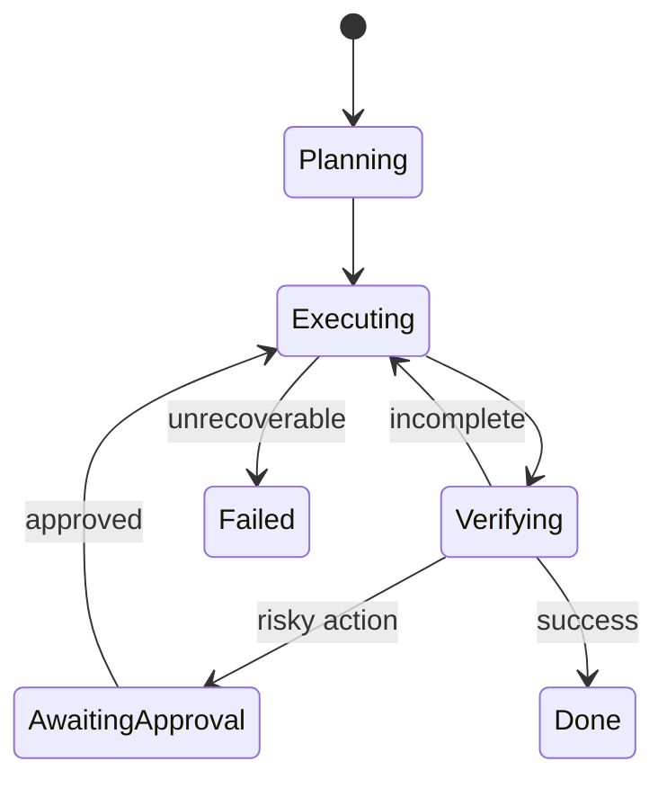

# Agent State và Context

Agent thường thất bại không phải vì model “không thông minh”, mà vì **state** và **context** bị trộn thành một khối text khó kiểm soát. Hai khái niệm này liên quan nhưng không đồng nghĩa.

**State (상태 / trạng thái)** là information mô tả task/system hiện đang ở đâu. **Context (문맥 / ngữ cảnh)** là subset information được đưa vào model ở một inference step.

```text
Persisted state (full source of truth)
          ↓ select / retrieve / summarize
Model context (temporary working view)
          ↓
Model decision
          ↓
State update
```

## Structured State

State nên lưu những thứ cần correctness:

```text
task id
status
current plan
completed steps
resource ids
versions
pending approvals
budgets
retry counters
verification results
```

Những dữ liệu này phù hợp JSON/DB hơn prose transcript.

## Context Window

Context window gồm token model thấy tại một call:

- system/developer instructions;
- user goal;
- selected state;
- retrieved docs/memory;
- tool schemas;
- recent observations;
- previous messages nếu cần.

Context là scarce resource. Thêm nhiều không đồng nghĩa tốt hơn.

## Context Selection

Context engineering hỏi:

> Với decision hiện tại, model cần biết chính xác gì?

Ví dụ agent đang rerun test không cần toàn bộ 200 trang product docs. Scoped context giảm cost và distraction.

## Source of Truth

Không nên coi model context là source of truth cho mutable external state.

Nếu database record version thay đổi sau khi agent đọc, context đã stale. Trước critical write cần refetch/version check.

## State Transition

Agent runtime có transition:

\[
s_{t+1}=T(s_t,a_t,o_{t+1})
\]

`a_t` là action, `o_{t+1}` là observation. Với software agent, `T` thường do deterministic application code implement.

Model có thể đề xuất update nhưng persisted transition nên validate.

## Conversation History

Conversation history là evidence về interaction, không phải ideal state representation.

Ví dụ user đã approve action ở message 42. Thay vì mỗi lần đưa 42 messages vào context, runtime có thể persist:

```json
{"approval":"granted","scope":"deploy-staging","approved_at":"..."}
```

và giữ original audit event riêng.

## Context Compression

Khi history dài, có thể:

- summarize;
- keep recent window;
- retrieve relevant turns;
- extract structured facts;
- move large artifacts ra external storage.

Compression cần preserve decision-critical details. Summary không nên xóa exception hoặc constraints.

## Lost-in-the-Middle

Ngay cả model context dài, relevant information ở vị trí bất lợi có thể được sử dụng kém hơn. Context organization quan trọng:

```text
policy/goal
→ critical current state
→ relevant evidence
→ tool definitions
→ noncritical background
```

Không nên dump data theo thứ tự tình cờ.

## Context Isolation

Subtasks/subagents nên nhận context minimum necessary. Điều này vừa giảm token cost vừa giảm data leakage.

Multi-tenant systems cần enforce authorization trước retrieval, không rely on model instruction “không được tiết lộ”.

## Context và Prompt Injection

Retrieved content/tool result là untrusted data. Context cần preserve trust boundary:

```text
Trusted policy
Trusted task state
Untrusted external content
```

Model prompt formatting chỉ hỗ trợ; actual permissions vẫn nằm ở runtime.

## State Versioning

Mutable resource nên có version/ETag.

Pattern:

```text
read resource version 7
model proposes update
write only if version still 7
```

Nếu đã thành version 8, return conflict để agent refetch/reason.

## Context Caching

Stable prefix như policy/tool schemas có thể cache để giảm inference cost. Nhưng cache invalidation cần versioning khi instructions/tool definitions thay đổi.

## State Machine

Explicit state machine làm behavior observable:



## Context Budgeting

Một simple token budget:

```text
20% policy + task
30% current state/observations
40% retrieved evidence
10% output headroom
```

Không có tỷ lệ universal; idea là allocate intentionally.

## Artifact References

Large file không nên copy toàn bộ vào every call. Persist artifact rồi pass:

```text
artifact_id
summary
relevant excerpts
```

Model request additional ranges khi cần.

## Mental Model

> **State là world model được persisted; context là camera frame model được nhìn thấy ở một thời điểm.**

Camera frame không phải toàn bộ world.

## Common Misconceptions

### “Nếu context window đủ lớn thì không cần state store”

Không. Context không cung cấp transaction, durability, exact query, authorization hay versioning.

### “Lưu toàn bộ chat là an toàn nhất”

Raw history có noise, stale instructions và security risk. Structured state + audit log thường tốt hơn.

### “Summary luôn thay thế được source data”

Summary lossy; critical evidence cần provenance/reference.

## Knowledge Connection

State/context nối database design, distributed systems, context engineering và memory. Tiếp theo ta phân biệt deterministic workflow với truly agentic control.

Xem tiếp: [Workflows vs Agents](./06_workflows_vs_agents.md).