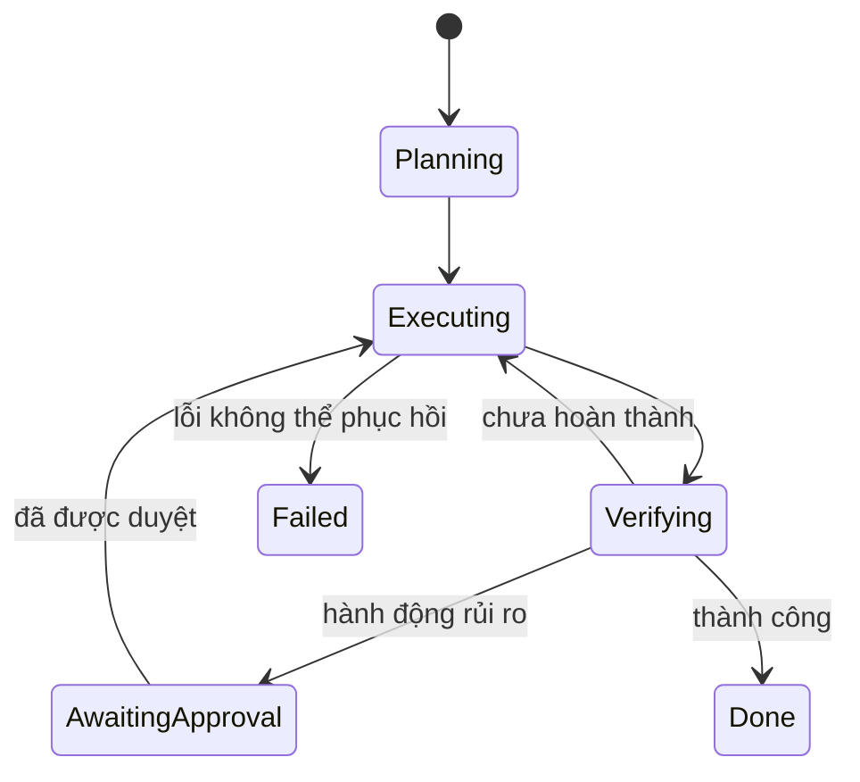

# Trạng thái và Ngữ cảnh của Agent

Agent thường thất bại không phải vì mô hình “không đủ thông minh”, mà vì **trạng thái (state / 상태)** và **ngữ cảnh (context / 문맥)** bị trộn thành một khối văn bản khó kiểm soát. Hai khái niệm này liên quan chặt chẽ nhưng không đồng nghĩa.

**State** là thông tin mô tả task và hệ thống hiện đang ở đâu. **Context** là tập con thông tin được đưa vào mô hình tại một lần suy luận (inference step).

```text
Trạng thái đã persist — persisted state, source of truth đầy đủ
          ↓ chọn / retrieve / tóm tắt
Ngữ cảnh của mô hình — model context, góc nhìn làm việc tạm thời
          ↓
Quyết định của mô hình
          ↓
Cập nhật trạng thái
```

## Trạng thái có cấu trúc

State nên lưu những dữ liệu cần tính chính xác và khả năng kiểm tra lại:

```text
task id
status
plan hiện tại
các bước đã hoàn thành
resource id
version
approval đang chờ
budget
retry counter
kết quả verification
```

Những dữ liệu này thường phù hợp với JSON, database hoặc state store hơn một transcript dạng prose.

## Context Window

**Cửa sổ ngữ cảnh (context window)** gồm các token mà mô hình nhìn thấy trong một lần gọi:

- system/developer instruction;
- mục tiêu của user;
- phần state được chọn;
- document hoặc memory được retrieve;
- tool schema;
- observation gần đây;
- các message trước nếu thật sự cần.

Context là tài nguyên hữu hạn. Thêm nhiều thông tin không đồng nghĩa chất lượng quyết định sẽ tốt hơn.

## Lựa chọn Context

Context engineering cần trả lời câu hỏi:

> Với quyết định hiện tại, mô hình thực sự cần biết những gì?

Ví dụ agent đang chạy lại test không cần nhận toàn bộ 200 trang tài liệu sản phẩm. Context được giới hạn đúng phạm vi giúp giảm chi phí token và giảm nhiễu.

## Source of Truth

Không nên coi context của mô hình là **nguồn dữ liệu chuẩn (source of truth)** cho trạng thái bên ngoài có thể thay đổi.

Nếu record trong database đã đổi version sau khi agent đọc, context hiện tại đã lỗi thời. Trước một thao tác ghi quan trọng, runtime nên đọc lại resource hoặc kiểm tra version.

## Chuyển đổi trạng thái

Agent runtime có thể được mô hình hóa bằng phép chuyển trạng thái:

\[
s_{t+1}=T(s_t,a_t,o_{t+1})
\]

Trong đó `a_t` là action và `o_{t+1}` là observation mới. Với software agent, hàm `T` thường được thực thi bằng application code có tính xác định thay vì để LLM tự sửa state trực tiếp.

Mô hình có thể đề xuất state update, nhưng transition được persist nên qua validation.

## Lịch sử hội thoại

Conversation history là bằng chứng về quá trình tương tác, nhưng không phải cách biểu diễn state lý tưởng.

Ví dụ user đã approve một thao tác ở message thứ 42. Thay vì mỗi lần lại đưa 42 message vào context, runtime có thể persist:

```json
{"approval":"granted","scope":"deploy-staging","approved_at":"..."}
```

Sự kiện gốc vẫn được giữ riêng trong audit log để truy vết.

## Nén Context

Khi lịch sử dài, hệ thống có thể:

- tóm tắt;
- giữ một cửa sổ message gần nhất;
- retrieve những turn có liên quan;
- trích xuất fact có cấu trúc;
- chuyển artifact lớn sang external storage.

Compression phải giữ lại những chi tiết ảnh hưởng quyết định. Một summary không nên làm mất exception, constraint hoặc approval quan trọng.

## Lost-in-the-Middle

Ngay cả khi mô hình hỗ trợ context dài, thông tin liên quan nằm ở vị trí bất lợi trong chuỗi vẫn có thể được sử dụng kém hiệu quả hơn. Vì vậy cách tổ chức context rất quan trọng:

```text
policy / goal
→ state hiện tại quan trọng nhất
→ evidence liên quan
→ tool definition
→ background ít quan trọng
```

Không nên dump dữ liệu vào prompt theo thứ tự ngẫu nhiên của pipeline.

## Cô lập Context

Subtask hoặc subagent chỉ nên nhận lượng context tối thiểu cần thiết. Điều này vừa giảm token cost vừa giảm nguy cơ rò rỉ dữ liệu.

Trong hệ thống nhiều tenant, authorization phải được enforce trước retrieval; không nên dựa vào instruction kiểu “không được tiết lộ dữ liệu của user khác”.

## Context và Prompt Injection

Nội dung được retrieve hoặc tool result nên được xem là dữ liệu không đáng tin cậy mặc định. Context cần duy trì ranh giới độ tin cậy:

```text
Trusted policy
Trusted task state
Untrusted external content
```

Prompt formatting chỉ giúp mô hình phân biệt các vùng dữ liệu. Quyền thực thi thật sự vẫn phải nằm trong runtime và permission system.

## Versioning cho State

Resource có thể thay đổi nên có version, revision hoặc ETag.

Một pattern an toàn:

```text
đọc resource ở version 7
mô hình đề xuất update
chỉ ghi nếu resource vẫn là version 7
```

Nếu resource đã thành version 8, runtime trả conflict để agent đọc lại rồi quyết định tiếp.

Đây là cách áp dụng **optimistic concurrency control** vào agent system.

## Context Caching

Các prefix ổn định như policy hoặc tool schema có thể được cache để giảm chi phí prefill. Tuy nhiên cache phải gắn với version; khi instruction hoặc tool definition thay đổi, cache cũ không được tiếp tục dùng một cách im lặng.

## State Machine

Một **máy trạng thái (state machine)** tường minh giúp hành vi agent dễ quan sát hơn:



State machine cũng giúp retry, resume và audit rõ hơn so với việc chỉ lưu transcript.

## Phân bổ Context Budget

Có thể chủ động chia token budget, ví dụ:

```text
20% policy + task
30% current state + observation
40% retrieved evidence
10% khoảng trống cho output
```

Không có tỷ lệ nào phù hợp cho mọi hệ thống. Ý chính là context phải được phân bổ có chủ đích thay vì lấp đầy đến giới hạn.

## Tham chiếu Artifact

File lớn không nên được copy toàn bộ vào mọi model call. Tốt hơn là persist artifact rồi truyền:

```text
artifact_id
summary
relevant excerpts
```

Khi cần thêm chi tiết, agent có thể yêu cầu đọc đúng range hoặc section tương ứng.

## Mô hình tư duy

> **State là mô hình thế giới đã được persist; context là khung hình mà mô hình được nhìn thấy tại một thời điểm.**

Khung hình không phải toàn bộ thế giới, và thay đổi khung hình không đồng nghĩa thay đổi source of truth.

## Những nhầm lẫn thường gặp

### “Context window đủ lớn thì không cần state store”

Không đúng. Context window không cung cấp transaction, durability, exact query, authorization hay versioning.

### “Lưu toàn bộ chat là cách an toàn nhất”

Raw history chứa nhiễu, instruction lỗi thời và rủi ro bảo mật. Structured state kết hợp audit log thường đáng tin hơn.

### “Summary luôn thay thế được source data”

Không. Summary là biểu diễn mất mát; evidence quan trọng vẫn cần provenance hoặc reference về dữ liệu gốc.

## Liên kết kiến thức

State và context nối trực tiếp với database design, distributed systems, context engineering và memory. Phần tiếp theo phân biệt workflow có control flow xác định với hệ thống agentic cho mô hình quyền chọn bước tiếp theo.

Xem tiếp: [Workflow và Agent](./06_workflows_vs_agents.md).