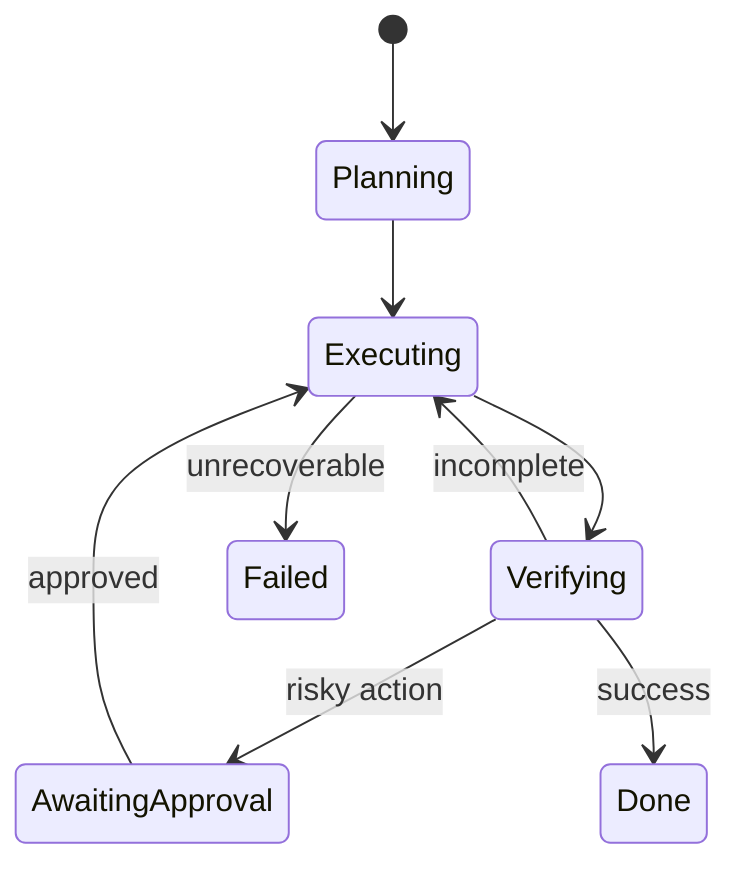

# Tác nhân (agent / 에이전트) trạng thái (state / 상태) và ngữ cảnh (context / 맥락)

> **Mạch đọc:** Đặt **tác nhân (agent / 에이전트) trạng thái (state / 상태) và ngữ cảnh (context / 맥락)** trong bản đồ [README](./README.md) để thấy đơn vị sở hữu (owner / 오너) và vị trí của nó. Nội dung đi từ **Structured trạng thái (state / 상태)** sang **ngữ cảnh (context / 맥락) cửa sổ (window / 윈도우)**; điểm nối này chuẩn bị câu hỏi cho các mục sau thay vì dừng ở định nghĩa đầu tiên.


Tác nhân (agent / 에이전트) thường thất bại không phải vì mô hình (model / 모델) “không thông minh”, mà vì **trạng thái (state / 상태)** và **ngữ cảnh (context / 맥락)** bị trộn thành một khối văn bản (text / 텍스트) khó kiểm soát. Hai khái niệm này liên quan nhưng không đồng nghĩa.

**trạng thái (state / 상태)** là thông tin (information / 정보) mô tả tác vụ (task / 작업)/hệ thống (system / 시스템) hiện đang ở đâu. **ngữ cảnh (context / 맥락)** là subset thông tin (information / 정보) được đưa vào mô hình (model / 모델) ở một suy luận (inference / 추론) step.

```text
Persisted state (full source of truth)
          ↓ select / retrieve / summarize
Model context (temporary working view)
          ↓
Model decision
          ↓
State update
```

## Structured trạng thái (state / 상태)

Trạng thái (state / 상태) nên lưu những thứ cần tính đúng đắn (correctness / 정확성):

```text
task id
status
current plan
completed steps
resource ids
versions
pending approvals
budgets
retry counters
verification results
```

Những dữ liệu này phù hợp JSON/DB hơn prose transcript.

## Ngữ cảnh (context / 맥락) cửa sổ (window / 윈도우)

Ngữ cảnh (context / 맥락) cửa sổ (window / 윈도우) gồm đơn vị từ (token / 토큰) mô hình (model / 모델) thấy tại một lời gọi (call / 호출):

- hệ thống (system / 시스템)/nhà phát triển (developer / 개발자) instructions;
- người dùng (user / 사용자) goal;
- selected trạng thái (state / 상태);
- retrieved docs/bộ nhớ (memory / 메모리);
- công cụ (tool / 도구) schemas;
- recent observations;
- previous messages nếu cần.

Ngữ cảnh (context / 맥락) là scarce tài nguyên (resource / 자원). Thêm nhiều không đồng nghĩa tốt hơn.

## Ngữ cảnh (context / 맥락) Selection

Ngữ cảnh (context / 맥락) kỹ thuật (engineering / 엔지니어링) hỏi:

> Với quyết định (decision / 결정) hiện tại, mô hình (model / 모델) cần biết chính xác gì?

Ví dụ tác nhân (agent / 에이전트) đang rerun kiểm thử (test / 테스트) không cần toàn bộ 200 trang sản phẩm (product / 제품) docs. Scoped ngữ cảnh (context / 맥락) giảm chi phí (cost / 비용) và distraction.

## Nguồn chuẩn (source of truth / 정본)

Không nên coi mô hình (model / 모델) ngữ cảnh (context / 맥락) là nguồn chuẩn (source of truth / 정본) cho mutable bên ngoài (external / 외부) trạng thái (state / 상태).

Nếu cơ sở dữ liệu (database / 데이터베이스) bản ghi (record / 레코드) phiên bản (version / 버전) thay đổi sau khi tác nhân (agent / 에이전트) đọc, ngữ cảnh (context / 맥락) đã stale. Trước trọng yếu (critical / 중요) ghi (write / 쓰기) cần refetch/phiên bản (version / 버전) check.

## Chuyển tiếp trạng thái (state transition / 상태 전이)

Tác nhân (agent / 에이전트) thời gian chạy (runtime / 런타임) có chuyển tiếp (transition / 전이):

\[
s_{t+1}=T(s_t,a_t,o_{t+1})
\]

`a_t` là hành động (action / 동작), `o_{t+1}` là observation. Với software tác nhân (agent / 에이전트), `T` thường do deterministic ứng dụng (application / 애플리케이션) mã (code / 코드) implement.

Mô hình (model / 모델) có thể đề xuất cập nhật (update / 업데이트) nhưng persisted chuyển tiếp (transition / 전이) nên validate.

## Conversation lịch sử (history / 이력)

Conversation lịch sử (history / 이력) là bằng chứng (evidence / 증거) về tương tác (interaction / 상호작용), không phải ideal trạng thái (state / 상태) biểu diễn (representation / 표현).

Ví dụ người dùng (user / 사용자) đã approve hành động (action / 동작) ở message 42. Thay vì mỗi lần đưa 42 messages vào ngữ cảnh (context / 맥락), thời gian chạy (runtime / 런타임) có thể persist:

```json
{"approval":"granted","scope":"deploy-staging","approved_at":"..."}
```

và giữ original kiểm tra (audit / 감사) sự kiện (event / 이벤트) riêng.

## Ngữ cảnh (context / 맥락) Compression

Khi lịch sử (history / 이력) dài, có thể:

- summarize;
- keep recent cửa sổ (window / 윈도우);
- retrieve relevant turns;
- extract structured facts;
- move large artifacts ra bên ngoài (external / 외부) lưu trữ (storage / 저장소).

Compression cần preserve decision-critical details. Summary không nên xóa exception hoặc các ràng buộc (constraints / 제약조건들).

## Lost-in-the-Middle

Ngay cả mô hình (model / 모델) ngữ cảnh (context / 맥락) dài, relevant thông tin (information / 정보) ở vị trí bất lợi có thể được sử dụng kém hơn. ngữ cảnh (context / 맥락) organization quan trọng:

```text
policy/goal
→ critical current state
→ relevant evidence
→ tool definitions
→ noncritical background
```

Không nên dump dữ liệu (data / 데이터) theo thứ tự tình cờ.

## Ngữ cảnh (context / 맥락) Isolation

Subtasks/subagents nên nhận ngữ cảnh (context / 맥락) minimum necessary. Điều này vừa giảm đơn vị từ (token / 토큰) chi phí (cost / 비용) vừa giảm dữ liệu (data / 데이터) leakage.

Multi-tenant các hệ thống (systems / 시스템들) cần enforce authorization trước retrieval, không rely on mô hình (model / 모델) instruction “không được tiết lộ”.

## Ngữ cảnh (context / 맥락) và Prompt Injection

Retrieved content/công cụ (tool / 도구) kết quả (result / 결과) là untrusted dữ liệu (data / 데이터). ngữ cảnh (context / 맥락) cần preserve trust ranh giới (boundary / 경계):

```text
Trusted policy
Trusted task state
Untrusted external content
```

Mô hình (model / 모델) prompt formatting chỉ hỗ trợ; actual permissions vẫn nằm ở thời gian chạy (runtime / 런타임).

## Trạng thái (state / 상태) Versioning

Mutable tài nguyên (resource / 자원) nên có phiên bản (version / 버전)/ETag.

Mẫu (pattern / 패턴):

```text
read resource version 7
model proposes update
write only if version still 7
```

Nếu đã thành phiên bản (version / 버전) 8, return xung đột (conflict / 충돌) để tác nhân (agent / 에이전트) refetch/reason.

## Ngữ cảnh (context / 맥락) Caching

Stable prefix như chính sách (policy / 정책)/công cụ (tool / 도구) schemas có thể bộ nhớ đệm (cache / 캐시) để giảm suy luận (inference / 추론) chi phí (cost / 비용). Nhưng bộ nhớ đệm (cache / 캐시) vô hiệu hóa (invalidation / 무효화) cần versioning khi instructions/công cụ (tool / 도구) definitions thay đổi.

## Máy trạng thái (state machine / 상태 머신)

Tường minh (explicit / 명시적) máy trạng thái (state machine / 상태 머신) làm hành vi (behavior / 동작) observable:


```mermaid
stateDiagram-v2
    [*] --> Planning
    Planning --> Executing
    Executing --> Verifying
    Verifying --> Executing: incomplete
    Verifying --> AwaitingApproval: risky action
    AwaitingApproval --> Executing: approved
    Verifying --> Done: success
    Executing --> Failed: unrecoverable
```

## Ngữ cảnh (context / 맥락) Budgeting

Một simple đơn vị từ (token / 토큰) ngân sách (budget / 예산):

```text
20% policy + task
30% current state/observations
40% retrieved evidence
10% output headroom
```

Không có tỷ lệ universal; idea là allocate intentionally.

## Sản phẩm tạo ra (artifact / 산출물) References

Large tệp (file / 파일) không nên bản sao (copy / 복사) toàn bộ vào every lời gọi (call / 호출). Persist sản phẩm tạo ra (artifact / 산출물) rồi pass:

```text
artifact_id
summary
relevant excerpts
```

Mô hình (model / 모델) yêu cầu (request / 요청) additional ranges khi cần.

## Mô hình tư duy (mental model / 사고 모델)

> **trạng thái (state / 상태) là world mô hình (model / 모델) được persisted; ngữ cảnh (context / 맥락) là camera frame mô hình (model / 모델) được nhìn thấy ở một thời điểm.**

Camera frame không phải toàn bộ world.

## Dùng chung (common / 공통) Misconceptions

### “Nếu ngữ cảnh (context / 맥락) cửa sổ (window / 윈도우) đủ lớn thì không cần trạng thái (state / 상태) store”

Không. ngữ cảnh (context / 맥락) không cung cấp giao dịch (transaction / 트랜잭션), durability, chính xác (exact / 정확한) truy vấn (query / 쿼리), authorization hay versioning.

### “Lưu toàn bộ chat là an toàn nhất”

Raw lịch sử (history / 이력) có noise, stale instructions và bảo mật (security / 보안) rủi ro (risk / 위험). Structured trạng thái (state / 상태) + nhật ký kiểm tra (audit log / 감사 로그) thường tốt hơn.

### “Summary luôn thay thế được nguồn (source / 소스) dữ liệu (data / 데이터)”

Summary lossy; trọng yếu (critical / 중요) bằng chứng (evidence / 증거) cần provenance/tham chiếu (reference / 참조).

## Liên kết kiến thức (knowledge connection / 지식 연결)

Trạng thái (state / 상태)/ngữ cảnh (context / 맥락) nối cơ sở dữ liệu (database / 데이터베이스) thiết kế (design / 설계), phân tán (distributed / 분산) các hệ thống (systems / 시스템들), ngữ cảnh (context / 맥락) kỹ thuật (engineering / 엔지니어링) và bộ nhớ (memory / 메모리). Tiếp theo ta phân biệt deterministic workflow với truly agentic điều khiển (control / 제어).

Xem tiếp: [Workflows vs Agents](./06_workflows_vs_agents.md).

> **Bàn giao:** Sau **liên kết kiến thức (knowledge connection / 지식 연결)**, hãy chốt bất biến (invariant / 불변식) và giới hạn của mục này trước khi nối sang kiến thức kế tiếp. Có thể đọc tiếp [00 from llm to agent](./00_from_llm_to_agent.md) để đối chiếu ranh giới (boundary / 경계) gần nhất.
