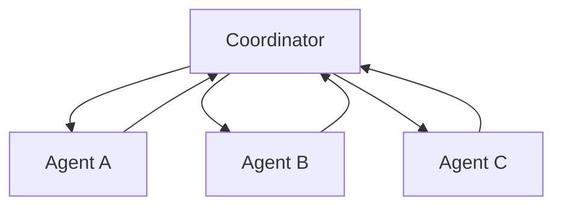

# Hệ thống Multi-Agent

Một **hệ thống đa tác nhân (multi-agent system / 다중 에이전트 시스템)** có nhiều agent tương tác để hoàn thành cùng một task hoặc một nhóm task liên quan. Ý tưởng này hấp dẫn vì có thể chia vai trò, chạy subtask song song hoặc tạo cơ chế kiểm tra chéo, nhưng mỗi agent bổ sung cũng làm tăng chi phí giao tiếp, điều phối và số failure mode.

```text
Coordinator
├── Research Agent
├── Coding Agent
├── Verification Agent
└── Domain Reviewer
```

## Vì sao dùng nhiều Agent?

Multi-agent có giá trị khi task có cấu trúc phân rã tự nhiên, ví dụ:

- các subtask độc lập có thể chạy song song;
- mỗi subtask cần context hoặc chuyên môn khác nhau;
- cần phân tách nhiệm vụ (separation of duties);
- một agent tạo artifact và agent khác verify;
- cần mô phỏng nhiều stakeholder hoặc perspective.

Không nên thêm nhiều agent chỉ với giả định rằng “nhiều agent = thông minh hơn”.

## Chuyên môn hóa vai trò

Các agent có thể khác nhau về:

```text
instruction
tool được phép dùng
permission
context
model
memory
success criterion
```

Ví dụ verifier agent chỉ có quyền đọc và chạy test, không có quyền write. Sự tách quyền này tạo một ranh giới kỹ thuật thực sự, đáng tin hơn việc dùng cùng một agent rồi prompt “hãy tự kiểm tra lại mình”.

## Coordinator Pattern

Trong **mẫu điều phối trung tâm (coordinator pattern)**, một coordinator phân task và tổng hợp kết quả:



Ưu điểm là ownership rõ và dễ quan sát. Nhược điểm là coordinator có thể trở thành bottleneck hoặc single point of failure.

## Blackboard Pattern

Trong **blackboard pattern**, nhiều agent đọc và ghi vào một workspace chung:

```text
shared task board
shared artifact store
shared state store
```

Cách này giảm phụ thuộc vào một coordinator duy nhất nhưng lại đòi hỏi rule rõ về ownership, locking, versioning và conflict resolution.

## Peer-to-Peer Debate

Các agent có thể critique proposal của nhau. Pattern này đôi khi giúp mở rộng coverage, nhưng cũng dễ tạo vòng lặp dài, tốn token và sinh false consensus.

Diversity chỉ có giá trị khi agent thực sự khác nhau về evidence, tool, role hoặc model. Nhiều bản clone cùng một prompt thường có lỗi tương quan cao.

## Producer–Verifier

Một pattern mạnh và dễ kiểm soát hơn:

```text
Producer tạo solution
→ Verifier kiểm bằng tiêu chí độc lập
→ Producer sửa nếu verification fail
```

Verifier nên có source hoặc tool độc lập, ví dụ test runner, schema validator, linter hoặc policy engine. Nếu verifier chỉ đọc prose của producer, hai agent vẫn có thể chia sẻ cùng một sai lầm.

## Hợp đồng Delegation

Subtask giao cho agent nên có contract rõ:

```text
objective
input
allowed tools
output schema
completion criterion
budget
deadline
```

Instruction kiểu “Research this” quá mơ hồ để orchestration đáng tin cậy.

## Chi phí giao tiếp

Nếu `n` agent giao tiếp all-to-all, số cạnh giao tiếp tiềm năng tăng gần:

\[
O(n^2)
\]

Do đó topology rất quan trọng. Mô hình hierarchical hoặc coordinator thường giảm lượng chatter không cần thiết.

## Tính nhất quán của Shared State

Hai agent cùng sửa một artifact có thể conflict. Hệ thống cần các cơ chế quen thuộc từ distributed systems:

- lock;
- versioning;
- optimistic concurrency;
- merge strategy;
- ownership partition;
- event ordering.

Multi-agent system không loại bỏ bài toán consistency; nó làm bài toán đó rõ hơn.

## Duplicate Work

Nếu không có task registry hoặc trạng thái assignment chung, nhiều agent có thể vô tình làm cùng một subtask. Coordinator hoặc workflow engine nên hỗ trợ assignment có tính idempotent và trạng thái như:

```text
PENDING
RUNNING
DONE
FAILED
CANCELLED
```

## Trust Boundary

Không phải agent nào cũng cần cùng permission.

Ví dụ:

```text
Research Agent → đọc web và tài liệu
Reviewer       → chỉ đọc artifact
Deploy Agent   → quyền production có kiểm soát
Coordinator    → điều phối nhưng không trực tiếp có mọi credential
```

Nếu một agent bị prompt injection hoặc compromise, blast radius không nên lan sang toàn hệ thống.

## Consensus không đồng nghĩa sự thật

Nếu ba agent cùng dùng một model, cùng training distribution và cùng context, lỗi của chúng có thể tương quan. Majority vote chỉ giúp khi các error đủ độc lập.

Do đó consensus nên được xem là một signal bổ sung, không phải proof of correctness.

## Multi-Agent và Parallel Tool Calls

Không cần tạo nhiều agent chỉ để fetch năm API song song. Parallel tool call trong một workflow đơn thường rẻ và dễ debug hơn.

Dùng multi-agent khi thực sự cần:

```text
state riêng
context riêng
permission riêng
reasoning role riêng
verification boundary riêng
```

chứ không chỉ vì cần concurrency.

## Handoff giữa các Agent

Handoff nên chuyển state có cấu trúc:

```text
đã làm gì
evidence nào đã có
artifact nào đã tạo
phần nào còn thiếu
constraint nào phải giữ
resource id / version liên quan
```

Không nên chỉ chuyển raw transcript dài rồi để agent sau tự suy ra trạng thái hiện tại.

## Ví dụ: thay đổi phần mềm

```text
Planner      → xác định file và test cần chạm tới
Implementer  → sửa code
Tester       → chạy test suite
Reviewer     → inspect diff theo requirement
Coordinator  → quyết định done hay revise
```

Điểm mạnh là separation of duties. Điểm yếu là latency, token cost và coordination overhead.

## Ví dụ: Research

Nhiều agent có thể chia source theo region, company hoặc criterion, sau đó aggregator tổng hợp. Citation provenance phải được giữ xuyên suốt handoff để final answer không mất nguồn.

## Đánh giá Multi-Agent System

Không chỉ đo final answer. Nên theo dõi:

- end-to-end task success;
- đóng góp của từng agent;
- tỷ lệ duplicate work;
- communication token;
- coordination latency;
- conflict rate;
- verifier catch rate;
- failure recovery rate.

Nếu kiến trúc multi-agent không tăng success hoặc reliability đủ để bù chi phí, nó là overengineering.

## Mô hình tư duy

> **Multi-agent là một distributed system gồm các worker xác suất.**

Thách thức không chỉ nằm ở reasoning của từng agent mà còn ở phân công task, giao tiếp, consistency, quyền hạn và verification.

## Những nhầm lẫn thường gặp

### “Nhiều agent tự nhiên sẽ thông minh hơn một agent”

Không. Coordination overhead và correlated failure có thể làm hệ thống tệ hơn.

### “Role chỉ cần đổi system prompt”

Role mạnh hơn khi khác permission, tool, context, model hoặc tiêu chí evaluation.

### “Debate luôn tăng accuracy”

Không. Debate có thể chỉ làm output dài hơn hoặc củng cố cùng một lỗi nếu các agent không có evidence độc lập.

## Liên kết kiến thức

Multi-agent system nối trực tiếp với distributed systems, organizational design, workflow orchestration, ensemble reasoning và security boundary.

Xem tiếp: [Điều phối Agent](./08_agent_orchestration.md).