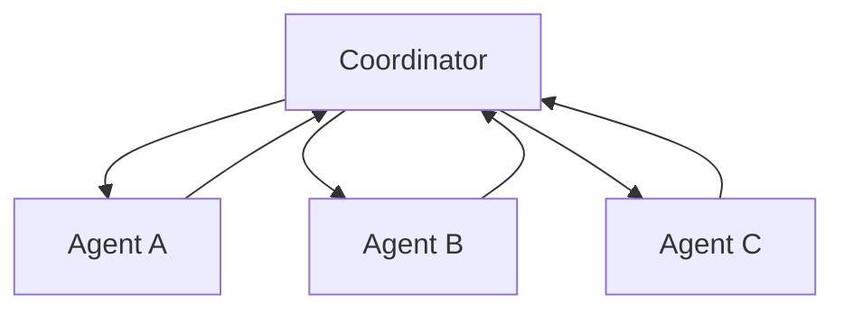

# Multi-Agent Systems

Một **multi-agent system (다중 에이전트 시스템)** có nhiều agents tương tác để hoàn thành task. Ý tưởng hấp dẫn vì có thể chia vai trò hoặc chạy subtasks song song, nhưng thêm agent cũng thêm communication, coordination và failure modes.

```text
Coordinator
├── Research Agent
├── Coding Agent
├── Verification Agent
└── Domain Reviewer
```

## Vì sao dùng nhiều agent?

Multi-agent hữu ích khi task có decomposition tự nhiên:

- subtasks độc lập có thể parallelize;
- cần specialization/context riêng;
- cần separation of duties;
- một agent tạo artifact và agent khác verify;
- cần simulate multiple stakeholders.

Không nên dùng chỉ để “tăng intelligence”.

## Role Specialization

Agent có thể khác nhau về:

```text
instructions
available tools
permissions
context
model
memory
success criteria
```

Ví dụ verifier agent chỉ có read/test tools, không có write permission. Separation này tăng reliability hơn việc prompt cùng model “hãy tự kiểm tra mình”.

## Coordinator Pattern

Coordinator phân task và aggregate results.



Coordinator có thể trở thành bottleneck hoặc single point of failure.

## Blackboard Pattern

Agents đọc/ghi shared workspace:

```text
shared task board / artifact store / state store
```

Coordinator nhẹ hơn, nhưng cần conflict resolution và ownership rules.

## Peer-to-Peer Debate

Agents critique proposals của nhau. Có thể tăng coverage, nhưng dễ tạo redundant token usage và false consensus.

Independent diversity chỉ có giá trị nếu agents thật sự có different evidence/roles, không phải clone cùng prompt.

## Producer–Verifier

Một pattern mạnh:

```text
Producer creates solution
→ Verifier tests against independent criteria
→ Producer revises if needed
```

Verifier nên có independent evidence/tooling. Nếu verifier chỉ đọc prose của producer, correlated errors vẫn cao.

## Delegation Contract

Subtask giao cho agent nên có:

```text
objective
inputs
allowed tools
output schema
completion criteria
budget
deadline
```

“Research this” quá mơ hồ.

## Communication Cost

Nếu `n` agents all-to-all communicate, potential communication edges tăng gần:

\[
O(n^2)
\]

Vì vậy topology quan trọng. Hierarchical/coordinator patterns giảm chatter.

## Shared State Consistency

Hai agents cùng edit artifact có thể conflict. Cần:

- locks;
- versioning;
- merge strategy;
- ownership partition;
- event ordering.

Multi-agent systems inherits distributed systems problems.

## Duplicate Work

Without task registry, agents có thể cùng làm một subtask. Coordinator cần idempotent assignment hoặc shared task status.

## Trust Boundaries

Không phải agent nào cũng nên có same permissions. Research agent đọc web; deploy agent có production permission; verifier read-only.

Compromise một agent không nên grant access toàn system.

## Consensus không đảm bảo truth

Nếu ba agents cùng dùng same model/training data, errors có thể correlated. Majority vote chỉ hiệu quả khi errors sufficiently independent.

## Multi-Agent vs Parallel Tool Calls

Nhiều agent không cần thiết nếu chỉ muốn fetch 5 APIs song song. Parallel tools trong một workflow đơn giản hơn.

Dùng multi-agent khi cần distinct reasoning/state/permission boundaries, không chỉ concurrency.

## Agent Handoff

Handoff cần explicit transfer state:

```text
what has been done
what evidence exists
what remains
constraints
artifact references
```

Không nên chỉ gửi raw transcript.

## Example: Software Change

```text
Planner → identifies files/tests
Implementer → edits code
Tester → runs test suite
Reviewer → inspects diff against requirements
Coordinator → decides done/revise
```

Điểm mạnh là separation of duties; điểm yếu là latency/cost.

## Example: Research

Agents có thể split sources theo region/criterion, sau đó aggregator merge. Citation provenance phải preserved xuyên handoffs.

## Evaluation

Đánh giá:

- end-to-end task success;
- per-agent contribution;
- duplicated work;
- communication tokens;
- coordination latency;
- conflict rate;
- verifier catch rate.

Nếu multi-agent không tăng success đủ để bù cost, architecture là overengineering.

## Mental Model

> **Multi-agent là distributed system của probabilistic workers.**

Điều khó không chỉ là reasoning từng agent mà là task allocation, communication, consistency và trust.

## Common Misconceptions

### “Nhiều agent sẽ tự nhiên thông minh hơn một agent”

Không. Coordination overhead và correlated failures có thể làm tệ hơn.

### “Agent roles chỉ cần đổi system prompt”

Role mạnh hơn khi khác permissions, tools, context và evaluation criteria.

### “Debate luôn tăng accuracy”

Debate có thể tạo verbosity hoặc reinforce common error nếu evidence không independent.

## Knowledge Connection

Multi-agent systems nối distributed systems, organizational design, workflow orchestration và ensemble reasoning.

Xem tiếp: [Agent Orchestration](./08_agent_orchestration.md).