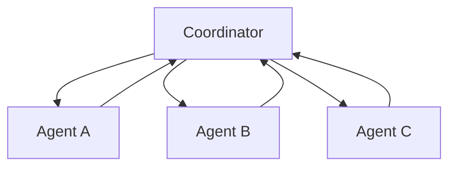

# Multi-Agent các hệ thống (systems / 시스템들)

> **Mạch đọc:** [README](./README.md) là bản đồ owner của **Multi-Agent các hệ thống (systems / 시스템들)**; nhìn vào vị trí đó trước để biết file này đang phục vụ nhánh kiến thức nào. **Vì sao dùng nhiều tác nhân (agent / 에이전트)?** mở đối tượng chính của file và câu hỏi cần theo dõi; sau đó sang **Role Specialization** để mở rộng đối tượng sang phạm vi kế cận. Cách đi này giữ lại điểm tựa của section đầu và cho biết kết luận sẽ được dùng ở đâu, thay vì dừng ở định nghĩa đầu tiên.

Một **multi-agent hệ thống (system / 시스템)** có nhiều agents tương tác để hoàn thành tác vụ (task / 작업). Ý tưởng hấp dẫn vì có thể chia vai trò hoặc chạy subtasks song song, nhưng thêm tác nhân (agent / 에이전트) cũng thêm communication, coordination và thất bại (failure / 실패) modes.

```text
Coordinator
├── Research Agent
├── Coding Agent
├── Verification Agent
└── Domain Reviewer
```

## Vì sao dùng nhiều tác nhân (agent / 에이전트)?

Multi-agent hữu ích khi tác vụ (task / 작업) có decomposition tự nhiên:

- subtasks độc lập có thể parallelize;
- cần specialization/ngữ cảnh (context / 맥락) riêng;
- cần separation of duties;
- một tác nhân (agent / 에이전트) tạo sản phẩm tạo ra (artifact / 산출물) và tác nhân (agent / 에이전트) khác verify;
- cần simulate multiple stakeholders.

Không nên dùng chỉ để “tăng intelligence”.

> **Chuyển mạch:** Trong **Multi-Agent các hệ thống (systems / 시스템들)**, **Role Specialization** tiếp nhận điểm tựa từ **Vì sao dùng nhiều tác nhân (agent / 에이전트)?** nhưng đổi góc nhìn sang câu hỏi của chính nó; đọc liền hai mục để thấy mối quan hệ đó. Từ đây, **Coordinator mẫu (pattern / 패턴)** sẽ cho biết hệ quả hoặc giới hạn ấy hiện ra ở đâu.

## Role Specialization

Tác nhân (agent / 에이전트) có thể khác nhau về:

```text
instructions
available tools
permissions
context
model
memory
success criteria
```

Ví dụ verifier tác nhân (agent / 에이전트) chỉ có read/kiểm thử (test / 테스트) tools, không có ghi (write / 쓰기) permission. Separation này tăng độ tin cậy (reliability / 신뢰성) hơn việc prompt cùng mô hình (model / 모델) “hãy tự kiểm tra mình”.

> **Chuyển mạch:** Ở chặng này của **Multi-Agent các hệ thống (systems / 시스템들)**, **Coordinator mẫu (pattern / 패턴)** tiếp nhận điểm tựa từ **Role Specialization** nhưng đổi góc nhìn sang câu hỏi của chính nó; đọc liền hai mục để thấy mối quan hệ đó. Từ đây, **Blackboard mẫu (pattern / 패턴)** sẽ cho biết hệ quả hoặc giới hạn ấy hiện ra ở đâu.

## Coordinator mẫu (pattern / 패턴)

Coordinator phân tác vụ (task / 작업) và aggregate results.


```mermaid
flowchart TD
    C[Coordinator] --> A[Agent A]
    C --> B[Agent B]
    C --> D[Agent C]
    A --> C
    B --> C
    D --> C
```

Coordinator có thể trở thành bottleneck hoặc single điểm (point / 지점) of thất bại (failure / 실패).

> **Chuyển mạch:** Đặt trong câu hỏi lớn của **Multi-Agent các hệ thống (systems / 시스템들)**, **Blackboard mẫu (pattern / 패턴)** tiếp nhận điểm tựa từ **Coordinator mẫu (pattern / 패턴)** nhưng đổi góc nhìn sang câu hỏi của chính nó; đọc liền hai mục để thấy mối quan hệ đó. Từ đây, **Peer-to-Peer Debate** sẽ cho biết hệ quả hoặc giới hạn ấy hiện ra ở đâu.

## Blackboard mẫu (pattern / 패턴)

Agents đọc/ghi dùng chung (shared / 공유) workspace:

```text
shared task board / artifact store / state store
```

Coordinator nhẹ hơn, nhưng cần giải quyết xung đột (conflict resolution / 충돌 해결) và quyền sở hữu (ownership / 소유권) rules.

> **Chuyển mạch:** Trong **Multi-Agent các hệ thống (systems / 시스템들)**, **Peer-to-Peer Debate** tiếp nhận điểm tựa từ **Blackboard mẫu (pattern / 패턴)** nhưng đổi góc nhìn sang câu hỏi của chính nó; đọc liền hai mục để thấy mối quan hệ đó. Từ đây, **Producer–Verifier** sẽ cho biết hệ quả hoặc giới hạn ấy hiện ra ở đâu.

## Peer-to-Peer Debate

Agents critique proposals của nhau. Có thể tăng coverage, nhưng dễ tạo redundant đơn vị từ (token / 토큰) usage và false consensus.

Independent diversity chỉ có giá trị nếu agents thật sự có different bằng chứng (evidence / 증거)/roles, không phải clone cùng prompt.

> **Chuyển mạch:** Ở chặng này của **Multi-Agent các hệ thống (systems / 시스템들)**, **Producer–Verifier** tiếp nhận điểm tựa từ **Peer-to-Peer Debate** nhưng đổi góc nhìn sang câu hỏi của chính nó; đọc liền hai mục để thấy mối quan hệ đó. Từ đây, **Delegation đặc tả hợp đồng (contract / 계약)** sẽ cho biết hệ quả hoặc giới hạn ấy hiện ra ở đâu.

## Producer–Verifier

Một mẫu (pattern / 패턴) mạnh:

```text
Producer creates solution
→ Verifier tests against independent criteria
→ Producer revises if needed
```

Verifier nên có independent bằng chứng (evidence / 증거)/tooling. Nếu verifier chỉ đọc prose của producer, correlated errors vẫn cao.

> **Chuyển mạch:** Đặt trong câu hỏi lớn của **Multi-Agent các hệ thống (systems / 시스템들)**, **Delegation đặc tả hợp đồng (contract / 계약)** tiếp nhận điểm tựa từ **Producer–Verifier** nhưng đổi góc nhìn sang câu hỏi của chính nó; đọc liền hai mục để thấy mối quan hệ đó. Từ đây, **Communication chi phí (cost / 비용)** sẽ cho biết hệ quả hoặc giới hạn ấy hiện ra ở đâu.

## Delegation đặc tả hợp đồng (contract / 계약)

Subtask giao cho tác nhân (agent / 에이전트) nên có:

```text
objective
inputs
allowed tools
output schema
completion criteria
budget
deadline
```

“Research this” quá mơ hồ.

> **Chuyển mạch:** Trong **Multi-Agent các hệ thống (systems / 시스템들)**, **Communication chi phí (cost / 비용)** tiếp nhận điểm tựa từ **Delegation đặc tả hợp đồng (contract / 계약)** nhưng đổi góc nhìn sang câu hỏi của chính nó; đọc liền hai mục để thấy mối quan hệ đó. Từ đây, **Trạng thái dùng chung (shared state / 공유 상태) Consistency** sẽ cho biết hệ quả hoặc giới hạn ấy hiện ra ở đâu.

## Communication chi phí (cost / 비용)

Nếu `n` agents all-to-all communicate, potential communication edges tăng gần:

\[
O(n^2)
\]

Vì vậy topology quan trọng. Hierarchical/coordinator patterns giảm chatter.

> **Chuyển mạch:** Ở chặng này của **Multi-Agent các hệ thống (systems / 시스템들)**, **Trạng thái dùng chung (shared state / 공유 상태) Consistency** tiếp nhận điểm tựa từ **Communication chi phí (cost / 비용)** nhưng đổi góc nhìn sang câu hỏi của chính nó; đọc liền hai mục để thấy mối quan hệ đó. Từ đây, **Duplicate công việc (work / 작업)** sẽ cho biết hệ quả hoặc giới hạn ấy hiện ra ở đâu.

## Trạng thái dùng chung (shared state / 공유 상태) Consistency

Hai agents cùng edit sản phẩm tạo ra (artifact / 산출물) có thể xung đột (conflict / 충돌). Cần:

- locks;
- versioning;
- merge chiến lược (strategy / 전략);
- quyền sở hữu (ownership / 소유권) partition;
- sự kiện (event / 이벤트) thứ tự (ordering / 순서).

Multi-agent các hệ thống (systems / 시스템들) inherits phân tán (distributed / 분산) các hệ thống (systems / 시스템들) problems.

> **Chuyển mạch:** Đặt trong câu hỏi lớn của **Multi-Agent các hệ thống (systems / 시스템들)**, **Duplicate công việc (work / 작업)** tiếp nhận điểm tựa từ **Trạng thái dùng chung (shared state / 공유 상태) Consistency** nhưng đổi góc nhìn sang câu hỏi của chính nó; đọc liền hai mục để thấy mối quan hệ đó. Từ đây, **Trust Boundaries** sẽ cho biết hệ quả hoặc giới hạn ấy hiện ra ở đâu.

## Duplicate công việc (work / 작업)

Without tác vụ (task / 작업) registry, agents có thể cùng làm một subtask. Coordinator cần idempotent assignment hoặc dùng chung (shared / 공유) tác vụ (task / 작업) status.

> **Chuyển mạch:** Trong **Multi-Agent các hệ thống (systems / 시스템들)**, **Trust Boundaries** tiếp nhận điểm tựa từ **Duplicate công việc (work / 작업)** nhưng đổi góc nhìn sang câu hỏi của chính nó; đọc liền hai mục để thấy mối quan hệ đó. Từ đây, **Consensus không đảm bảo truth** sẽ cho biết hệ quả hoặc giới hạn ấy hiện ra ở đâu.

## Trust Boundaries

Không phải tác nhân (agent / 에이전트) nào cũng nên có same permissions. Research tác nhân (agent / 에이전트) đọc web; deploy tác nhân (agent / 에이전트) có môi trường vận hành (production / 운영 환경) permission; verifier read-only.

Compromise một tác nhân (agent / 에이전트) không nên grant truy cập (access / 접근) toàn hệ thống (system / 시스템).

> **Chuyển mạch:** Ở chặng này của **Multi-Agent các hệ thống (systems / 시스템들)**, **Consensus không đảm bảo truth** tiếp nhận điểm tựa từ **Trust Boundaries** nhưng đổi góc nhìn sang câu hỏi của chính nó; đọc liền hai mục để thấy mối quan hệ đó. Từ đây, **Multi-Agent vs Parallel công cụ (tool / 도구) Calls** sẽ cho biết hệ quả hoặc giới hạn ấy hiện ra ở đâu.

## Consensus không đảm bảo truth

Nếu ba agents cùng dùng same mô hình (model / 모델)/dữ liệu huấn luyện (training data / 학습 데이터), errors có thể correlated. Majority vote chỉ hiệu quả khi errors sufficiently independent.

> **Chuyển mạch:** Đặt trong câu hỏi lớn của **Multi-Agent các hệ thống (systems / 시스템들)**, **Multi-Agent vs Parallel công cụ (tool / 도구) Calls** tiếp nhận điểm tựa từ **Consensus không đảm bảo truth** nhưng đổi góc nhìn sang câu hỏi của chính nó; đọc liền hai mục để thấy mối quan hệ đó. Từ đây, **Tác nhân (agent / 에이전트) Handoff** sẽ cho biết hệ quả hoặc giới hạn ấy hiện ra ở đâu.

## Multi-Agent vs Parallel công cụ (tool / 도구) Calls

Nhiều tác nhân (agent / 에이전트) không cần thiết nếu chỉ muốn fetch 5 APIs song song. Parallel tools trong một workflow đơn giản hơn.

Dùng multi-agent khi cần distinct lập luận (reasoning / 추론)/trạng thái (state / 상태)/permission boundaries, không chỉ tính đồng thời (concurrency / 동시성).

> **Chuyển mạch:** Trong **Multi-Agent các hệ thống (systems / 시스템들)**, **Tác nhân (agent / 에이전트) Handoff** tiếp nhận điểm tựa từ **Multi-Agent vs Parallel công cụ (tool / 도구) Calls** nhưng đổi góc nhìn sang câu hỏi của chính nó; đọc liền hai mục để thấy mối quan hệ đó. Từ đây, **Example: Software thay đổi (change / 변경)** sẽ cho biết hệ quả hoặc giới hạn ấy hiện ra ở đâu.

## Tác nhân (agent / 에이전트) Handoff

Handoff cần tường minh (explicit / 명시적) transfer trạng thái (state / 상태):

```text
what has been done
what evidence exists
what remains
constraints
artifact references
```

Không nên chỉ gửi raw transcript.

> **Chuyển mạch:** Ở chặng này của **Multi-Agent các hệ thống (systems / 시스템들)**, **Tác nhân (agent / 에이전트) Handoff** cho ta quy tắc; **Example: Software thay đổi (change / 변경)** đặt quy tắc ấy vào tình huống cụ thể để thấy nó hoạt động đến đâu. Từ đây, **Example: Research** sẽ cho biết hệ quả hoặc giới hạn ấy hiện ra ở đâu.

## Example: Software thay đổi (change / 변경)

Phần này chuyển khái niệm Computer Science thành cấu trúc, ví dụ hoặc quy trình có thể kiểm tra. Hãy xác định câu hỏi mà mục trả lời rồi nối kết luận với phần kế tiếp.

```text
Planner → identifies files/tests
Implementer → edits code
Tester → runs test suite
Reviewer → inspects diff against requirements
Coordinator → decides done/revise
```

Điểm mạnh là separation of duties; điểm yếu là độ trễ (latency / 지연 시간)/chi phí (cost / 비용).

> **Chuyển mạch:** Đặt trong câu hỏi lớn của **Multi-Agent các hệ thống (systems / 시스템들)**, **Example: Software thay đổi (change / 변경)** cho ta quy tắc; **Example: Research** đặt quy tắc ấy vào tình huống cụ thể để thấy nó hoạt động đến đâu. Từ đây, **Evaluation** sẽ cho biết hệ quả hoặc giới hạn ấy hiện ra ở đâu.

## Example: Research

Agents có thể split sources theo region/criterion, sau đó aggregator merge. Citation provenance phải preserved xuyên handoffs.

> **Chuyển mạch:** Trong **Multi-Agent các hệ thống (systems / 시스템들)**, **Example: Research** cho ta quy tắc; **Evaluation** đặt quy tắc ấy vào tình huống cụ thể để thấy nó hoạt động đến đâu. Từ đây, **Mô hình tư duy (mental model / 사고 모델)** sẽ cho biết hệ quả hoặc giới hạn ấy hiện ra ở đâu.

## Evaluation

Đánh giá:

- end-to-end tác vụ (task / 작업) success;
- per-agent contribution;
- duplicated công việc (work / 작업);
- communication tokens;
- coordination độ trễ (latency / 지연 시간);
- xung đột (conflict / 충돌) tỷ lệ (rate / 비율);
- verifier catch tỷ lệ (rate / 비율).

Nếu multi-agent không tăng success đủ để bù chi phí (cost / 비용), kiến trúc (architecture / 아키텍처) là overengineering.

> **Chuyển mạch:** Ở chặng này của **Multi-Agent các hệ thống (systems / 시스템들)**, **Mô hình tư duy (mental model / 사고 모델)** gom các mảnh từ **Evaluation** thành một kết luận có thể mang sang phần kế tiếp. Từ đây, **Dùng chung (common / 공통) Misconceptions** sẽ cho biết hệ quả hoặc giới hạn ấy hiện ra ở đâu.

## Mô hình tư duy (mental model / 사고 모델)

> **Multi-agent là hệ thống phân tán (distributed system / 분산 시스템) của probabilistic workers.**

Điều khó không chỉ là lập luận (reasoning / 추론) từng tác nhân (agent / 에이전트) mà là tác vụ (task / 작업) allocation, communication, consistency và trust.

> **Chuyển mạch:** Đặt trong câu hỏi lớn của **Multi-Agent các hệ thống (systems / 시스템들)**, **Dùng chung (common / 공통) Misconceptions** gom các mảnh từ **Mô hình tư duy (mental model / 사고 모델)** thành một kết luận có thể mang sang phần kế tiếp. Từ đây, **Liên kết kiến thức (knowledge connection / 지식 연결)** sẽ cho biết hệ quả hoặc giới hạn ấy hiện ra ở đâu.

## Dùng chung (common / 공통) Misconceptions

### “Nhiều tác nhân (agent / 에이전트) sẽ tự nhiên thông minh hơn một tác nhân (agent / 에이전트)”

Không. Coordination overhead và correlated failures có thể làm tệ hơn.

### “tác nhân (agent / 에이전트) roles chỉ cần đổi hệ thống (system / 시스템) prompt”

Role mạnh hơn khi khác permissions, tools, ngữ cảnh (context / 맥락) và evaluation criteria.

### “Debate luôn tăng accuracy”

Debate có thể tạo verbosity hoặc reinforce dùng chung (common / 공통) lỗi (error / 오류) nếu bằng chứng (evidence / 증거) không independent.

> **Chuyển mạch:** Trong **Multi-Agent các hệ thống (systems / 시스템들)**, sau nội dung của **Dùng chung (common / 공통) Misconceptions**, **Liên kết kiến thức (knowledge connection / 지식 연결)** chỉ rõ tài liệu chuẩn và vị trí sở hữu để người học biết phần nào cần quay lại khi muốn đào sâu. Phần còn lại của file dùng kết quả này để khép lại mạch giải thích.

## Liên kết kiến thức (knowledge connection / 지식 연결)

Multi-agent các hệ thống (systems / 시스템들) nối phân tán (distributed / 분산) các hệ thống (systems / 시스템들), organizational thiết kế (design / 설계), workflow orchestration và ensemble lập luận (reasoning / 추론).

Xem tiếp: [Agent Orchestration](./08_agent_orchestration.md).

> **Bàn giao:** Sau **Liên kết kiến thức (knowledge connection / 지식 연결)**, hãy giữ lại kết luận và ranh giới của mục này; quay về [README](./README.md) khi cần định vị owner hoặc chọn nhánh học tiếp theo.
