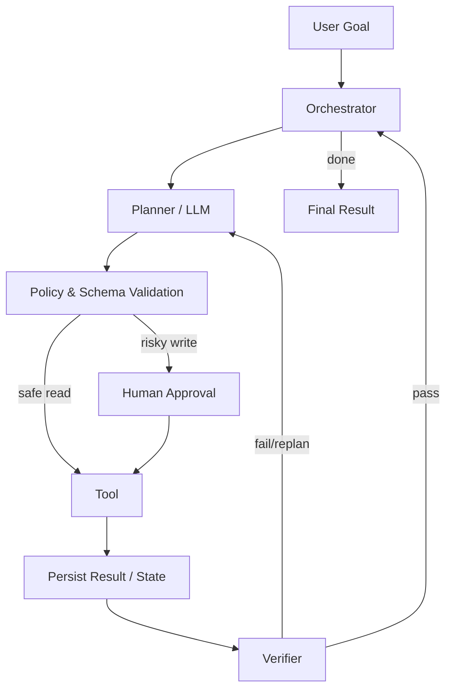

# Reliable Agent Design

Reliable agent không đến từ một prompt “hãy cẩn thận”. Reliability xuất hiện khi architecture giới hạn uncertainty, kiểm soát side effects, verify progress và phục hồi được sau failure.

Một production mental model:

```text
User goal
→ scoped plan
→ bounded action space
→ validated execution
→ observed result
→ verification
→ persisted state
→ continue / escalate / stop
```

## Principle 1: Minimize autonomy where it adds no value

Nếu logic known trước, code/workflow deterministic thường đáng tin hơn. Chỉ giao cho model những decision cần semantic flexibility.

```text
known branch → code it
ambiguous semantic choice → model may decide
high-risk write → policy + approval
```

## Principle 2: Narrow the action space

Tool ít nhưng meaningful tốt hơn raw shell/API toàn quyền. Typed actions tạo boundary rõ cho authorization và audit.

## Principle 3: Separate proposal from execution

LLM đề xuất action. Runtime kiểm:

```text
schema
business constraints
permission
risk
budget
approval
```

rồi mới execute.

## Principle 4: Use least privilege

Credentials và tools chỉ có quyền cần thiết. Read-only mặc định; write permission tách riêng; destructive operations cần stronger gates.

## Principle 5: Make writes idempotent

Retry-safe design tránh duplicate side effects. Dùng idempotency key, resource version hoặc transaction ID.

## Principle 6: Verify effects, not intentions

Sau mutation:

```text
write → re-read / test / inspect external state
```

Không chấp nhận model assertion “đã xong”.

## Principle 7: Persist structured state

Conversation transcript không đủ. Persist task status, resource IDs, plan, completed steps, approvals và verification.

## Principle 8: Design for restart

Worker/model/API có thể fail. Checkpoint after committed side effects. Resume từ known state thay vì replay mù.

## Principle 9: Classify errors

Transient, semantic, permission và conflict errors cần recovery khác nhau. Blind retry là anti-pattern.

## Principle 10: Bound the loop

Đặt limits:

```text
max steps
max tokens
max tool calls
max cost
wall-clock deadline
repetition threshold
```

Agent cần biết khi nào escalate.

## Principle 11: Context is curated, not dumped

Inject minimum relevant state/evidence. Tách trusted instructions khỏi untrusted content. Preserve provenance.

## Principle 12: Treat retrieved/tool content as untrusted

Document có thể chứa prompt injection. External data không được tự nâng cấp thành instruction authority.

## Principle 13: Human approval by risk class

Approval policy nên explicit:

| Action | Default |
|---|---|
| Search/read | automatic |
| Draft artifact | automatic |
| Modify reversible sandbox state | controlled automatic |
| Send external communication | often approval |
| Production deploy | approval/policy |
| Delete/transfer sensitive assets | strict approval |

Exact policy phụ thuộc domain.

## Principle 14: Use sandbox for exploration

Coding/browser agents nên thử trong sandbox/staging khi có thể. Failure trong isolated environment rẻ hơn production.

## Principle 15: Prefer reversible actions

Ordering:

```text
observe → simulate → stage → verify → commit
```

Delayed irreversible action tạo opportunity kiểm tra.

## Principle 16: Separate planner, executor and verifier concerns

Không nhất thiết dùng 3 models, nhưng logical roles nên tách:

```text
planner proposes
executor performs allowed operation
verifier checks acceptance criteria
```

Independent verifier giảm self-confirmation bias.

## Principle 17: Preserve provenance

Facts/decisions nên link evidence. Với RAG/research agent, citation phải map tới source chunks/documents. Với tool action, log request/result resource IDs.

## Principle 18: Version mutable state

Optimistic concurrency:

```text
read v10
propose update
commit only if still v10
```

Nếu stale, refetch và replan.

## Principle 19: Monitor economics

Reliable nhưng cost vô hạn không production-ready. Track:

```text
success per dollar
success per second
steps/task
retries/task
cost by tool/model
```

## Principle 20: Evaluate adversarially

Test happy path chưa đủ. Inject:

- stale data;
- timeouts;
- malicious documents;
- missing permissions;
- partial success;
- conflicting state;
- goal changes.

## Reliability Architecture Example



## Reliability Budget

Không phải mọi failure equal. Allocate engineering effort theo expected loss:

\[
Expected\ Loss = P(failure)\times Impact(failure)
\]

Low-impact summarization có thể accept more variance. Payment/deletion cần much stricter controls.

## Graceful Degradation

Khi model/tool unavailable:

- fallback model;
- read-only mode;
- reduced scope;
- queue for later;
- human handoff.

Fail closed cho high-risk writes, không improvise insecurely.

## Safe Defaults

Ambiguous action nên default non-destructive. Example nếu không rõ “remove” là hide hay delete, ask/choose reversible operation tùy policy.

## Auditability

Store enough to reconstruct:

```text
who requested
what state was observed
which action proposed
which policy approved
what tool actually did
what verification saw
```

Audit log phải chống tampering theo risk level.

## Data Privacy

Context minimization cũng là privacy control. Không gửi toàn customer database cho model nếu task cần một record. Redact secrets và PII khi không cần.

## Model Updates are System Changes

Đổi model version có thể thay tool behavior. Treat like dependency upgrade:

```text
offline eval
canary
monitor
rollback capability
```

## Prompt/Tool Schema Versioning

Version prompt templates, tool schemas và policies để trace regression về exact configuration.

## Incident Response

Khi agent gây incident:

1. stop/cancel affected tasks;
2. revoke dangerous credentials nếu cần;
3. identify side effects;
4. rollback/compensate;
5. preserve traces;
6. classify root cause;
7. add regression scenario.

## Mental Model

> **Reliable agent = bounded probabilistic reasoning inside deterministic safety and systems boundaries.**

Model không cần hoàn hảo nếu system phát hiện, giới hạn và phục hồi failure tốt. Nhưng high-risk actions không nên phụ thuộc vào model self-restraint alone.

## Common Misconceptions

### “Model mạnh hơn sẽ giải quyết reliability”

Model quality giúp, nhưng không thay transaction, authorization, state consistency hay observability.

### “Guardrail prompt là security boundary”

Prompt là behavioral signal, không phải access-control mechanism.

### “Human-in-the-loop tự động làm hệ thống an toàn”

Approval overload gây rubber-stamping. Chỉ escalate meaningful risk với context rõ.

### “Agent có thể tự verify mọi thứ”

Verification tốt nhất dựa deterministic tests, independent sources hoặc external state khi có thể.

## Knowledge Connection

Reliable agent design kết hợp Software Engineering, Security, Distributed Systems, Databases, HCI, AI Evaluation và classical control loops. Đây là điểm kết thúc layer Agent trước khi chuyển sang Reinforcement Learning, nơi agent học policy trực tiếp từ reward/interaction.