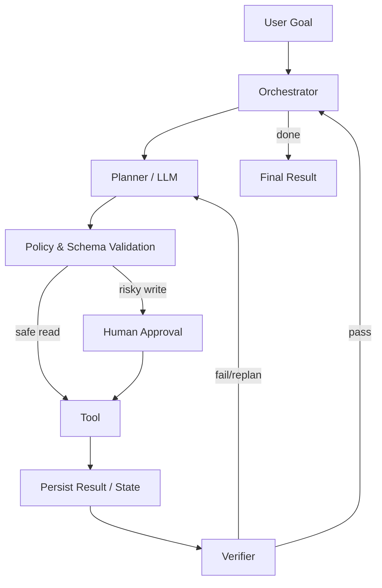

# Reliable tác nhân (agent / 에이전트) thiết kế (design / 설계)

> **Mạch đọc:** [README](./README.md) là bản đồ owner của **Reliable tác nhân (agent / 에이전트) thiết kế (design / 설계)**; nhìn vào vị trí đó trước để biết file này đang phục vụ nhánh kiến thức nào. **Principle 1: Minimize autonomy where it adds no giá trị (value / 값)** xác định điều kiện hoặc ranh giới mà các cơ chế sau phải tôn trọng; sau đó sang **Principle 2: Narrow the hành động (action / 동작) không gian (space / 공간)** để chuyển câu hỏi ấy thành điều kiện phải giữ. Mạch này nối reliable agent design với planning, tool use, verification và failure recovery, để agent có hành vi kiểm soát được.

Reliable tác nhân (agent / 에이전트) không đến từ một prompt “hãy cẩn thận”. độ tin cậy (reliability / 신뢰성) xuất hiện khi kiến trúc (architecture / 아키텍처) giới hạn bất định (uncertainty / 불확실성), kiểm soát side effects, verify progress và phục hồi được sau thất bại (failure / 실패).

Một môi trường vận hành (production / 운영 환경) mô hình tư duy (mental model / 사고 모델):

```text
User goal
→ scoped plan
→ bounded action space
→ validated execution
→ observed result
→ verification
→ persisted state
→ continue / escalate / stop
```

## Principle 1: Minimize autonomy where it adds no giá trị (value / 값)

Nếu lô-gic (logic / 논리) known trước, mã (code / 코드)/workflow deterministic thường đáng tin hơn. Chỉ giao cho mô hình (model / 모델) những quyết định (decision / 결정) cần ngữ nghĩa (semantic / 의미적) flexibility.

```text
known branch → code it
ambiguous semantic choice → model may decide
high-risk write → policy + approval
```

> **Chuyển mạch:** Trong **Reliable tác nhân (agent / 에이전트) thiết kế (design / 설계)**, **Principle 2: Narrow the hành động (action / 동작) không gian (space / 공간)** tiếp nhận điểm tựa từ **Principle 1: Minimize autonomy where it adds no giá trị (value / 값)** nhưng đổi góc nhìn sang câu hỏi của chính nó; đọc liền hai mục để thấy mối quan hệ đó. Từ đây, **Principle 3: Separate proposal from thực thi (execution / 실행)** sẽ cho biết hệ quả hoặc giới hạn ấy hiện ra ở đâu.

## Principle 2: Narrow the hành động (action / 동작) không gian (space / 공간)

Công cụ (tool / 도구) ít nhưng meaningful tốt hơn raw shell/API toàn quyền. Typed actions tạo ranh giới (boundary / 경계) rõ cho authorization và kiểm tra (audit / 감사).

> **Chuyển mạch:** Ở chặng này của **Reliable tác nhân (agent / 에이전트) thiết kế (design / 설계)**, **Principle 3: Separate proposal from thực thi (execution / 실행)** tiếp nhận điểm tựa từ **Principle 2: Narrow the hành động (action / 동작) không gian (space / 공간)** nhưng đổi góc nhìn sang câu hỏi của chính nó; đọc liền hai mục để thấy mối quan hệ đó. Từ đây, **Principle 4: Use least privilege** sẽ cho biết hệ quả hoặc giới hạn ấy hiện ra ở đâu.

## Principle 3: Separate proposal from thực thi (execution / 실행)

LLM đề xuất hành động (action / 동작). thời gian chạy (runtime / 런타임) kiểm:

```text
schema
business constraints
permission
risk
budget
approval
```

rồi mới execute.

> **Chuyển mạch:** Đặt trong câu hỏi lớn của **Reliable tác nhân (agent / 에이전트) thiết kế (design / 설계)**, **Principle 4: Use least privilege** tiếp nhận điểm tựa từ **Principle 3: Separate proposal from thực thi (execution / 실행)** nhưng đổi góc nhìn sang câu hỏi của chính nó; đọc liền hai mục để thấy mối quan hệ đó. Từ đây, **Principle 5: Make writes idempotent** sẽ cho biết hệ quả hoặc giới hạn ấy hiện ra ở đâu.

## Principle 4: Use least privilege

Credentials và tools chỉ có quyền cần thiết. Read-only mặc định; ghi (write / 쓰기) permission tách riêng; destructive operations cần stronger gates.

> **Chuyển mạch:** Trong **Reliable tác nhân (agent / 에이전트) thiết kế (design / 설계)**, **Principle 5: Make writes idempotent** tiếp nhận điểm tựa từ **Principle 4: Use least privilege** nhưng đổi góc nhìn sang câu hỏi của chính nó; đọc liền hai mục để thấy mối quan hệ đó. Từ đây, **Principle 6: Verify effects, not intentions** sẽ cho biết hệ quả hoặc giới hạn ấy hiện ra ở đâu.

## Principle 5: Make writes idempotent

Retry-safe thiết kế (design / 설계) tránh duplicate side effects. Dùng idempotency key, tài nguyên (resource / 자원) phiên bản (version / 버전) hoặc giao dịch (transaction / 트랜잭션) ID.

> **Chuyển mạch:** Ở chặng này của **Reliable tác nhân (agent / 에이전트) thiết kế (design / 설계)**, **Principle 6: Verify effects, not intentions** tiếp nhận điểm tựa từ **Principle 5: Make writes idempotent** nhưng đổi góc nhìn sang câu hỏi của chính nó; đọc liền hai mục để thấy mối quan hệ đó. Từ đây, **Principle 7: Persist structured trạng thái (state / 상태)** sẽ cho biết hệ quả hoặc giới hạn ấy hiện ra ở đâu.

## Principle 6: Verify effects, not intentions

Sau mutation:

```text
write → re-read / test / inspect external state
```

Không chấp nhận mô hình (model / 모델) assertion “đã xong”.

> **Chuyển mạch:** Đặt trong câu hỏi lớn của **Reliable tác nhân (agent / 에이전트) thiết kế (design / 설계)**, **Principle 7: Persist structured trạng thái (state / 상태)** tiếp nhận điểm tựa từ **Principle 6: Verify effects, not intentions** nhưng đổi góc nhìn sang câu hỏi của chính nó; đọc liền hai mục để thấy mối quan hệ đó. Từ đây, **Principle 8: thiết kế (design / 설계) for restart** sẽ cho biết hệ quả hoặc giới hạn ấy hiện ra ở đâu.

## Principle 7: Persist structured trạng thái (state / 상태)

Conversation transcript không đủ. Persist tác vụ (task / 작업) status, tài nguyên (resource / 자원) IDs, plan, completed steps, approvals và xác minh (verification / 확인).

> **Chuyển mạch:** Trong **Reliable tác nhân (agent / 에이전트) thiết kế (design / 설계)**, **Principle 8: thiết kế (design / 설계) for restart** tiếp nhận điểm tựa từ **Principle 7: Persist structured trạng thái (state / 상태)** nhưng đổi góc nhìn sang câu hỏi của chính nó; đọc liền hai mục để thấy mối quan hệ đó. Từ đây, **Principle 9: Classify errors** sẽ cho biết hệ quả hoặc giới hạn ấy hiện ra ở đâu.

## Principle 8: thiết kế (design / 설계) for restart

Worker/mô hình (model / 모델)/API có thể thất bại (fail / 실패). Checkpoint after committed side effects. Resume từ known trạng thái (state / 상태) thay vì replay mù.

> **Chuyển mạch:** Ở chặng này của **Reliable tác nhân (agent / 에이전트) thiết kế (design / 설계)**, **Principle 9: Classify errors** tiếp nhận điểm tựa từ **Principle 8: thiết kế (design / 설계) for restart** nhưng đổi góc nhìn sang câu hỏi của chính nó; đọc liền hai mục để thấy mối quan hệ đó. Từ đây, **Principle 10: Bound the vòng lặp (loop / 루프)** sẽ cho biết hệ quả hoặc giới hạn ấy hiện ra ở đâu.

## Principle 9: Classify errors

Transient, ngữ nghĩa (semantic / 의미적), permission và xung đột (conflict / 충돌) errors cần khôi phục (recovery / 복구) khác nhau. Blind thử lại (retry / 재시도) là anti-pattern.

> **Chuyển mạch:** Đặt trong câu hỏi lớn của **Reliable tác nhân (agent / 에이전트) thiết kế (design / 설계)**, **Principle 10: Bound the vòng lặp (loop / 루프)** tiếp nhận điểm tựa từ **Principle 9: Classify errors** nhưng đổi góc nhìn sang câu hỏi của chính nó; đọc liền hai mục để thấy mối quan hệ đó. Từ đây, **Principle 11: ngữ cảnh (context / 맥락) is curated, not dumped** sẽ cho biết hệ quả hoặc giới hạn ấy hiện ra ở đâu.

## Principle 10: Bound the vòng lặp (loop / 루프)

Đặt limits:

```text
max steps
max tokens
max tool calls
max cost
wall-clock deadline
repetition threshold
```

Tác nhân (agent / 에이전트) cần biết khi nào escalate.

> **Chuyển mạch:** Trong **Reliable tác nhân (agent / 에이전트) thiết kế (design / 설계)**, **Principle 11: ngữ cảnh (context / 맥락) is curated, not dumped** tiếp nhận điểm tựa từ **Principle 10: Bound the vòng lặp (loop / 루프)** nhưng đổi góc nhìn sang câu hỏi của chính nó; đọc liền hai mục để thấy mối quan hệ đó. Từ đây, **Principle 12: Treat retrieved/công cụ (tool / 도구) content as untrusted** sẽ cho biết hệ quả hoặc giới hạn ấy hiện ra ở đâu.

## Principle 11: ngữ cảnh (context / 맥락) is curated, not dumped

Inject minimum relevant trạng thái (state / 상태)/bằng chứng (evidence / 증거). Tách trusted instructions khỏi untrusted content. Preserve provenance.

> **Chuyển mạch:** Ở chặng này của **Reliable tác nhân (agent / 에이전트) thiết kế (design / 설계)**, **Principle 12: Treat retrieved/công cụ (tool / 도구) content as untrusted** tiếp nhận điểm tựa từ **Principle 11: ngữ cảnh (context / 맥락) is curated, not dumped** nhưng đổi góc nhìn sang câu hỏi của chính nó; đọc liền hai mục để thấy mối quan hệ đó. Từ đây, **Principle 13: Human approval by rủi ro (risk / 위험) lớp (class / 클래스)** sẽ cho biết hệ quả hoặc giới hạn ấy hiện ra ở đâu.

## Principle 12: Treat retrieved/công cụ (tool / 도구) content as untrusted

Document có thể chứa prompt injection. bên ngoài (external / 외부) dữ liệu (data / 데이터) không được tự nâng cấp thành instruction authority.

> **Chuyển mạch:** Đặt trong câu hỏi lớn của **Reliable tác nhân (agent / 에이전트) thiết kế (design / 설계)**, **Principle 13: Human approval by rủi ro (risk / 위험) lớp (class / 클래스)** tiếp nhận điểm tựa từ **Principle 12: Treat retrieved/công cụ (tool / 도구) content as untrusted** nhưng đổi góc nhìn sang câu hỏi của chính nó; đọc liền hai mục để thấy mối quan hệ đó. Từ đây, **Principle 14: Use sandbox for exploration** sẽ cho biết hệ quả hoặc giới hạn ấy hiện ra ở đâu.

## Principle 13: Human approval by rủi ro (risk / 위험) lớp (class / 클래스)

Approval chính sách (policy / 정책) nên tường minh (explicit / 명시적):

| hành động (action / 동작) | Default |
|---|---|
| tìm kiếm (search / 검색)/read | automatic |
| Draft sản phẩm tạo ra (artifact / 산출물) | automatic |
| Modify reversible sandbox trạng thái (state / 상태) | controlled automatic |
| Send bên ngoài (external / 외부) communication | often approval |
| môi trường vận hành (production / 운영 환경) deploy | approval/chính sách (policy / 정책) |
| Delete/transfer sensitive assets | strict approval |

Chính xác (exact / 정확한) chính sách (policy / 정책) phụ thuộc lĩnh vực (domain / 도메인).

> **Chuyển mạch:** Trong **Reliable tác nhân (agent / 에이전트) thiết kế (design / 설계)**, **Principle 14: Use sandbox for exploration** tiếp nhận điểm tựa từ **Principle 13: Human approval by rủi ro (risk / 위험) lớp (class / 클래스)** nhưng đổi góc nhìn sang câu hỏi của chính nó; đọc liền hai mục để thấy mối quan hệ đó. Từ đây, **Principle 15: Prefer reversible actions** sẽ cho biết hệ quả hoặc giới hạn ấy hiện ra ở đâu.

## Principle 14: Use sandbox for exploration

Coding/trình duyệt (browser / 브라우저) agents nên thử trong sandbox/staging khi có thể. thất bại (failure / 실패) trong isolated môi trường (environment / 환경) rẻ hơn môi trường vận hành (production / 운영 환경).

> **Chuyển mạch:** Ở chặng này của **Reliable tác nhân (agent / 에이전트) thiết kế (design / 설계)**, **Principle 15: Prefer reversible actions** tiếp nhận điểm tựa từ **Principle 14: Use sandbox for exploration** nhưng đổi góc nhìn sang câu hỏi của chính nó; đọc liền hai mục để thấy mối quan hệ đó. Từ đây, **Principle 16: Separate planner, executor and verifier concerns** sẽ cho biết hệ quả hoặc giới hạn ấy hiện ra ở đâu.

## Principle 15: Prefer reversible actions

Thứ tự (ordering / 순서):

```text
observe → simulate → stage → verify → commit
```

Delayed irreversible hành động (action / 동작) tạo opportunity kiểm tra.

> **Chuyển mạch:** Đặt trong câu hỏi lớn của **Reliable tác nhân (agent / 에이전트) thiết kế (design / 설계)**, **Principle 16: Separate planner, executor and verifier concerns** tiếp nhận điểm tựa từ **Principle 15: Prefer reversible actions** nhưng đổi góc nhìn sang câu hỏi của chính nó; đọc liền hai mục để thấy mối quan hệ đó. Từ đây, **Principle 17: Preserve provenance** sẽ cho biết hệ quả hoặc giới hạn ấy hiện ra ở đâu.

## Principle 16: Separate planner, executor and verifier concerns

Không nhất thiết dùng 3 các mô hình (models / 모델들), nhưng logical roles nên tách:

```text
planner proposes
executor performs allowed operation
verifier checks acceptance criteria
```

Independent verifier giảm self-confirmation độ lệch (bias / 편향).

> **Chuyển mạch:** Trong **Reliable tác nhân (agent / 에이전트) thiết kế (design / 설계)**, **Principle 17: Preserve provenance** tiếp nhận điểm tựa từ **Principle 16: Separate planner, executor and verifier concerns** nhưng đổi góc nhìn sang câu hỏi của chính nó; đọc liền hai mục để thấy mối quan hệ đó. Từ đây, **Principle 18: phiên bản (version / 버전) mutable trạng thái (state / 상태)** sẽ cho biết hệ quả hoặc giới hạn ấy hiện ra ở đâu.

## Principle 17: Preserve provenance

Facts/decisions nên link bằng chứng (evidence / 증거). Với RAG/research tác nhân (agent / 에이전트), citation phải map tới nguồn (source / 소스) chunks/documents. Với công cụ (tool / 도구) hành động (action / 동작), log yêu cầu (request / 요청)/kết quả (result / 결과) tài nguyên (resource / 자원) IDs.

> **Chuyển mạch:** Ở chặng này của **Reliable tác nhân (agent / 에이전트) thiết kế (design / 설계)**, **Principle 18: phiên bản (version / 버전) mutable trạng thái (state / 상태)** tiếp nhận điểm tựa từ **Principle 17: Preserve provenance** nhưng đổi góc nhìn sang câu hỏi của chính nó; đọc liền hai mục để thấy mối quan hệ đó. Từ đây, **Principle 19: Monitor economics** sẽ cho biết hệ quả hoặc giới hạn ấy hiện ra ở đâu.

## Principle 18: phiên bản (version / 버전) mutable trạng thái (state / 상태)

Optimistic tính đồng thời (concurrency / 동시성):

```text
read v10
propose update
commit only if still v10
```

Nếu stale, refetch và replan.

> **Chuyển mạch:** Đặt trong câu hỏi lớn của **Reliable tác nhân (agent / 에이전트) thiết kế (design / 설계)**, **Principle 19: Monitor economics** tiếp nhận điểm tựa từ **Principle 18: phiên bản (version / 버전) mutable trạng thái (state / 상태)** nhưng đổi góc nhìn sang câu hỏi của chính nó; đọc liền hai mục để thấy mối quan hệ đó. Từ đây, **Principle 20: Evaluate adversarially** sẽ cho biết hệ quả hoặc giới hạn ấy hiện ra ở đâu.

## Principle 19: Monitor economics

Reliable nhưng chi phí (cost / 비용) vô hạn không production-ready. nhánh học (track / 트랙):

```text
success per dollar
success per second
steps/task
retries/task
cost by tool/model
```

> **Chuyển mạch:** Trong **Reliable tác nhân (agent / 에이전트) thiết kế (design / 설계)**, **Principle 20: Evaluate adversarially** tiếp nhận điểm tựa từ **Principle 19: Monitor economics** nhưng đổi góc nhìn sang câu hỏi của chính nó; đọc liền hai mục để thấy mối quan hệ đó. Từ đây, **Độ tin cậy (reliability / 신뢰성) kiến trúc (architecture / 아키텍처) Example** sẽ cho biết hệ quả hoặc giới hạn ấy hiện ra ở đâu.

## Principle 20: Evaluate adversarially

Kiểm thử (test / 테스트) happy đường dẫn (path / 경로) chưa đủ. Inject:

- stale dữ liệu (data / 데이터);
- timeouts;
- malicious documents;
- missing permissions;
- partial success;
- conflicting trạng thái (state / 상태);
- goal changes.

> **Chuyển mạch:** Ở chặng này của **Reliable tác nhân (agent / 에이전트) thiết kế (design / 설계)**, **Principle 20: Evaluate adversarially** cho ta quy tắc; **Độ tin cậy (reliability / 신뢰성) kiến trúc (architecture / 아키텍처) Example** đặt quy tắc ấy vào tình huống cụ thể để thấy nó hoạt động đến đâu. Từ đây, **Độ tin cậy (reliability / 신뢰성) ngân sách (budget / 예산)** sẽ cho biết hệ quả hoặc giới hạn ấy hiện ra ở đâu.

## Độ tin cậy (reliability / 신뢰성) kiến trúc (architecture / 아키텍처) Example

Phần này chuyển khái niệm Computer Science thành cấu trúc, ví dụ hoặc quy trình có thể kiểm tra. Hãy xác định câu hỏi mà mục trả lời rồi nối kết luận với phần kế tiếp.


```mermaid
flowchart TD
    U[User Goal] --> O[Orchestrator]
    O --> P[Planner / LLM]
    P --> V[Policy & Schema Validation]
    V -->|safe read| T[Tool]
    V -->|risky write| H[Human Approval]
    H --> T
    T --> S[Persist Result / State]
    S --> Q[Verifier]
    Q -->|pass| O
    Q -->|fail/replan| P
    O -->|done| R[Final Result]
```

> **Chuyển mạch:** Đặt trong câu hỏi lớn của **Reliable tác nhân (agent / 에이전트) thiết kế (design / 설계)**, **Độ tin cậy (reliability / 신뢰성) kiến trúc (architecture / 아키텍처) Example** cho ta quy tắc; **Độ tin cậy (reliability / 신뢰성) ngân sách (budget / 예산)** đặt quy tắc ấy vào tình huống cụ thể để thấy nó hoạt động đến đâu. Từ đây, **Graceful Degradation** sẽ cho biết hệ quả hoặc giới hạn ấy hiện ra ở đâu.

## Độ tin cậy (reliability / 신뢰성) ngân sách (budget / 예산)

Không phải mọi thất bại (failure / 실패) equal. Allocate kỹ thuật (engineering / 엔지니어링) effort theo expected mất mát (loss / 손실):

\[
Expected\ mất mát (loss / 손실) = P(failure)\times Impact(failure)
\]

Low-impact summarization có thể accept more variance. Payment/deletion cần much stricter controls.

> **Chuyển mạch:** Trong **Reliable tác nhân (agent / 에이전트) thiết kế (design / 설계)**, **Graceful Degradation** tiếp nhận điểm tựa từ **Độ tin cậy (reliability / 신뢰성) ngân sách (budget / 예산)** nhưng đổi góc nhìn sang câu hỏi của chính nó; đọc liền hai mục để thấy mối quan hệ đó. Từ đây, **Safe Defaults** sẽ cho biết hệ quả hoặc giới hạn ấy hiện ra ở đâu.

## Graceful Degradation

Khi mô hình (model / 모델)/công cụ (tool / 도구) unavailable:

- fallback mô hình (model / 모델);
- read-only chế độ (mode / 모드);
- reduced phạm vi (scope / 범위);
- hàng đợi (queue / 큐) for later;
- human handoff.

Thất bại (fail / 실패) closed cho high-risk writes, không improvise insecurely.

> **Chuyển mạch:** Ở chặng này của **Reliable tác nhân (agent / 에이전트) thiết kế (design / 설계)**, **Safe Defaults** tiếp nhận điểm tựa từ **Graceful Degradation** nhưng đổi góc nhìn sang câu hỏi của chính nó; đọc liền hai mục để thấy mối quan hệ đó. Từ đây, **Auditability** sẽ cho biết hệ quả hoặc giới hạn ấy hiện ra ở đâu.

## Safe Defaults

Ambiguous hành động (action / 동작) nên default non-destructive. Example nếu không rõ “remove” là hide hay delete, ask/choose reversible thao tác (operation / 연산) tùy chính sách (policy / 정책).

> **Chuyển mạch:** Đặt trong câu hỏi lớn của **Reliable tác nhân (agent / 에이전트) thiết kế (design / 설계)**, **Auditability** tiếp nhận điểm tựa từ **Safe Defaults** nhưng đổi góc nhìn sang câu hỏi của chính nó; đọc liền hai mục để thấy mối quan hệ đó. Từ đây, **Dữ liệu (data / 데이터) Privacy** sẽ cho biết hệ quả hoặc giới hạn ấy hiện ra ở đâu.

## Auditability

Store enough to reconstruct:

```text
who requested
what state was observed
which action proposed
which policy approved
what tool actually did
what verification saw
```

Nhật ký kiểm tra (audit log / 감사 로그) phải chống tampering theo rủi ro (risk / 위험) mức (level / 수준).

> **Chuyển mạch:** Trong **Reliable tác nhân (agent / 에이전트) thiết kế (design / 설계)**, **Auditability** nêu điều cần giải thích; **Dữ liệu (data / 데이터) Privacy** đối chiếu nó với bằng chứng hoặc nguồn kiểm chứng. Từ đây, **Mô hình (model / 모델) Updates are hệ thống (system / 시스템) Changes** sẽ cho biết hệ quả hoặc giới hạn ấy hiện ra ở đâu.

## Dữ liệu (data / 데이터) Privacy

Ngữ cảnh (context / 맥락) minimization cũng là privacy điều khiển (control / 제어). Không gửi toàn customer cơ sở dữ liệu (database / 데이터베이스) cho mô hình (model / 모델) nếu tác vụ (task / 작업) cần một bản ghi (record / 레코드). Redact secrets và PII khi không cần.

> **Chuyển mạch:** Ở chặng này của **Reliable tác nhân (agent / 에이전트) thiết kế (design / 설계)**, **Dữ liệu (data / 데이터) Privacy** nêu điều cần giải thích; **Mô hình (model / 모델) Updates are hệ thống (system / 시스템) Changes** đối chiếu nó với bằng chứng hoặc nguồn kiểm chứng. Từ đây, **Prompt/công cụ (tool / 도구) lược đồ (schema / 스키마) Versioning** sẽ cho biết hệ quả hoặc giới hạn ấy hiện ra ở đâu.

## Mô hình (model / 모델) Updates are hệ thống (system / 시스템) Changes

Đổi mô hình (model / 모델) phiên bản (version / 버전) có thể thay công cụ (tool / 도구) hành vi (behavior / 동작). Treat like phụ thuộc (dependency / 의존성) upgrade:

```text
offline eval
canary
monitor
rollback capability
```

> **Chuyển mạch:** Đặt trong câu hỏi lớn của **Reliable tác nhân (agent / 에이전트) thiết kế (design / 설계)**, **Prompt/công cụ (tool / 도구) lược đồ (schema / 스키마) Versioning** tiếp nhận điểm tựa từ **Mô hình (model / 모델) Updates are hệ thống (system / 시스템) Changes** nhưng đổi góc nhìn sang câu hỏi của chính nó; đọc liền hai mục để thấy mối quan hệ đó. Từ đây, **Sự cố (incident / 인시던트) phản hồi (response / 응답)** sẽ cho biết hệ quả hoặc giới hạn ấy hiện ra ở đâu.

## Prompt/công cụ (tool / 도구) lược đồ (schema / 스키마) Versioning

Phiên bản (version / 버전) prompt templates, công cụ (tool / 도구) schemas và policies để dấu vết (trace / 추적) regression về chính xác (exact / 정확한) cấu hình (configuration / 구성).

> **Chuyển mạch:** Trong **Reliable tác nhân (agent / 에이전트) thiết kế (design / 설계)**, **Sự cố (incident / 인시던트) phản hồi (response / 응답)** tiếp nhận điểm tựa từ **Prompt/công cụ (tool / 도구) lược đồ (schema / 스키마) Versioning** nhưng đổi góc nhìn sang câu hỏi của chính nó; đọc liền hai mục để thấy mối quan hệ đó. Từ đây, **Mô hình tư duy (mental model / 사고 모델)** sẽ cho biết hệ quả hoặc giới hạn ấy hiện ra ở đâu.

## Sự cố (incident / 인시던트) phản hồi (response / 응답)

Khi tác nhân (agent / 에이전트) gây sự cố (incident / 인시던트):

1. stop/cancel affected tasks;
2. revoke dangerous credentials nếu cần;
3. identify side effects;
4. quay lui (rollback / 롤백)/compensate;
5. preserve traces;
6. classify nguyên nhân gốc (root cause / 근본 원인);
7. add regression scenario.

> **Chuyển mạch:** Ở chặng này của **Reliable tác nhân (agent / 에이전트) thiết kế (design / 설계)**, **Mô hình tư duy (mental model / 사고 모델)** gom các mảnh từ **Sự cố (incident / 인시던트) phản hồi (response / 응답)** thành một kết luận có thể mang sang phần kế tiếp. Từ đây, **Dùng chung (common / 공통) Misconceptions** sẽ cho biết hệ quả hoặc giới hạn ấy hiện ra ở đâu.

## Mô hình tư duy (mental model / 사고 모델)

> **Reliable tác nhân (agent / 에이전트) = bounded probabilistic lập luận (reasoning / 추론) inside deterministic an toàn (safety / 안전) and các hệ thống (systems / 시스템들) boundaries.**

Mô hình (model / 모델) không cần hoàn hảo nếu hệ thống (system / 시스템) phát hiện, giới hạn và phục hồi thất bại (failure / 실패) tốt. Nhưng high-risk actions không nên phụ thuộc vào mô hình (model / 모델) self-restraint alone.

> **Chuyển mạch:** Đặt trong câu hỏi lớn của **Reliable tác nhân (agent / 에이전트) thiết kế (design / 설계)**, **Dùng chung (common / 공통) Misconceptions** gom các mảnh từ **Mô hình tư duy (mental model / 사고 모델)** thành một kết luận có thể mang sang phần kế tiếp. Từ đây, **Liên kết kiến thức (knowledge connection / 지식 연결)** sẽ cho biết hệ quả hoặc giới hạn ấy hiện ra ở đâu.

## Dùng chung (common / 공통) Misconceptions

### “mô hình (model / 모델) mạnh hơn sẽ giải quyết độ tin cậy (reliability / 신뢰성)”

Mô hình (model / 모델) chất lượng (quality / 품질) giúp, nhưng không thay giao dịch (transaction / 트랜잭션), authorization, trạng thái (state / 상태) consistency hay khả năng quan sát (observability / 관측 가능성).

### “Guardrail prompt là ranh giới bảo mật (security boundary / 보안 경계)”

Prompt là behavioral tín hiệu (signal / 신호), không phải access-control cơ chế (mechanism / 메커니즘).

### “Human-in-the-loop tự động làm hệ thống an toàn”

Approval overload gây rubber-stamping. Chỉ escalate meaningful rủi ro (risk / 위험) với ngữ cảnh (context / 맥락) rõ.

### “tác nhân (agent / 에이전트) có thể tự verify mọi thứ”

Xác minh (verification / 확인) tốt nhất dựa deterministic tests, independent sources hoặc bên ngoài (external / 외부) trạng thái (state / 상태) khi có thể.

> **Chuyển mạch:** Trong **Reliable tác nhân (agent / 에이전트) thiết kế (design / 설계)**, sau nội dung của **Dùng chung (common / 공통) Misconceptions**, **Liên kết kiến thức (knowledge connection / 지식 연결)** chỉ rõ tài liệu chuẩn và vị trí sở hữu để người học biết phần nào cần quay lại khi muốn đào sâu. Phần còn lại của file dùng kết quả này để khép lại mạch giải thích.

## Liên kết kiến thức (knowledge connection / 지식 연결)

Reliable agent design kết hợp Software Engineering, Security, Distributed Systems, Databases, HCI, AI Evaluation và classical control loops. Đây là điểm kết thúc layer Agent trước khi chuyển sang Reinforcement Learning, nơi agent học policy trực tiếp từ reward/interaction.

> **Bàn giao:** Sau **Liên kết kiến thức (knowledge connection / 지식 연결)**, hãy giữ lại kết luận và ranh giới của mục này; quay về [README](./README.md) khi cần định vị owner hoặc chọn nhánh học tiếp theo.
