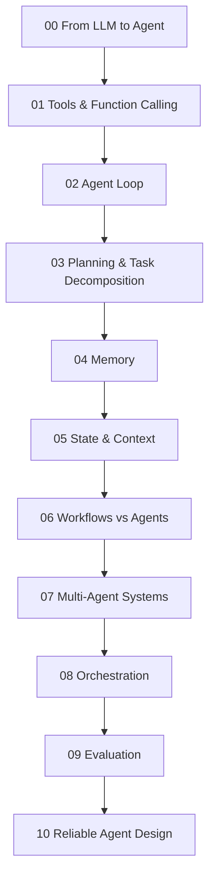

# Agents and AI Systems — Reading Map

Folder này giải thích cách từ một Large Language Model chuyển thành một **agent system** có goal, state, tools, memory, planning, orchestration, evaluation và reliability controls.

Không coi “agent” là framework hay prompt pattern. Reading path:



## Chapters

- [00 — From LLM to Agent](./00_from_llm_to_agent.md)
- [01 — Tools and Function Calling](./01_tools_and_function_calling.md)
- [02 — Agent Loop](./02_agent_loop.md)
- [03 — Planning and Task Decomposition](./03_planning_and_task_decomposition.md)
- [04 — Agent Memory](./04_agent_memory.md)
- [05 — Agent State and Context](./05_agent_state_and_context.md)
- [06 — Workflows vs Agents](./06_workflows_vs_agents.md)
- [07 — Multi-Agent Systems](./07_multi_agent_systems.md)
- [08 — Agent Orchestration](./08_agent_orchestration.md)
- [09 — Agent Evaluation](./09_agent_evaluation.md)
- [10 — Reliable Agent Design](./10_reliable_agent_design.md)

## Core distinctions

```text
LLM ≠ Agent
Tool Calling ≠ Agent
RAG ≠ Agent
Memory ≠ Context Window
State ≠ Conversation Transcript
Workflow ≠ Agent
Multi-Agent ≠ Automatically Better
Prompt Guardrail ≠ Security Boundary
Model says “done” ≠ Verified completion
```

## Mental model

```text
Probabilistic policy / reasoning
        ↓
Deterministic control plane
        ↓
Validated tools and state transitions
        ↓
External environment
        ↓
Observations and verification
        ↺
```

Agent engineering vì vậy nằm ở intersection của AI, Software Engineering, Distributed Systems, Databases, Security và HCI.

## Prerequisites

Nên đọc trước:

- [Classical Agents](../00_foundations/02_intelligence_agents_and_environments.md)
- [Planning](../02_search_reasoning_and_planning/05_planning.md)
- [Large Language Models](../08_large_language_models/README.md)
- [Retrieval and RAG](../09_retrieval_and_rag/README.md)

Sau folder này, [Reinforcement Learning](../11_reinforcement_learning/README.md) sẽ đi theo một hướng khác: thay vì chỉ dùng pretrained LLM như policy, agent học policy/value trực tiếp từ interaction và reward.