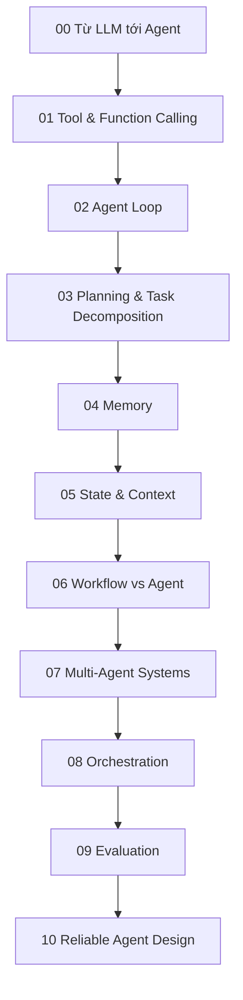

# Knowledge Layer về Agent và AI Systems

Folder này giải thích cách một Large Language Model được đặt vào kiến trúc lớn hơn để trở thành một **hệ thống tác nhân (agent system)** có mục tiêu, trạng thái, công cụ, bộ nhớ, lập kế hoạch, điều phối, đánh giá và kiểm soát độ tin cậy.

Ở đây “agent” không được xem như tên của một framework hoặc một prompt pattern. Trọng tâm là cơ chế hệ thống: mô hình được phép quyết định gì, runtime kiểm soát gì, state được giữ ở đâu, side effect được giới hạn ra sao và failure được phát hiện hoặc phục hồi như thế nào.

## Kiến thức cần có trước

Nên đọc theo tuyến:

```text
Transformer
→ LLM
→ Retrieval / Vector Search
→ RAG
→ Tool Calling
→ Agent
```

Các nền tảng trực tiếp:

- [Transformer](../06_deep_learning_architectures/05_transformer.md)
- [Large Language Models](../08_large_language_models/README.md)
- [Retrieval và RAG](../09_retrieval_and_rag/README.md)
- [Classical Agents](../00_foundations/02_intelligence_agents_and_environments.md)
- [Planning](../02_search_reasoning_and_planning/05_planning.md)

## Bản đồ học trong layer Agent



## Các Chapter

- [00 — Từ LLM tới Agent](./00_from_llm_to_agent.md)
- [01 — Tool và Function Calling](./01_tools_and_function_calling.md)
- [02 — Agent Loop](./02_agent_loop.md)
- [03 — Planning và Task Decomposition](./03_planning_and_task_decomposition.md)
- [04 — Bộ nhớ của Agent](./04_agent_memory.md)
- [05 — State và Context của Agent](./05_agent_state_and_context.md)
- [06 — Workflow và Agent](./06_workflows_vs_agents.md)
- [07 — Hệ thống Multi-Agent](./07_multi_agent_systems.md)
- [08 — Điều phối Agent](./08_agent_orchestration.md)
- [09 — Đánh giá Agent](./09_agent_evaluation.md)
- [10 — Thiết kế Agent đáng tin cậy](./10_reliable_agent_design.md)

## Những phân biệt cốt lõi

```text
LLM ≠ Agent
Tool Calling ≠ Agent
RAG ≠ Agent
Memory ≠ Context Window
State ≠ Conversation Transcript
Workflow ≠ Agent
Multi-Agent ≠ tự động tốt hơn
Prompt Guardrail ≠ Security Boundary
Model nói “done” ≠ hoàn thành đã được verify
Schema hợp lệ ≠ action được phép
Retry ≠ chạy lại vô điều kiện
```

Những distinction này giúp tránh việc gọi mọi application dùng LLM là “agent”.

## Mô hình tư duy

```text
Policy / reasoning có tính xác suất
        ↓
Control plane có tính xác định
        ↓
Tool và state transition đã được validate
        ↓
External environment
        ↓
Observation và verification
        ↺
```

Agent engineering vì vậy nằm ở giao điểm của AI, Software Engineering, Distributed Systems, Databases, Security và Human–Computer Interaction.

## Cơ chế cốt lõi

Một agent production không chỉ là LLM trong vòng lặp. Nó thường có:

```text
mục tiêu có cấu trúc
→ planner / policy
→ tool proposal
→ schema + semantic validation
→ authorization / policy
→ execution
→ observation
→ verification
→ persisted state
→ continue / stop / escalate
```

Đây là **vòng kín (closed-loop system)**: quyết định mới phụ thuộc vào state và observation mới nhất, không chỉ vào plan ban đầu.

## Implementation Model

Một cách triển khai điển hình:

```text
API / user request
→ orchestrator
→ state store
→ LLM / planner
→ tool runtime
→ external services
→ verifier
→ event log / trace
→ response hoặc next step
```

Runtime chịu trách nhiệm cho:

```text
state
permission
budget
retry
idempotency
concurrency
timeout
logging
termination
```

LLM chịu trách nhiệm chủ yếu cho:

```text
semantic interpretation
planning proposal
tool selection trong capability được phép
reasoning dưới uncertainty
```

## Trade-off chính

Tăng autonomy có thể giảm code workflow thủ công nhưng làm tăng:

- variance của trajectory;
- chi phí model/tool;
- độ khó đánh giá;
- surface bảo mật;
- nhu cầu state/recovery;
- tail latency.

Nếu workflow đã biết trước, deterministic workflow thường đáng tin hơn. Agent phù hợp khi cần semantic decision trong môi trường không thể encode hết bằng rule.

## Failure Mode chính

```text
tool selection sai
argument đúng schema nhưng sai semantics
state stale
retry gây side effect lặp
loop không tiến triển
memory đưa dữ liệu cũ vào context
prompt injection qua tool/retrieval
permission vượt scope
model claim success nhưng outcome chưa verify
```

Các failure này không thể sửa chỉ bằng “model mạnh hơn”.

## Production Usage

Agent nên được đưa vào production theo mức autonomy tăng dần:

```text
read-only assistant
→ draft-only workflow
→ sandboxed write
→ reversible action
→ gated external side effect
→ high-impact action có approval mạnh
```

Capability, permission, evaluation và observability phải tăng cùng mức autonomy.

## Logic của Layer

Các chapter đầu đi từ LLM thuần sang tool-using loop. Phần giữa xây state, memory, planning và orchestration. Phần cuối tập trung evaluation và reliability, vì một agent có thể “làm được task” nhưng vẫn chưa đủ ổn định để chạy production.

Điểm cần giữ xuyên suốt:

> **Mô hình chỉ là một component của agent system. Runtime, permission, state, verification và recovery quyết định hành động của mô hình có trở thành hệ thống đáng tin hay không.**

## Dependency tiếp theo: không nhảy sang RL

Sau khi hoàn thành layer Agent, tuyến production tiếp tục là:

```text
Agent
→ Evaluation
→ AI Engineering
→ LLMOps
→ Reliability
→ Security
```

Cụ thể:

- [Evaluation / Reliability](../18_evaluation_reliability_interpretability/README.md)
- [AI Engineering](../15_ai_engineering/README.md)
- [MLOps / LLMOps](../16_mlops_and_llmops/README.md)
- [AI Safety / Security / Alignment](../19_ai_safety_security_alignment/README.md)

[Reinforcement Learning](../11_reinforcement_learning/README.md) vẫn là một nhánh kiến thức riêng của AI, nhưng **không phải dependency tiếp theo của tuyến LLM/Agent production này**.