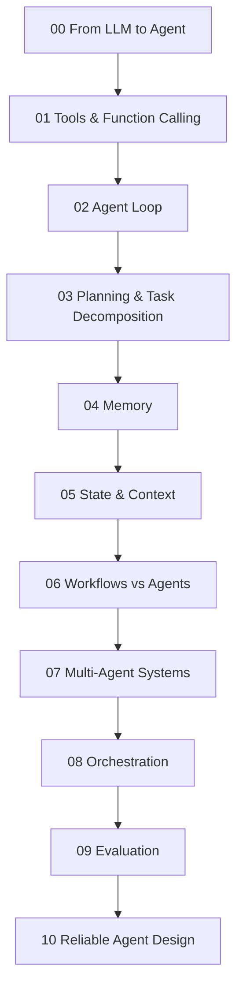

# Agents and AI các hệ thống (systems / 시스템들) — Reading Map

> **Mạch đọc:** [README](./README.md) là bản đồ owner của **Agents and AI các hệ thống (systems / 시스템들) — Reading Map**; nhìn vào vị trí đó trước để biết file này đang phục vụ nhánh kiến thức nào. **Chapters** mở đối tượng chính của file và câu hỏi cần theo dõi; sau đó sang **Cốt lõi (core / 핵심) distinctions** để mở rộng đối tượng sang phạm vi kế cận. Mạch này dùng README làm bản đồ owner của agents and AI systems, rồi nối planning, tools, memory, reliability và governance.

Folder này giải thích cách từ một Large ngôn ngữ (language / 언어) mô hình (model / 모델) chuyển thành một **hệ tác nhân (agent system / 에이전트 시스템)** có goal, trạng thái (state / 상태), tools, bộ nhớ (memory / 메모리), planning, orchestration, evaluation và độ tin cậy (reliability / 신뢰성) controls.

Không coi “tác nhân (agent / 에이전트)” là khung phần mềm (framework / 프레임워크) hay prompt mẫu (pattern / 패턴). Reading đường dẫn (path / 경로):


```mermaid
flowchart TD
    A[00 From LLM to Agent] --> T[01 Tools & Function Calling]
    T --> L[02 Agent Loop]
    L --> P[03 Planning & Task Decomposition]
    P --> M[04 Memory]
    M --> S[05 State & Context]
    S --> W[06 Workflows vs Agents]
    W --> MA[07 Multi-Agent Systems]
    MA --> O[08 Orchestration]
    O --> E[09 Evaluation]
    E --> R[10 Reliable Agent Design]
```

## Chapters

Sơ đồ hoặc danh sách này mô tả thứ tự phụ thuộc của các khái niệm. Hãy đọc theo mũi tên để biết phần nào là prerequisite, phần nào là ứng dụng và khi nào cần quay lại nền tảng.

- [00 — From LLM to Agent](./00_from_llm_to_agent.md)
- [01 — Tools and Function Calling](./01_tools_and_function_calling.md)
- [02 — Agent Loop](./02_agent_loop.md)
- [03 — Planning and Task Decomposition](./03_planning_and_task_decomposition.md)
- [04 — Agent Memory](./04_agent_memory.md)
- [05 — Agent State and Context](./05_agent_state_and_context.md)
- [06 — Workflows vs Agents](./06_workflows_vs_agents.md)
- [07 — Multi-Agent Systems](./07_multi_agent_systems.md)
- [08 — Agent Orchestration](./08_agent_orchestration.md)
- [09 — Agent Evaluation](./09_agent_evaluation.md)
- [10 — Reliable Agent Design](./10_reliable_agent_design.md)

Các chapter tách agent loop, tool use, memory và evaluation; core distinctions biến chúng thành mental model để phân biệt agent với workflow tự động.

## Cốt lõi (core / 핵심) distinctions

Phần này kiểm tra ranh giới và failure mode của cơ chế vừa học. Hãy dùng nó để biết khi nào mô hình còn đúng, khi nào cần đổi chiến lược và bằng chứng nào phải thu thập.

```text
LLM ≠ Agent
Tool Calling ≠ Agent
RAG ≠ Agent
Memory ≠ Context Window
State ≠ Conversation Transcript
Workflow ≠ Agent
Multi-Agent ≠ Automatically Better
Prompt Guardrail ≠ Security Boundary
Model says “done” ≠ Verified completion
```

Core distinctions đã tách vòng lặp, state và agency; mental model tiếp theo cho biết agent cần những prerequisite nào để vận hành an toàn.

## Mô hình tư duy (mental model / 사고 모델)

Phần này chốt mental model thành một chuỗi có thể dùng lại: bối cảnh → cơ chế → quan sát → giới hạn → quyết định. Hãy đọc sơ đồ như công cụ suy luận, không như một khẩu hiệu tách khỏi chapter.

```text
Probabilistic policy / reasoning
        ↓
Deterministic control plane
        ↓
Validated tools and state transitions
        ↓
External environment
        ↓
Observations and verification
        ↺
```

Tác nhân (agent / 에이전트) kỹ thuật (engineering / 엔지니어링) vì vậy nằm ở intersection của AI, Kỹ nghệ phần mềm (software engineering / 소프트웨어 공학), phân tán (distributed / 분산) các hệ thống (systems / 시스템들), Databases, bảo mật (security / 보안) và HCI.

Mental model cho biết agent cần state, policy và feedback nào; Prerequisites trả từng nền tảng về owner planning, programming languages và distributed systems.

## Prerequisites

Nên đọc trước:

- [Classical Agents](../00_foundations/02_intelligence_agents_and_environments.md)
- [Planning](../02_search_reasoning_and_planning/05_planning.md)
- [Large Language Models](../08_large_language_models/README.md)
- [Retrieval and RAG](../09_retrieval_and_rag/README.md)

Sau folder này, [Reinforcement Learning](../11_reinforcement_learning/README.md) sẽ đi theo một hướng khác: thay vì chỉ dùng pretrained LLM như policy, agent học policy/value trực tiếp từ interaction và reward.

> **Bàn giao:** Sau **Prerequisites**, hãy giữ lại kết luận và ranh giới của mục này; quay về [README](./README.md) khi cần định vị owner hoặc chọn nhánh học tiếp theo.
