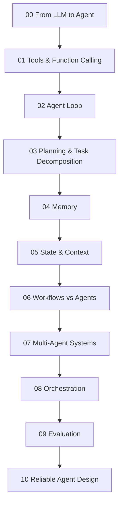

# Agents and AI các hệ thống (systems / 시스템들) — Reading Map

> **Mạch đọc:** Đọc **Agents and AI các hệ thống (systems / 시스템들) — Reading Map** như một mắt xích của lộ trình học (learning path / 학습 경로) hiện tại, không như một ghi chú tách rời. Nội dung đi từ **Chapters** sang **cốt lõi (core / 핵심) distinctions**; điểm nối này chuẩn bị câu hỏi cho các mục sau thay vì dừng ở định nghĩa đầu tiên.


Folder này giải thích cách từ một Large ngôn ngữ (language / 언어) mô hình (model / 모델) chuyển thành một **hệ tác nhân (agent system / 에이전트 시스템)** có goal, trạng thái (state / 상태), tools, bộ nhớ (memory / 메모리), planning, orchestration, evaluation và độ tin cậy (reliability / 신뢰성) controls.

Không coi “tác nhân (agent / 에이전트)” là khung phần mềm (framework / 프레임워크) hay prompt mẫu (pattern / 패턴). Reading đường dẫn (path / 경로):


```mermaid
flowchart TD
    A[00 From LLM to Agent] --> T[01 Tools & Function Calling]
    T --> L[02 Agent Loop]
    L --> P[03 Planning & Task Decomposition]
    P --> M[04 Memory]
    M --> S[05 State & Context]
    S --> W[06 Workflows vs Agents]
    W --> MA[07 Multi-Agent Systems]
    MA --> O[08 Orchestration]
    O --> E[09 Evaluation]
    E --> R[10 Reliable Agent Design]
```

## Chapters

- [00 — From LLM to Agent](./00_from_llm_to_agent.md)
- [01 — Tools and Function Calling](./01_tools_and_function_calling.md)
- [02 — Agent Loop](./02_agent_loop.md)
- [03 — Planning and Task Decomposition](./03_planning_and_task_decomposition.md)
- [04 — Agent Memory](./04_agent_memory.md)
- [05 — Agent State and Context](./05_agent_state_and_context.md)
- [06 — Workflows vs Agents](./06_workflows_vs_agents.md)
- [07 — Multi-Agent Systems](./07_multi_agent_systems.md)
- [08 — Agent Orchestration](./08_agent_orchestration.md)
- [09 — Agent Evaluation](./09_agent_evaluation.md)
- [10 — Reliable Agent Design](./10_reliable_agent_design.md)


> **Chuyển mạch:** Từ **Chapters**, ta sang **cốt lõi (core / 핵심) distinctions** để mở rộng cùng câu hỏi và dùng kết quả đó để khép lại mạch giải thích.

## Cốt lõi (core / 핵심) distinctions

```text
LLM ≠ Agent
Tool Calling ≠ Agent
RAG ≠ Agent
Memory ≠ Context Window
State ≠ Conversation Transcript
Workflow ≠ Agent
Multi-Agent ≠ Automatically Better
Prompt Guardrail ≠ Security Boundary
Model says “done” ≠ Verified completion
```


> **Chuyển mạch:** Từ **cốt lõi (core / 핵심) distinctions**, ta sang **mô hình tư duy (mental model / 사고 모델)** để mở rộng cùng câu hỏi và dùng kết quả đó để khép lại mạch giải thích.

## Mô hình tư duy (mental model / 사고 모델)

```text
Probabilistic policy / reasoning
        ↓
Deterministic control plane
        ↓
Validated tools and state transitions
        ↓
External environment
        ↓
Observations and verification
        ↺
```

Tác nhân (agent / 에이전트) kỹ thuật (engineering / 엔지니어링) vì vậy nằm ở intersection của AI, Kỹ nghệ phần mềm (software engineering / 소프트웨어 공학), phân tán (distributed / 분산) các hệ thống (systems / 시스템들), Databases, bảo mật (security / 보안) và HCI.


> **Chuyển mạch:** Từ **mô hình tư duy (mental model / 사고 모델)**, ta sang **Prerequisites** để mở rộng cùng câu hỏi và dùng kết quả đó để khép lại mạch giải thích.

## Prerequisites

Nên đọc trước:

- [Classical Agents](../00_foundations/02_intelligence_agents_and_environments.md)
- [Planning](../02_search_reasoning_and_planning/05_planning.md)
- [Large Language Models](../08_large_language_models/README.md)
- [Retrieval and RAG](../09_retrieval_and_rag/README.md)

Sau folder này, [Reinforcement Learning](../11_reinforcement_learning/README.md) sẽ đi theo một hướng khác: thay vì chỉ dùng pretrained LLM như chính sách (policy / 정책), tác nhân (agent / 에이전트) học chính sách (policy / 정책)/giá trị (value / 값) trực tiếp từ tương tác (interaction / 상호작용) và reward.

> **Bàn giao:** Sau **Prerequisites**, hãy chốt bất biến (invariant / 불변식) và giới hạn của mục này trước khi nối sang kiến thức kế tiếp. Có thể đọc tiếp [00 from llm to agent](./00_from_llm_to_agent.md) để đối chiếu ranh giới (boundary / 경계) gần nhất.
