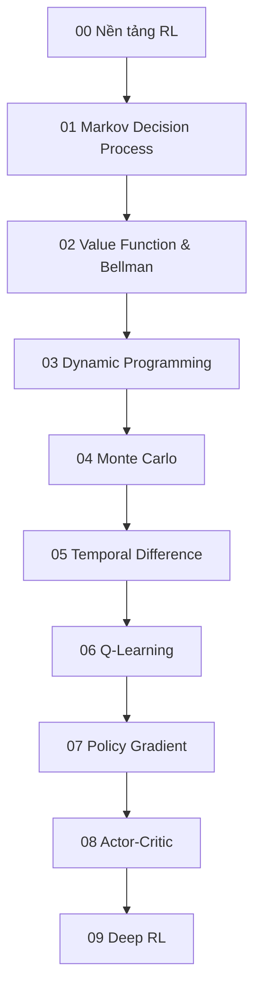

# Knowledge Layer về Reinforcement Learning

Folder này xây Reinforcement Learning từ first principles: agent tương tác với environment, reward tạo learning signal, value function nén consequence dài hạn, Bellman equation tạo cấu trúc đệ quy, rồi các sample-based method học value và policy từ experience.



## Các Chapter

- [00 — Nền tảng Reinforcement Learning](./00_reinforcement_learning_foundations.md)
- [01 — Markov Decision Process](./01_markov_decision_processes.md)
- [02 — Value Function và Bellman Equation](./02_value_functions_and_bellman_equations.md)
- [03 — Dynamic Programming](./03_dynamic_programming.md)
- [04 — Monte Carlo Methods](./04_monte_carlo_methods.md)
- [05 — Temporal-Difference Learning](./05_temporal_difference_learning.md)
- [06 — Q-Learning](./06_q_learning.md)
- [07 — Policy Gradient](./07_policy_gradient.md)
- [08 — Actor–Critic](./08_actor_critic.md)
- [09 — Deep Reinforcement Learning](./09_deep_reinforcement_learning.md)

## Những phân biệt cốt lõi

```text
Reward ≠ mục tiêu thật
Value ≠ immediate reward
State ≠ observation
Planning ≠ model-free RL
Monte Carlo ≠ Temporal Difference
SARSA ≠ Q-learning
Value-based ≠ Policy-based
On-policy ≠ Off-policy
RL ≠ RLHF
Reward cao ≠ behavior an toàn
```

Các distinction này đặc biệt quan trọng vì nhiều thuật ngữ RL mô tả **cách học** hoặc **cách biểu diễn decision**, không phải các model hoàn toàn tách rời nhau.

## Mô hình tư duy

```text
Agent policy
    ↓ action
Environment
    ↓ reward + next observation
Value / policy update
    ↺
```

Khác với supervised learning, policy ảnh hưởng trực tiếp distribution của data mà agent sẽ thu được tiếp theo. Vì vậy RL là một learning problem nằm bên trong feedback loop giữa learner và environment.

## Logic của Layer

Ba chapter đầu xây MDP, value và Bellman equation. Dynamic Programming cho thấy cách giải khi environment model đã biết. Monte Carlo và Temporal Difference chuyển sang learning từ sample. Q-learning và Policy Gradient đại diện hai hướng control lớn, sau đó Actor–Critic kết hợp chúng. Deep RL đưa neural function approximation vào toàn bộ stack.

Một mental model ngắn:

```text
MDP định nghĩa bài toán
Bellman định nghĩa consistency
Value dự đoán future return
Policy quyết định action
Sampling cung cấp experience
Optimization cập nhật value / policy
```

## Kiến thức liên quan

Nên liên hệ với:

- [Agents and Environments](../00_foundations/02_intelligence_agents_and_environments.md)
- [Decision Making Under Uncertainty](../02_search_reasoning_and_planning/06_decision_making_under_uncertainty.md)
- [Probability](../01_mathematical_foundations/02_probability_for_ai.md)
- [Optimization](../01_mathematical_foundations/06_optimization.md)
- [Neural Networks](../05_neural_networks/README.md)
- [RLHF trong LLM](../08_large_language_models/08_rlhf.md)

Sau RL, roadmap chuyển sang các domain thiên về perception: Computer Vision và Speech/Audio/Multimodal AI.