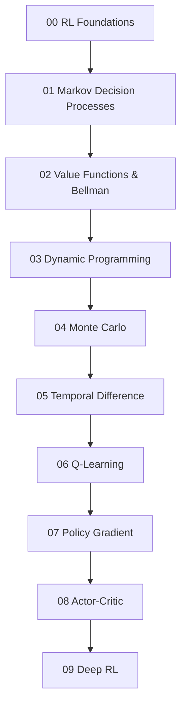

# Reinforcement Learning — Reading Map

Folder này xây Reinforcement Learning từ first principles: agent tương tác với environment, reward định nghĩa learning signal, value functions nén consequence của future, Bellman equations tạo recursive structure, rồi sample-based methods học policy từ experience.



## Chapters

- [00 — Reinforcement Learning Foundations](./00_reinforcement_learning_foundations.md)
- [01 — Markov Decision Processes](./01_markov_decision_processes.md)
- [02 — Value Functions and Bellman Equations](./02_value_functions_and_bellman_equations.md)
- [03 — Dynamic Programming](./03_dynamic_programming.md)
- [04 — Monte Carlo Methods](./04_monte_carlo_methods.md)
- [05 — Temporal Difference Learning](./05_temporal_difference_learning.md)
- [06 — Q-Learning](./06_q_learning.md)
- [07 — Policy Gradient](./07_policy_gradient.md)
- [08 — Actor-Critic](./08_actor_critic.md)
- [09 — Deep Reinforcement Learning](./09_deep_reinforcement_learning.md)

## Core distinctions

```text
Reward ≠ true goal
Value ≠ immediate reward
State ≠ observation
Planning ≠ model-free RL
Monte Carlo ≠ TD
SARSA ≠ Q-learning
Value-based ≠ Policy-based
On-policy ≠ Off-policy
RL ≠ RLHF
High reward ≠ safe behavior
```

## Mental Model

```text
Agent policy
    ↓ action
Environment
    ↓ reward + next observation
Value / policy update
    ↺
```

Khác với supervised learning, policy ảnh hưởng distribution của data agent sẽ thu được tiếp theo. Vì vậy RL là learning problem nằm trong một feedback loop.

## Prerequisites và Connections

Nên liên hệ với:

- [Agents and Environments](../00_foundations/02_intelligence_agents_and_environments.md)
- [Decision Making Under Uncertainty](../02_search_reasoning_and_planning/06_decision_making_under_uncertainty.md)
- [Probability](../01_mathematical_foundations/02_probability_for_ai.md)
- [Optimization](../01_mathematical_foundations/06_optimization.md)
- [Neural Networks](../05_neural_networks/README.md)
- [LLM RLHF](../08_large_language_models/08_rlhf.md)

Sau RL, roadmap chuyển sang perception-oriented domains: Computer Vision và Speech/Audio/Multimodal AI.