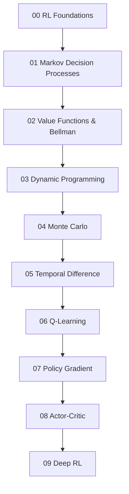

# Reinforcement học tập (learning / 학습) — Reading Map

> **Mạch đọc:** Đọc **Reinforcement học tập (learning / 학습) — Reading Map** như một mắt xích của lộ trình học (learning path / 학습 경로) hiện tại, không như một ghi chú tách rời. Nội dung đi từ **Chapters** sang **cốt lõi (core / 핵심) distinctions**; điểm nối này chuẩn bị câu hỏi cho các mục sau thay vì dừng ở định nghĩa đầu tiên.


Folder này xây Reinforcement học tập (learning / 학습) từ nguyên lý nền tảng (first principles / 제일 원리): tác nhân (agent / 에이전트) tương tác với môi trường (environment / 환경), reward định nghĩa học tập (learning / 학습) tín hiệu (signal / 신호), giá trị (value / 값) functions nén consequence của future, Bellman equations tạo recursive cấu trúc (structure / 구조), rồi sample-based methods học chính sách (policy / 정책) từ experience.


```mermaid
flowchart TD
    F[00 RL Foundations] --> M[01 Markov Decision Processes]
    M --> B[02 Value Functions & Bellman]
    B --> DP[03 Dynamic Programming]
    DP --> MC[04 Monte Carlo]
    MC --> TD[05 Temporal Difference]
    TD --> Q[06 Q-Learning]
    Q --> PG[07 Policy Gradient]
    PG --> AC[08 Actor-Critic]
    AC --> DRL[09 Deep RL]
```

## Chapters

- [00 — Reinforcement Learning Foundations](./00_reinforcement_learning_foundations.md)
- [01 — Markov Decision Processes](./01_markov_decision_processes.md)
- [02 — Value Functions and Bellman Equations](./02_value_functions_and_bellman_equations.md)
- [03 — Dynamic Programming](./03_dynamic_programming.md)
- [04 — Monte Carlo Methods](./04_monte_carlo_methods.md)
- [05 — Temporal Difference Learning](./05_temporal_difference_learning.md)
- [06 — Q-Learning](./06_q_learning.md)
- [07 — Policy Gradient](./07_policy_gradient.md)
- [08 — Actor-Critic](./08_actor_critic.md)
- [09 — Deep Reinforcement Learning](./09_deep_reinforcement_learning.md)


> **Chuyển mạch:** Từ **Chapters**, ta sang **cốt lõi (core / 핵심) distinctions** để mở rộng cùng câu hỏi và dùng kết quả đó để khép lại mạch giải thích.

## Cốt lõi (core / 핵심) distinctions

```text
Reward ≠ true goal
Value ≠ immediate reward
State ≠ observation
Planning ≠ model-free RL
Monte Carlo ≠ TD
SARSA ≠ Q-learning
Value-based ≠ Policy-based
On-policy ≠ Off-policy
RL ≠ RLHF
High reward ≠ safe behavior
```


> **Chuyển mạch:** Từ **cốt lõi (core / 핵심) distinctions**, ta sang **mô hình tư duy (mental model / 사고 모델)** để mở rộng cùng câu hỏi và dùng kết quả đó để khép lại mạch giải thích.

## Mô hình tư duy (mental model / 사고 모델)

```text
Agent policy
    ↓ action
Environment
    ↓ reward + next observation
Value / policy update
    ↺
```

Khác với supervised học tập (learning / 학습), chính sách (policy / 정책) ảnh hưởng phân phối (distribution / 분포) của dữ liệu (data / 데이터) tác nhân (agent / 에이전트) sẽ thu được tiếp theo. Vì vậy RL là học tập (learning / 학습) bài toán (problem / 문제) nằm trong một vòng phản hồi (feedback loop / 피드백 루프).


> **Chuyển mạch:** Từ **mô hình tư duy (mental model / 사고 모델)**, ta sang **Prerequisites và Connections** để mở rộng cùng câu hỏi và dùng kết quả đó để khép lại mạch giải thích.

## Prerequisites và Connections

Nên liên hệ với:

- [Agents and Environments](../00_foundations/02_intelligence_agents_and_environments.md)
- [Decision Making Under Uncertainty](../02_search_reasoning_and_planning/06_decision_making_under_uncertainty.md)
- [Probability](../01_mathematical_foundations/02_probability_for_ai.md)
- [Optimization](../01_mathematical_foundations/06_optimization.md)
- [Neural Networks](../05_neural_networks/README.md)
- [LLM RLHF](../08_large_language_models/08_rlhf.md)

Sau RL, roadmap chuyển sang perception-oriented domains: Computer Vision và Speech/Audio/Multimodal AI.

> **Bàn giao:** Sau **Prerequisites và Connections**, hãy chốt bất biến (invariant / 불변식) và giới hạn của mục này trước khi nối sang kiến thức kế tiếp. Có thể đọc tiếp [00 reinforcement learning foundations](./00_reinforcement_learning_foundations.md) để đối chiếu ranh giới (boundary / 경계) gần nhất.
