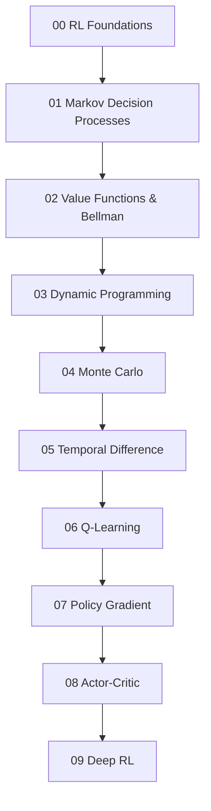

# Reinforcement học tập (learning / 학습) — Reading Map

> **Mạch đọc:** [README](./README.md) là bản đồ owner của **Reinforcement học tập (learning / 학습) — Reading Map**; nhìn vào vị trí đó trước để biết file này đang phục vụ nhánh kiến thức nào. **Chapters** mở đối tượng chính của file và câu hỏi cần theo dõi; sau đó sang **Cốt lõi (core / 핵심) distinctions** để mở rộng đối tượng sang phạm vi kế cận. Mạch này nối reinforcement learning với state, action, reward và policy, để chương sách đi theo vòng lặp quyết định.

Folder này xây Reinforcement học tập (learning / 학습) từ nguyên lý nền tảng (first principles / 제일 원리): tác nhân (agent / 에이전트) tương tác với môi trường (environment / 환경), reward định nghĩa học tập (learning / 학습) tín hiệu (signal / 신호), giá trị (value / 값) functions nén consequence của future, Bellman equations tạo recursive cấu trúc (structure / 구조), rồi sample-based methods học chính sách (policy / 정책) từ experience.


```mermaid
flowchart TD
    F[00 RL Foundations] --> M[01 Markov Decision Processes]
    M --> B[02 Value Functions & Bellman]
    B --> DP[03 Dynamic Programming]
    DP --> MC[04 Monte Carlo]
    MC --> TD[05 Temporal Difference]
    TD --> Q[06 Q-Learning]
    Q --> PG[07 Policy Gradient]
    PG --> AC[08 Actor-Critic]
    AC --> DRL[09 Deep RL]
```

## Chapters

Sơ đồ hoặc danh sách này mô tả thứ tự phụ thuộc của các khái niệm. Hãy đọc theo mũi tên để biết phần nào là prerequisite, phần nào là ứng dụng và khi nào cần quay lại nền tảng.

- [00 — Reinforcement Learning Foundations](./00_reinforcement_learning_foundations.md)
- [01 — Markov Decision Processes](./01_markov_decision_processes.md)
- [02 — Value Functions and Bellman Equations](./02_value_functions_and_bellman_equations.md)
- [03 — Dynamic Programming](./03_dynamic_programming.md)
- [04 — Monte Carlo Methods](./04_monte_carlo_methods.md)
- [05 — Temporal Difference Learning](./05_temporal_difference_learning.md)
- [06 — Q-Learning](./06_q_learning.md)
- [07 — Policy Gradient](./07_policy_gradient.md)
- [08 — Actor-Critic](./08_actor_critic.md)
- [09 — Deep Reinforcement Learning](./09_deep_reinforcement_learning.md)

> **Chuyển mạch:** Trong **Reinforcement học tập (learning / 학습) — Reading Map**, **Cốt lõi (core / 핵심) distinctions** tiếp nhận điểm tựa từ **Chapters** nhưng đổi góc nhìn sang câu hỏi của chính nó; đọc liền hai mục để thấy mối quan hệ đó. Từ đây, **Mô hình tư duy (mental model / 사고 모델)** sẽ cho biết hệ quả hoặc giới hạn ấy hiện ra ở đâu.

## Cốt lõi (core / 핵심) distinctions

Phần này kiểm tra ranh giới và failure mode của cơ chế vừa học. Hãy dùng nó để biết khi nào mô hình còn đúng, khi nào cần đổi chiến lược và bằng chứng nào phải thu thập.

```text
Reward ≠ true goal
Value ≠ immediate reward
State ≠ observation
Planning ≠ model-free RL
Monte Carlo ≠ TD
SARSA ≠ Q-learning
Value-based ≠ Policy-based
On-policy ≠ Off-policy
RL ≠ RLHF
High reward ≠ safe behavior
```

> **Chuyển mạch:** Ở chặng này của **Reinforcement học tập (learning / 학습) — Reading Map**, **Mô hình tư duy (mental model / 사고 모델)** gom các mảnh từ **Cốt lõi (core / 핵심) distinctions** thành một kết luận có thể mang sang phần kế tiếp. Từ đây, **Prerequisites và Connections** sẽ cho biết hệ quả hoặc giới hạn ấy hiện ra ở đâu.

## Mô hình tư duy (mental model / 사고 모델)

Phần này chốt mental model thành một chuỗi có thể dùng lại: bối cảnh → cơ chế → quan sát → giới hạn → quyết định. Hãy đọc sơ đồ như công cụ suy luận, không như một khẩu hiệu tách khỏi chapter.

```text
Agent policy
    ↓ action
Environment
    ↓ reward + next observation
Value / policy update
    ↺
```

Khác với supervised học tập (learning / 학습), chính sách (policy / 정책) ảnh hưởng phân phối (distribution / 분포) của dữ liệu (data / 데이터) tác nhân (agent / 에이전트) sẽ thu được tiếp theo. Vì vậy RL là học tập (learning / 학습) bài toán (problem / 문제) nằm trong một vòng phản hồi (feedback loop / 피드백 루프).

> **Chuyển mạch:** Đặt trong câu hỏi lớn của **Reinforcement học tập (learning / 학습) — Reading Map**, **Prerequisites và Connections** gom các mảnh từ **Mô hình tư duy (mental model / 사고 모델)** thành một kết luận có thể mang sang phần kế tiếp. Phần còn lại của file dùng kết quả này để khép lại mạch giải thích.

## Prerequisites và Connections

Nên liên hệ với:

- [Agents and Environments](../00_foundations/02_intelligence_agents_and_environments.md)
- [Decision Making Under Uncertainty](../02_search_reasoning_and_planning/06_decision_making_under_uncertainty.md)
- [Probability](../01_mathematical_foundations/02_probability_for_ai.md)
- [Optimization](../01_mathematical_foundations/06_optimization.md)
- [Neural Networks](../05_neural_networks/README.md)
- [LLM RLHF](../08_large_language_models/08_rlhf.md)

Sau RL, roadmap chuyển sang perception-oriented domains: Computer Vision và Speech/Audio/Multimodal AI.

> **Bàn giao:** Sau **Prerequisites và Connections**, hãy giữ lại kết luận và ranh giới của mục này; quay về [README](./README.md) khi cần định vị owner hoặc chọn nhánh học tiếp theo.
