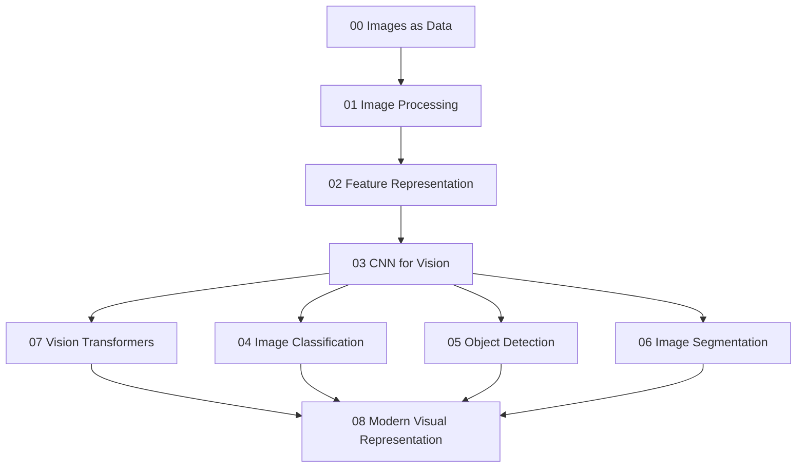

# Computer Vision — Reading Map

Folder này xây Computer Vision từ bản chất image là measurement tensor, đi qua signal/image processing, hand-designed và learned features, CNN, các task spatial, rồi Vision Transformer và visual foundation models.



## Chapters

- [00 — Images as Data](./00_images_as_data.md)
- [01 — Image Processing Foundations](./01_image_processing_foundations.md)
- [02 — Feature Representation](./02_feature_representation.md)
- [03 — CNN for Vision](./03_cnn_for_vision.md)
- [04 — Image Classification](./04_image_classification.md)
- [05 — Object Detection](./05_object_detection.md)
- [06 — Image Segmentation](./06_image_segmentation.md)
- [07 — Vision Transformers](./07_vision_transformers.md)
- [08 — Modern Visual Representation](./08_modern_visual_representation.md)

## Core distinctions

```text
Image ≠ world itself
Classification ≠ Detection
Detection ≠ Segmentation
Semantic Segmentation ≠ Instance Segmentation
Convolutional Equivariance ≠ Perfect Invariance
Higher Resolution ≠ More True Information
Softmax Confidence ≠ Calibrated Certainty
Embedding Similarity ≠ Semantic Truth
ViT ≠ Automatically Better Than CNN
Foundation Model ≠ Domain Validation No Longer Needed
```

## Mental Model

```text
Physical scene
→ sensor measurement
→ pixels/tensors
→ representation
→ spatial/semantic inference
→ task output
```

Computer Vision luôn là inverse problem: infer hidden scene structure từ finite 2D/3D measurements chịu noise, viewpoint và sensor limitations.

## Connections

Nên liên hệ với:

- [Linear Algebra](../01_mathematical_foundations/01_linear_algebra_for_ai.md)
- [CNN Architecture](../06_deep_learning_architectures/00_convolutional_neural_networks.md)
- [Attention](../06_deep_learning_architectures/04_attention.md)
- [Transformer](../06_deep_learning_architectures/05_transformer.md)
- [Representation Learning](../05_neural_networks/08_representation_learning.md)

Layer tiếp theo `13_speech_audio_and_multimodal/` sẽ mở rộng perception sang time-frequency audio và cách vision/audio representations kết nối với language models.