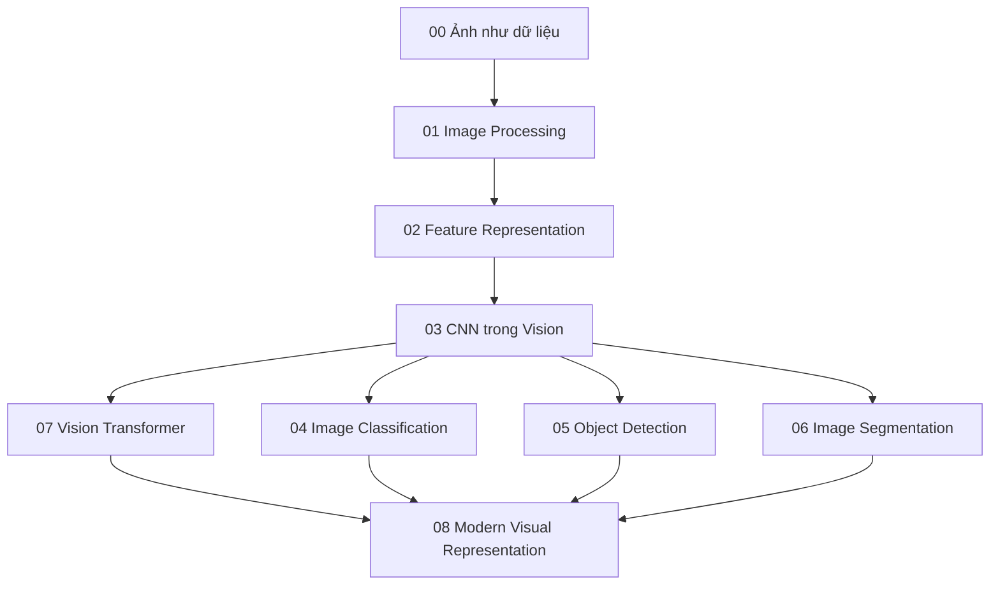

# Knowledge Layer về Computer Vision

Folder này xây Computer Vision từ bản chất image là một measurement tensor, đi qua signal/image processing, hand-designed và learned feature, CNN, các spatial task, rồi tới Vision Transformer và visual foundation model.



## Các Chapter

- [00 — Ảnh như dữ liệu](./00_images_as_data.md)
- [01 — Nền tảng Image Processing](./01_image_processing_foundations.md)
- [02 — Feature Representation](./02_feature_representation.md)
- [03 — CNN trong Computer Vision](./03_cnn_for_vision.md)
- [04 — Image Classification](./04_image_classification.md)
- [05 — Object Detection](./05_object_detection.md)
- [06 — Image Segmentation](./06_image_segmentation.md)
- [07 — Vision Transformer](./07_vision_transformers.md)
- [08 — Modern Visual Representation](./08_modern_visual_representation.md)

## Những phân biệt cốt lõi

```text
Image ≠ bản thân thế giới thật
Classification ≠ Detection
Detection ≠ Segmentation
Semantic Segmentation ≠ Instance Segmentation
Convolutional Equivariance ≠ Perfect Invariance
Resolution cao hơn ≠ nhiều thông tin thật hơn trong mọi trường hợp
Softmax Confidence ≠ Calibrated Certainty
Embedding Similarity ≠ Semantic Truth
ViT ≠ tự động tốt hơn CNN
Foundation Model ≠ không còn cần Domain Validation
```

## Mô hình tư duy

```text
Physical scene
→ sensor measurement
→ pixel / tensor
→ representation
→ spatial / semantic inference
→ task output
```

Computer Vision về bản chất là một **inverse problem**: suy ra hidden scene structure từ measurement 2D hoặc 3D hữu hạn, chịu ảnh hưởng của noise, viewpoint, lighting và sensor limitation.

## Logic của Layer

Các chapter đầu giải thích image như signal và những transformation cơ bản. Sau đó feature representation và CNN cho thấy cách locality được khai thác. Classification, detection và segmentation mở rộng output từ global label tới spatial structure. Cuối cùng, ViT và foundation model chuyển trọng tâm từ task-specific architecture sang reusable representation và multimodal interface.

## Liên kết kiến thức

Nên liên hệ với:

- [Linear Algebra](../01_mathematical_foundations/01_linear_algebra_for_ai.md)
- [CNN Architecture](../06_deep_learning_architectures/00_convolutional_neural_networks.md)
- [Attention](../06_deep_learning_architectures/04_attention.md)
- [Transformer](../06_deep_learning_architectures/05_transformer.md)
- [Representation Learning](../05_neural_networks/08_representation_learning.md)

Layer tiếp theo `13_speech_audio_and_multimodal/` mở rộng perception sang audio theo time–frequency và cách visual/audio representation được kết nối với language model.