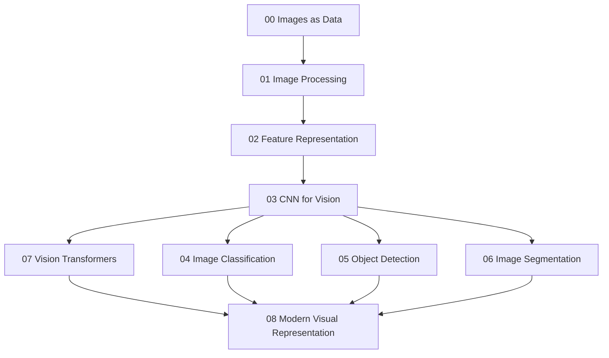

# Computer Vision — Reading Map

> **Mạch đọc:** [README](./README.md) là bản đồ owner của **Computer Vision — Reading Map**; nhìn vào vị trí đó trước để biết file này đang phục vụ nhánh kiến thức nào. **Chapters** mở đối tượng chính của file và câu hỏi cần theo dõi; sau đó sang **Cốt lõi (core / 핵심) distinctions** để mở rộng đối tượng sang phạm vi kế cận. Cách đi này giữ lại điểm tựa của section đầu và cho biết kết luận sẽ được dùng ở đâu, thay vì dừng ở định nghĩa đầu tiên.

Folder này xây Computer Vision từ bản chất ảnh (image / 이미지) là đo lường (measurement / 측정) tensor, đi qua tín hiệu (signal / 신호)/xử lý ảnh (image processing / 이미지 처리), hand-designed và learned features, CNN, các tác vụ (task / 작업) spatial, rồi Vision Transformer và visual foundation các mô hình (models / 모델들).


```mermaid
flowchart TD
    I[00 Images as Data] --> P[01 Image Processing]
    P --> F[02 Feature Representation]
    F --> C[03 CNN for Vision]
    C --> CL[04 Image Classification]
    C --> D[05 Object Detection]
    C --> S[06 Image Segmentation]
    C --> V[07 Vision Transformers]
    V --> M[08 Modern Visual Representation]
    CL --> M
    D --> M
    S --> M
```

## Chapters

Sơ đồ hoặc danh sách này mô tả thứ tự phụ thuộc của các khái niệm. Hãy đọc theo mũi tên để biết phần nào là prerequisite, phần nào là ứng dụng và khi nào cần quay lại nền tảng.

- [00 — Images as Data](./00_images_as_data.md)
- [01 — Image Processing Foundations](./01_image_processing_foundations.md)
- [02 — Feature Representation](./02_feature_representation.md)
- [03 — CNN for Vision](./03_cnn_for_vision.md)
- [04 — Image Classification](./04_image_classification.md)
- [05 — Object Detection](./05_object_detection.md)
- [06 — Image Segmentation](./06_image_segmentation.md)
- [07 — Vision Transformers](./07_vision_transformers.md)
- [08 — Modern Visual Representation](./08_modern_visual_representation.md)

> **Chuyển mạch:** Reading map đặt các distinctions—pixels, geometry, recognition, localization và representation—trước chapter; mental model giúp chọn nhánh theo câu hỏi thay vì chỉ theo tên kỹ thuật.

## Cốt lõi (core / 핵심) distinctions

Phần này kiểm tra ranh giới và failure mode của cơ chế vừa học. Hãy dùng nó để biết khi nào mô hình còn đúng, khi nào cần đổi chiến lược và bằng chứng nào phải thu thập.

```text
Image ≠ world itself
Classification ≠ Detection
Detection ≠ Segmentation
Semantic Segmentation ≠ Instance Segmentation
Convolutional Equivariance ≠ Perfect Invariance
Higher Resolution ≠ More True Information
Softmax Confidence ≠ Calibrated Certainty
Embedding Similarity ≠ Semantic Truth
ViT ≠ Automatically Better Than CNN
Foundation Model ≠ Domain Validation No Longer Needed
```

> **Chuyển mạch:** Ở chặng này của **Computer Vision — Reading Map**, **Mô hình tư duy (mental model / 사고 모델)** gom các mảnh từ **Cốt lõi (core / 핵심) distinctions** thành một kết luận có thể mang sang phần kế tiếp. Từ đây, **Connections** sẽ cho biết hệ quả hoặc giới hạn ấy hiện ra ở đâu.

## Mô hình tư duy (mental model / 사고 모델)

Phần này chốt mental model thành một chuỗi có thể dùng lại: bối cảnh → cơ chế → quan sát → giới hạn → quyết định. Hãy đọc sơ đồ như công cụ suy luận, không như một khẩu hiệu tách khỏi chapter.

```text
Physical scene
→ sensor measurement
→ pixels/tensors
→ representation
→ spatial/semantic inference
→ task output
```

Computer Vision luôn là inverse bài toán (problem / 문제): infer hidden scene cấu trúc (structure / 구조) từ finite 2D/3D measurements chịu noise, viewpoint và sensor limitations.

> **Chuyển mạch:** Đặt trong câu hỏi lớn của **Computer Vision — Reading Map**, **Connections** gom các mảnh từ **Mô hình tư duy (mental model / 사고 모델)** thành một kết luận có thể mang sang phần kế tiếp. Phần còn lại của file dùng kết quả này để khép lại mạch giải thích.

## Connections

Nên liên hệ với:

- [Linear Algebra](../01_mathematical_foundations/01_linear_algebra_for_ai.md)
- [CNN Architecture](../06_deep_learning_architectures/00_convolutional_neural_networks.md)
- [Attention](../06_deep_learning_architectures/04_attention.md)
- [Transformer](../06_deep_learning_architectures/05_transformer.md)
- [Representation Learning](../05_neural_networks/08_representation_learning.md)

Layer tiếp theo `13_speech_audio_and_multimodal/` sẽ mở rộng perception sang time-frequency audio và cách vision/audio representations kết nối với language models.

> **Bàn giao:** Sau **Connections**, hãy giữ lại kết luận và ranh giới của mục này; quay về [README](./README.md) khi cần định vị owner hoặc chọn nhánh học tiếp theo.
