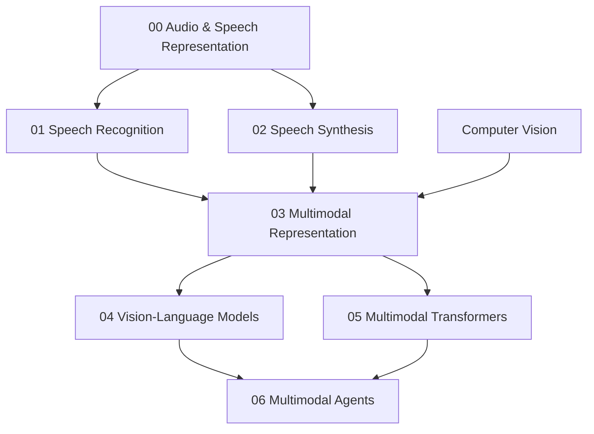

# Speech, Audio and Multimodal AI — Reading Map

Folder này nối perception ngoài text vào AI system: waveform/audio representation → ASR/TTS → multimodal alignment → Vision-Language Models → multimodal Transformer → multimodal agents.



## Chapters

- [00 — Audio and Speech Representation](./00_audio_and_speech_representation.md)
- [01 — Speech Recognition](./01_speech_recognition.md)
- [02 — Speech Synthesis](./02_speech_synthesis.md)
- [03 — Multimodal Representation](./03_multimodal_representation.md)
- [04 — Vision-Language Models](./04_vision_language_models.md)
- [05 — Multimodal Transformers](./05_multimodal_transformers.md)
- [06 — Multimodal Agents](./06_multimodal_agents.md)

## Core distinctions

```text
Waveform ≠ Text
Spectrogram ≠ Ordinary Image
ASR ≠ Speaker Recognition
TTS ≠ Just Pronunciation
Shared Embedding ≠ Perfect Grounding
Vision-Language Model ≠ Exact Spatial Understanding
More Modalities ≠ Better Answer
Visual Text ≠ Trusted Instruction
Multimodal Agent ≠ VLM With Click Tool Only
```

## Mental Model

```text
Physical signals / visual scenes
→ modality-specific measurement
→ modality encoders
→ aligned/fused representation
→ language/reasoning
→ tool/action/output
```

The library treats multimodal AI as an interface problem between heterogeneous measurement spaces, not as a buzzword layer over an LLM.

## Connections

Nên đọc cùng:

- [Computer Vision](../12_computer_vision/README.md)
- [Transformer](../06_deep_learning_architectures/05_transformer.md)
- [Large Language Models](../08_large_language_models/README.md)
- [Agents](../10_agents_and_ai_systems/README.md)

Layer tiếp theo `14_data_for_ai/` tập trung vào material mà toàn bộ learning system phụ thuộc: data collection, labeling, quality, leakage, bias, synthetic data và governance.