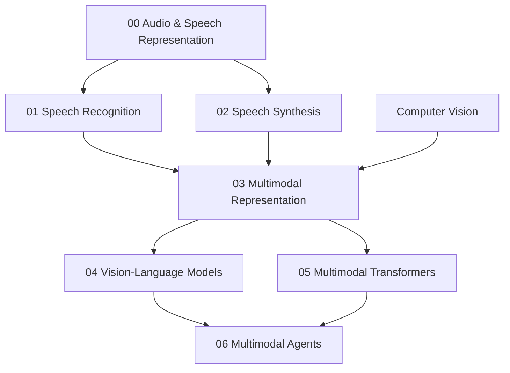

# Speech, Audio and Multimodal AI — Reading Map

> **Mạch đọc:** Đọc **Speech, Audio and Multimodal AI — Reading Map** như một mắt xích của lộ trình học (learning path / 학습 경로) hiện tại, không như một ghi chú tách rời. Nội dung đi từ **Chapters** sang **cốt lõi (core / 핵심) distinctions**; điểm nối này chuẩn bị câu hỏi cho các mục sau thay vì dừng ở định nghĩa đầu tiên.


Folder này nối perception ngoài văn bản (text / 텍스트) vào AI hệ thống (system / 시스템): waveform/audio biểu diễn (representation / 표현) → ASR/TTS → multimodal alignment → Vision-Language các mô hình (models / 모델들) → multimodal Transformer → multimodal agents.


```mermaid
flowchart TD
    A[00 Audio & Speech Representation] --> ASR[01 Speech Recognition]
    A --> TTS[02 Speech Synthesis]
    ASR --> M[03 Multimodal Representation]
    TTS --> M
    V[Computer Vision] --> M
    M --> VLM[04 Vision-Language Models]
    M --> MT[05 Multimodal Transformers]
    VLM --> MA[06 Multimodal Agents]
    MT --> MA
```

## Chapters

- [00 — Audio and Speech Representation](./00_audio_and_speech_representation.md)
- [01 — Speech Recognition](./01_speech_recognition.md)
- [02 — Speech Synthesis](./02_speech_synthesis.md)
- [03 — Multimodal Representation](./03_multimodal_representation.md)
- [04 — Vision-Language Models](./04_vision_language_models.md)
- [05 — Multimodal Transformers](./05_multimodal_transformers.md)
- [06 — Multimodal Agents](./06_multimodal_agents.md)


> **Chuyển mạch:** Từ **Chapters**, ta sang **cốt lõi (core / 핵심) distinctions** để mở rộng cùng câu hỏi và dùng kết quả đó để khép lại mạch giải thích.

## Cốt lõi (core / 핵심) distinctions

```text
Waveform ≠ Text
Spectrogram ≠ Ordinary Image
ASR ≠ Speaker Recognition
TTS ≠ Just Pronunciation
Shared Embedding ≠ Perfect Grounding
Vision-Language Model ≠ Exact Spatial Understanding
More Modalities ≠ Better Answer
Visual Text ≠ Trusted Instruction
Multimodal Agent ≠ VLM With Click Tool Only
```


> **Chuyển mạch:** Từ **cốt lõi (core / 핵심) distinctions**, ta sang **mô hình tư duy (mental model / 사고 모델)** để mở rộng cùng câu hỏi và dùng kết quả đó để khép lại mạch giải thích.

## Mô hình tư duy (mental model / 사고 모델)

```text
Physical signals / visual scenes
→ modality-specific measurement
→ modality encoders
→ aligned/fused representation
→ language/reasoning
→ tool/action/output
```

The thư viện (library / 라이브러리) treats multimodal AI as an giao diện (interface / 인터페이스) bài toán (problem / 문제) between heterogeneous đo lường (measurement / 측정) spaces, not as a buzzword tầng (layer / 계층) over an LLM.


> **Chuyển mạch:** Từ **mô hình tư duy (mental model / 사고 모델)**, ta sang **Connections** để mở rộng cùng câu hỏi và dùng kết quả đó để khép lại mạch giải thích.

## Connections

Nên đọc cùng:

- [Computer Vision](../12_computer_vision/README.md)
- [Transformer](../06_deep_learning_architectures/05_transformer.md)
- [Large Language Models](../08_large_language_models/README.md)
- [Agents](../10_agents_and_ai_systems/README.md)

Tầng (layer / 계층) tiếp theo `14_data_for_ai/` tập trung vào material mà toàn bộ học tập (learning / 학습) hệ thống (system / 시스템) phụ thuộc: dữ liệu (data / 데이터) collection, labeling, chất lượng (quality / 품질), leakage, độ lệch (bias / 편향), synthetic dữ liệu (data / 데이터) và quản trị (governance / 거버넌스).

> **Bàn giao:** Sau **Connections**, hãy chốt bất biến (invariant / 불변식) và giới hạn của mục này trước khi nối sang kiến thức kế tiếp. Có thể đọc tiếp [00 audio and speech representation](./00_audio_and_speech_representation.md) để đối chiếu ranh giới (boundary / 경계) gần nhất.
