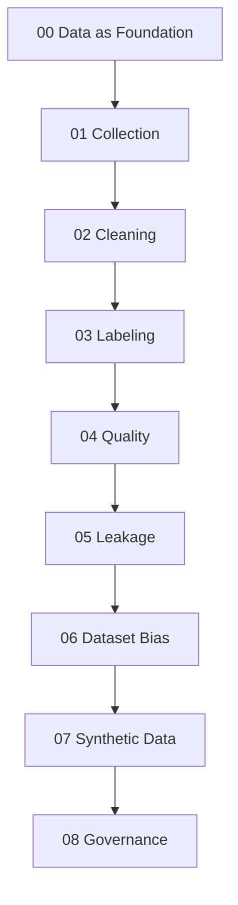

# Data for AI — Reading Map

Folder này coi data như một **engineered observation system**, không phải CSV phụ trợ cho model. Reading path đi từ data-generating process tới collection, cleaning, labeling, quality, leakage, bias, synthetic data và governance.



## Chapters

- [00 — Data as the Foundation of AI](./00_data_as_the_foundation_of_ai.md)
- [01 — Data Collection](./01_data_collection.md)
- [02 — Data Cleaning](./02_data_cleaning.md)
- [03 — Data Labeling](./03_data_labeling.md)
- [04 — Data Quality](./04_data_quality.md)
- [05 — Data Leakage](./05_data_leakage.md)
- [06 — Dataset Bias](./06_dataset_bias.md)
- [07 — Synthetic Data](./07_synthetic_data.md)
- [08 — Data Governance](./08_data_governance.md)

## Core distinctions

```text
Dataset ≠ Reality
Label ≠ Ground Truth by Definition
Missing ≠ Zero
Clean Format ≠ High Quality
Data Drift ≠ Necessarily Model Failure
Random Split ≠ Always Valid Split
Balanced Classes ≠ Unbiased Dataset
Synthetic Data ≠ Privacy Guarantee
Available in Database ≠ Available at Prediction Time
Pseudonymization ≠ Anonymization
```

## Mental Model

```text
Reality
→ measurement / logging
→ collection policy
→ cleaning / labeling
→ versioned dataset
→ model
→ decisions
→ feedback into future data
```

Data quality therefore depends on both statistical properties and the software/social process that generates observations.

## Connections

Nên đọc cùng:

- [Statistics for AI](../01_mathematical_foundations/03_statistics_for_ai.md)
- [Machine Learning Data, Features and Labels](../04_machine_learning/02_data_features_and_labels.md)
- [Model Evaluation](../04_machine_learning/15_model_evaluation.md)
- [RAG Document Processing](../09_retrieval_and_rag/06_chunking_and_document_processing.md)
- [Agent Memory](../10_agents_and_ai_systems/04_agent_memory.md)

Layer tiếp theo `15_ai_engineering/` chuyển từ learning artifacts sang production systems: training/inference pipelines, serving, batching, quantization, compression, latency/cost và AI system design.