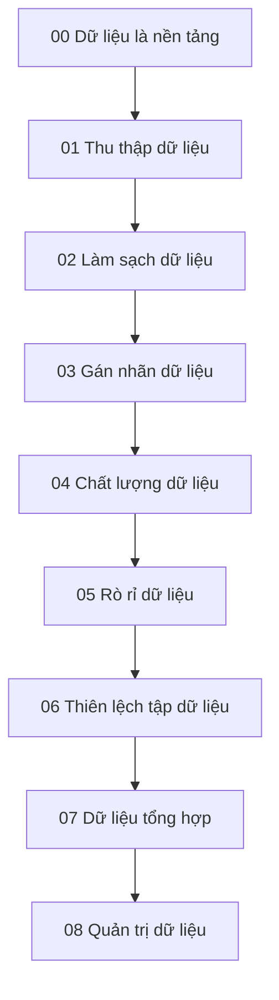

# Knowledge Layer về Dữ liệu cho AI

Folder này xem **dữ liệu (data)** như một **hệ thống quan sát được thiết kế (engineered observation system)**, không phải một file CSV phụ trợ cho mô hình. Lộ trình đọc đi từ quá trình sinh dữ liệu, thu thập, làm sạch, gán nhãn, đánh giá chất lượng, rò rỉ dữ liệu, thiên lệch tập dữ liệu, dữ liệu tổng hợp cho tới quản trị dữ liệu.



## Các chapter

- [00 — Dữ liệu là nền tảng của AI](./00_data_as_the_foundation_of_ai.md)
- [01 — Thu thập dữ liệu](./01_data_collection.md)
- [02 — Làm sạch dữ liệu](./02_data_cleaning.md)
- [03 — Gán nhãn dữ liệu](./03_data_labeling.md)
- [04 — Chất lượng dữ liệu](./04_data_quality.md)
- [05 — Rò rỉ dữ liệu](./05_data_leakage.md)
- [06 — Thiên lệch tập dữ liệu](./06_dataset_bias.md)
- [07 — Dữ liệu tổng hợp](./07_synthetic_data.md)
- [08 — Quản trị dữ liệu](./08_data_governance.md)

## Những phân biệt cốt lõi

```text
Tập dữ liệu (dataset) ≠ thực tế
Nhãn (label) ≠ ground truth chỉ vì nó được gán nhãn
Giá trị thiếu (missing) ≠ số 0
Định dạng sạch ≠ dữ liệu chất lượng cao
Data drift ≠ chắc chắn là model failure
Random split ≠ luôn là cách chia dữ liệu hợp lệ
Cân bằng số lượng class ≠ tập dữ liệu không thiên lệch
Synthetic data ≠ bảo đảm quyền riêng tư
Có trong database ≠ chắc chắn có sẵn tại thời điểm dự đoán
Pseudonymization ≠ anonymization
```

Các phân biệt này giúp tránh một lỗi tư duy phổ biến: coi dataset là bản sao trung thực của thế giới. Trên thực tế, dữ liệu luôn đi qua quá trình đo lường, lựa chọn, logging, sampling, labeling và filtering trước khi tới mô hình.

## Mô hình tư duy

```text
Thực tế
→ đo lường / logging
→ chính sách thu thập
→ làm sạch / gán nhãn
→ tập dữ liệu có version
→ mô hình
→ quyết định
→ phản hồi quay trở lại dữ liệu tương lai
```

Chất lượng dữ liệu vì vậy phụ thuộc đồng thời vào thuộc tính thống kê và vào quy trình phần mềm/xã hội tạo ra các observation. Một dataset có schema hoàn hảo vẫn có thể gây sai lệch nếu cơ chế thu thập bỏ sót một nhóm người dùng, nếu label phản ánh guideline không nhất quán hoặc nếu thông tin chỉ xuất hiện sau thời điểm prediction nhưng vô tình được đưa vào feature.

## Cách đọc layer này

Các chapter đầu tập trung vào cách dữ liệu được tạo và biến đổi. Phần giữa đi sâu vào quality, leakage và bias — ba nhóm lỗi có thể làm evaluation trông rất tốt nhưng deployment lại thất bại. Hai chapter cuối mở rộng sang synthetic data và governance, nơi câu hỏi không còn chỉ là “model học tốt không?” mà còn là dữ liệu có provenance, quyền truy cập, retention, version và trách nhiệm quản lý rõ hay không.

Một nguyên tắc xuyên suốt là:

> **Mô hình chỉ có thể học từ những gì pipeline dữ liệu làm cho nó quan sát được. Vì vậy data design là một phần của model design.**

## Liên kết kiến thức

Nên đọc cùng:

- [Thống kê cho AI](../01_mathematical_foundations/03_statistics_for_ai.md)
- [Dữ liệu, Feature và Label trong Machine Learning](../04_machine_learning/02_data_features_and_labels.md)
- [Đánh giá mô hình](../04_machine_learning/15_model_evaluation.md)
- [Xử lý tài liệu cho RAG](../09_retrieval_and_rag/06_chunking_and_document_processing.md)
- [Bộ nhớ của Agent](../10_agents_and_ai_systems/04_agent_memory.md)

Layer tiếp theo `15_ai_engineering/` chuyển từ các artifact phục vụ học máy sang hệ thống production: pipeline huấn luyện/suy luận, model serving, batching, quantization, compression, latency, cost và kiến trúc hệ thống AI.