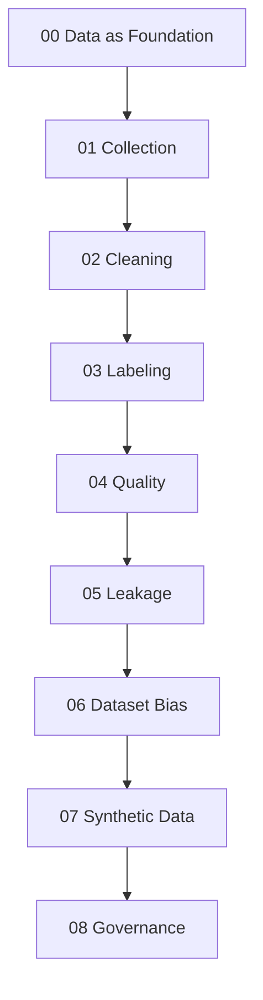

# Dữ liệu (data / 데이터) for AI — Reading Map

> **Mạch đọc:** Đọc **dữ liệu (data / 데이터) for AI — Reading Map** như một mắt xích của lộ trình học (learning path / 학습 경로) hiện tại, không như một ghi chú tách rời. Nội dung đi từ **Chapters** sang **cốt lõi (core / 핵심) distinctions**; điểm nối này chuẩn bị câu hỏi cho các mục sau thay vì dừng ở định nghĩa đầu tiên.


Folder này coi dữ liệu (data / 데이터) như một **engineered observation hệ thống (system / 시스템)**, không phải CSV phụ trợ cho mô hình (model / 모델). Reading đường dẫn (path / 경로) đi từ data-generating tiến trình (process / 프로세스) tới collection, cleaning, labeling, chất lượng (quality / 품질), leakage, độ lệch (bias / 편향), synthetic dữ liệu (data / 데이터) và quản trị (governance / 거버넌스).


```mermaid
flowchart TD
    F[00 Data as Foundation] --> C[01 Collection]
    C --> CL[02 Cleaning]
    CL --> L[03 Labeling]
    L --> Q[04 Quality]
    Q --> LK[05 Leakage]
    LK --> B[06 Dataset Bias]
    B --> S[07 Synthetic Data]
    S --> G[08 Governance]
```

## Chapters

Sơ đồ hoặc danh sách này mô tả thứ tự phụ thuộc của các khái niệm. Hãy đọc theo mũi tên để biết phần nào là prerequisite, phần nào là ứng dụng và khi nào cần quay lại nền tảng.

- [00 — Data as the Foundation of AI](./00_data_as_the_foundation_of_ai.md)
- [01 — Data Collection](./01_data_collection.md)
- [02 — Data Cleaning](./02_data_cleaning.md)
- [03 — Data Labeling](./03_data_labeling.md)
- [04 — Data Quality](./04_data_quality.md)
- [05 — Data Leakage](./05_data_leakage.md)
- [06 — Dataset Bias](./06_dataset_bias.md)
- [07 — Synthetic Data](./07_synthetic_data.md)
- [08 — Data Governance](./08_data_governance.md)


> **Chuyển mạch:** Từ **Chapters**, ta sang **cốt lõi (core / 핵심) distinctions** để mở rộng cùng câu hỏi và dùng kết quả đó để khép lại mạch giải thích.

## Cốt lõi (core / 핵심) distinctions

Phần này kiểm tra ranh giới và failure mode của cơ chế vừa học. Hãy dùng nó để biết khi nào mô hình còn đúng, khi nào cần đổi chiến lược và bằng chứng nào phải thu thập.

```text
Dataset ≠ Reality
Label ≠ Ground Truth by Definition
Missing ≠ Zero
Clean Format ≠ High Quality
Data Drift ≠ Necessarily Model Failure
Random Split ≠ Always Valid Split
Balanced Classes ≠ Unbiased Dataset
Synthetic Data ≠ Privacy Guarantee
Available in Database ≠ Available at Prediction Time
Pseudonymization ≠ Anonymization
```


> **Chuyển mạch:** Từ **cốt lõi (core / 핵심) distinctions**, ta sang **mô hình tư duy (mental model / 사고 모델)** để mở rộng cùng câu hỏi và dùng kết quả đó để khép lại mạch giải thích.

## Mô hình tư duy (mental model / 사고 모델)

Phần này chốt mental model thành một chuỗi có thể dùng lại: bối cảnh → cơ chế → quan sát → giới hạn → quyết định. Hãy đọc sơ đồ như công cụ suy luận, không như một khẩu hiệu tách khỏi chapter.

```text
Reality
→ measurement / logging
→ collection policy
→ cleaning / labeling
→ versioned dataset
→ model
→ decisions
→ feedback into future data
```

Dữ liệu (data / 데이터) chất lượng (quality / 품질) therefore depends on both statistical properties and the software/xã hội (social / 사회적) tiến trình (process / 프로세스) that generates observations.


> **Chuyển mạch:** Từ **mô hình tư duy (mental model / 사고 모델)**, ta sang **Connections** để mở rộng cùng câu hỏi và dùng kết quả đó để khép lại mạch giải thích.

## Connections

Nên đọc cùng:

- [Statistics for AI](../01_mathematical_foundations/03_statistics_for_ai.md)
- [Machine Learning Data, Features and Labels](../04_machine_learning/02_data_features_and_labels.md)
- [Model Evaluation](../04_machine_learning/15_model_evaluation.md)
- [RAG Document Processing](../09_retrieval_and_rag/06_chunking_and_document_processing.md)
- [Agent Memory](../10_agents_and_ai_systems/04_agent_memory.md)

Layer tiếp theo `15_ai_engineering/` chuyển từ learning artifacts sang production systems: training/inference pipelines, serving, batching, quantization, compression, latency/cost và AI system design.
