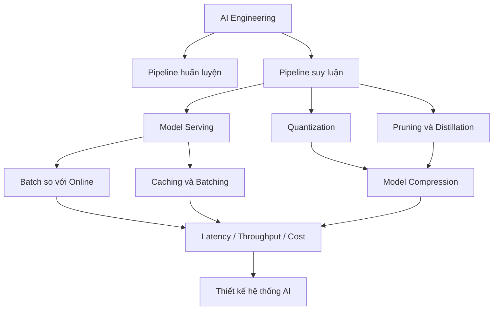

# AI Engineering

**Kỹ thuật AI (AI Engineering)** là layer biến model, data, retrieval và agent thành năng lực production có performance, reliability và cost dễ dự đoán hơn. Folder này không tập trung vào một framework cụ thể mà ưu tiên các cơ chế, trade-off và system contract có giá trị lâu dài.

## Thứ tự đọc

```text
00_ai_engineering.md
01_training_pipeline.md
02_inference_pipeline.md
03_model_serving.md
04_batch_vs_online_inference.md
05_caching_and_batching.md
06_quantization.md
07_pruning_and_distillation.md
08_model_compression.md
09_latency_throughput_and_cost.md
10_ai_system_design.md
```

## Bản đồ phụ thuộc



## Mô hình tư duy cốt lõi

```text
Model artifact
   ↓
Runtime
   ↓
Hợp đồng serving
   ↓
Lập lịch tài nguyên
   ↓
Điều phối application
   ↓
Verification / fallback
   ↓
Observability / evaluation
```

Một model tốt chưa phải một production system tốt. Sau khi training kết thúc, model còn phải được đóng gói, load vào runtime, expose qua serving contract, chia tài nguyên, quản lý concurrency, kiểm soát latency, fallback khi lỗi và được quan sát liên tục trong môi trường thật.

AI Engineering khác với MLOps ở trọng tâm. Layer này tập trung nhiều hơn vào **runtime, serving và system design**. Layer `16_mlops_and_llmops/` đi sâu vào lifecycle: experiment, versioning, CI/CD/CT, registry, monitoring, governance và quy trình vận hành xuyên suốt nhiều model version.

## Những phân biệt cần giữ rõ

```text
Training pipeline      ≠ Inference pipeline
Deployment             ≠ Serving
Batch inference         ≠ Online inference
Caching                 ≠ Batching
Quantization            ≠ Distillation
Model file nhỏ hơn      ≠ end-to-end latency luôn thấp hơn
GPU utilization cao     ≠ trải nghiệm user luôn tốt
Model endpoint          ≠ production AI system hoàn chỉnh
Prompt instruction      ≠ security boundary
```

Các distinction này quan trọng vì nhiều tối ưu nhìn tốt ở một layer có thể làm hệ thống tổng thể tệ hơn. Ví dụ model nhỏ hơn có thể load nhanh nhưng tokenizer, network hoặc queue vẫn là bottleneck; GPU utilization cao có thể đến từ batch lớn nhưng làm request đơn lẻ chờ lâu hơn.

## Cách đọc layer này

Các chapter đầu xây ranh giới giữa training và inference. Phần giữa đi vào serving, batch/online, caching, batching và các kỹ thuật giảm chi phí tính toán như quantization, pruning, distillation và compression. Phần cuối nối tất cả thành bài toán latency–throughput–cost và kiến trúc AI end-to-end.

Một nguyên tắc xuyên suốt là:

> **Tối ưu model không đồng nghĩa tối ưu hệ thống. Production quality xuất hiện khi model, runtime, dữ liệu, orchestration và hạ tầng được thiết kế như một hệ thống thống nhất.**

## Liên kết kiến thức

AI Engineering phụ thuộc vào [Dữ liệu cho AI](../14_data_for_ai/README.md), [RAG](../09_retrieval_and_rag/README.md), [Agent](../10_agents_and_ai_systems/README.md) và [Deep Learning](../06_deep_learning_architectures/README.md).

Sau folder này nên đọc [MLOps / LLMOps](../16_mlops_and_llmops/README.md) và [AI Compute & Infrastructure](../17_ai_compute_and_infrastructure/README.md), nơi các concern về lifecycle, deployment automation, hardware, memory, networking và distributed execution được mở rộng sâu hơn.