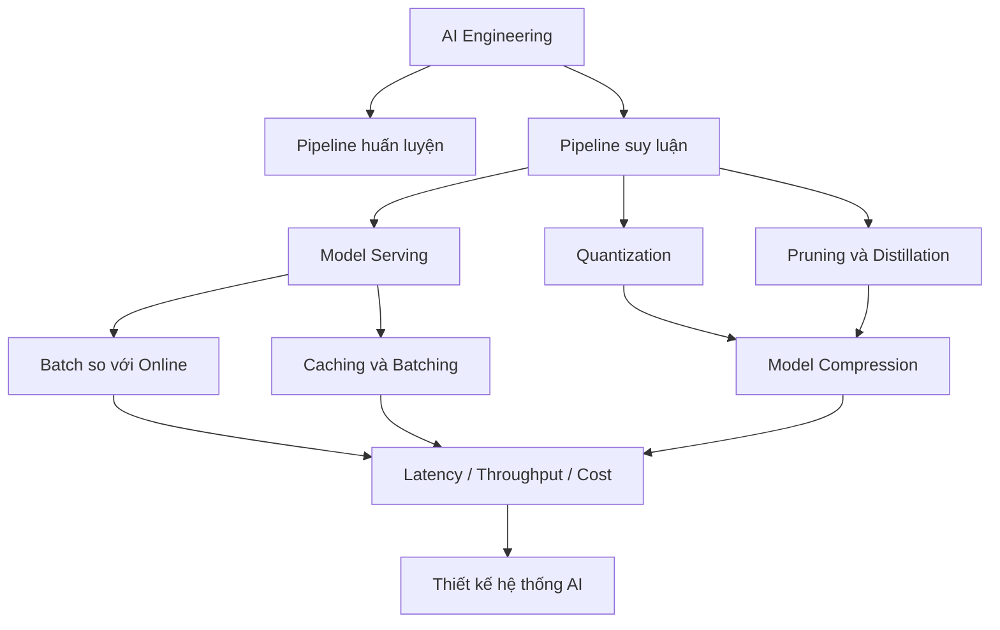

# AI kỹ thuật (engineering / 엔지니어링)

> **Mạch đọc:** [README](./README.md) là bản đồ owner của **AI kỹ thuật (engineering / 엔지니어링)**; nhìn vào vị trí đó trước để biết file này đang phục vụ nhánh kiến thức nào. **Thứ tự đọc** mở đối tượng chính của file và câu hỏi cần theo dõi; sau đó sang **Bản đồ phụ thuộc** để mở rộng đối tượng sang phạm vi kế cận. Cách đi này giữ lại điểm tựa của section đầu và cho biết kết luận sẽ được dùng ở đâu, thay vì dừng ở định nghĩa đầu tiên.

**Kỹ thuật AI (AI Engineering)** là tầng (layer / 계층) biến mô hình (model / 모델), dữ liệu (data / 데이터), retrieval và tác nhân (agent / 에이전트) thành năng lực môi trường vận hành (production / 운영 환경) có hiệu năng (performance / 성능), độ tin cậy (reliability / 신뢰성) và chi phí (cost / 비용) dễ dự đoán hơn. Folder này không tập trung vào một khung phần mềm (framework / 프레임워크) cụ thể mà ưu tiên các cơ chế, sự đánh đổi (trade-off / 트레이드오프) và hệ thống (system / 시스템) đặc tả hợp đồng (contract / 계약) có giá trị lâu dài.

## Thứ tự đọc

Phần này chuyển khái niệm Computer Science thành cấu trúc, ví dụ hoặc quy trình có thể kiểm tra. Hãy xác định câu hỏi mà mục trả lời rồi nối kết luận với phần kế tiếp.

```text
00_ai_engineering.md
01_training_pipeline.md
02_inference_pipeline.md
03_model_serving.md
04_batch_vs_online_inference.md
05_caching_and_batching.md
06_quantization.md
07_pruning_and_distillation.md
08_model_compression.md
09_latency_throughput_and_cost.md
10_ai_system_design.md
```

> **Chuyển mạch:** Trong **AI kỹ thuật (engineering / 엔지니어링)**, **Bản đồ phụ thuộc** tiếp nhận điểm tựa từ **Thứ tự đọc** nhưng đổi góc nhìn sang câu hỏi của chính nó; đọc liền hai mục để thấy mối quan hệ đó. Từ đây, **Mô hình tư duy cốt lõi** sẽ cho biết hệ quả hoặc giới hạn ấy hiện ra ở đâu.

## Bản đồ phụ thuộc

Sơ đồ hoặc danh sách này mô tả thứ tự phụ thuộc của các khái niệm. Hãy đọc theo mũi tên để biết phần nào là prerequisite, phần nào là ứng dụng và khi nào cần quay lại nền tảng.


```mermaid
flowchart TD
    A[AI Engineering] --> T[Pipeline huấn luyện]
    A --> I[Pipeline suy luận]
    I --> S[Model Serving]
    S --> BO[Batch so với Online]
    S --> CB[Caching và Batching]
    I --> Q[Quantization]
    I --> PD[Pruning và Distillation]
    Q --> MC[Model Compression]
    PD --> MC
    BO --> LTC[Latency / Throughput / Cost]
    CB --> LTC
    MC --> LTC
    LTC --> SD[Thiết kế hệ thống AI]
```

> **Chuyển mạch:** Ở chặng này của **AI kỹ thuật (engineering / 엔지니어링)**, **Mô hình tư duy cốt lõi** gom các mảnh từ **Bản đồ phụ thuộc** thành một kết luận có thể mang sang phần kế tiếp. Từ đây, **Những phân biệt cần giữ rõ** sẽ cho biết hệ quả hoặc giới hạn ấy hiện ra ở đâu.

## Mô hình tư duy cốt lõi

Phần này chốt mental model thành một chuỗi có thể dùng lại: bối cảnh → cơ chế → quan sát → giới hạn → quyết định. Hãy đọc sơ đồ như công cụ suy luận, không như một khẩu hiệu tách khỏi chapter.

```text
Model artifact
   ↓
Runtime
   ↓
Hợp đồng serving
   ↓
Lập lịch tài nguyên
   ↓
Điều phối application
   ↓
Verification / fallback
   ↓
Observability / evaluation
```

Một mô hình (model / 모델) tốt chưa phải một môi trường vận hành (production / 운영 환경) hệ thống (system / 시스템) tốt. Sau khi huấn luyện (training / 학습) kết thúc, mô hình (model / 모델) còn phải được đóng gói, tải (load / 로드) vào thời gian chạy (runtime / 런타임), expose qua serving đặc tả hợp đồng (contract / 계약), chia tài nguyên, quản lý tính đồng thời (concurrency / 동시성), kiểm soát độ trễ (latency / 지연 시간), fallback khi lỗi và được quan sát liên tục trong môi trường thật.

AI kỹ thuật (engineering / 엔지니어링) khác với MLOps ở trọng tâm. tầng (layer / 계층) này tập trung nhiều hơn vào **thời gian chạy (runtime / 런타임), serving và hệ thống (system / 시스템) thiết kế (design / 설계)**. tầng (layer / 계층) `16_mlops_and_llmops/` đi sâu vào vòng đời (lifecycle / 생명주기): experiment, versioning, CI/CD/CT, registry, monitoring, quản trị (governance / 거버넌스) và quy trình vận hành xuyên suốt nhiều mô hình (model / 모델) phiên bản (version / 버전).

> **Chuyển mạch:** Đặt trong câu hỏi lớn của **AI kỹ thuật (engineering / 엔지니어링)**, **Những phân biệt cần giữ rõ** gom các mảnh từ **Mô hình tư duy cốt lõi** thành một kết luận có thể mang sang phần kế tiếp. Từ đây, **Cách đọc tầng (layer / 계층) này** sẽ cho biết hệ quả hoặc giới hạn ấy hiện ra ở đâu.

## Những phân biệt cần giữ rõ

Phần này chuyển khái niệm Computer Science thành cấu trúc, ví dụ hoặc quy trình có thể kiểm tra. Hãy xác định câu hỏi mà mục trả lời rồi nối kết luận với phần kế tiếp.

```text
Training pipeline      ≠ Inference pipeline
Deployment             ≠ Serving
Batch inference         ≠ Online inference
Caching                 ≠ Batching
Quantization            ≠ Distillation
Model file nhỏ hơn      ≠ end-to-end latency luôn thấp hơn
GPU utilization cao     ≠ trải nghiệm user luôn tốt
Model endpoint          ≠ production AI system hoàn chỉnh
Prompt instruction      ≠ security boundary
```

Các distinction này quan trọng vì nhiều tối ưu nhìn tốt ở một tầng (layer / 계층) có thể làm hệ thống tổng thể tệ hơn. Ví dụ mô hình (model / 모델) nhỏ hơn có thể tải (load / 로드) nhanh nhưng tokenizer, mạng (network / 네트워크) hoặc hàng đợi (queue / 큐) vẫn là bottleneck; GPU utilization cao có thể đến từ batch lớn nhưng làm yêu cầu (request / 요청) đơn lẻ chờ lâu hơn.

> **Chuyển mạch:** Trong **AI kỹ thuật (engineering / 엔지니어링)**, **Cách đọc tầng (layer / 계층) này** tiếp nhận điểm tựa từ **Những phân biệt cần giữ rõ** nhưng đổi góc nhìn sang câu hỏi của chính nó; đọc liền hai mục để thấy mối quan hệ đó. Từ đây, **Liên kết kiến thức** sẽ cho biết hệ quả hoặc giới hạn ấy hiện ra ở đâu.

## Cách đọc tầng (layer / 계층) này

Các chapter đầu xây ranh giới giữa huấn luyện (training / 학습) và suy luận (inference / 추론). Phần giữa đi vào serving, batch/online, caching, batching và các kỹ thuật giảm chi phí tính toán như quantization, pruning, distillation và compression. Phần cuối nối tất cả thành bài toán độ trễ (latency / 지연 시간)–thông lượng (throughput / 처리량)–chi phí (cost / 비용) và kiến trúc AI end-to-end.

Một nguyên tắc xuyên suốt là:

> **Tối ưu mô hình (model / 모델) không đồng nghĩa tối ưu hệ thống. môi trường vận hành (production / 운영 환경) chất lượng (quality / 품질) xuất hiện khi mô hình (model / 모델), thời gian chạy (runtime / 런타임), dữ liệu, orchestration và hạ tầng được thiết kế như một hệ thống thống nhất.**

> **Chuyển mạch:** Ở chặng này của **AI kỹ thuật (engineering / 엔지니어링)**, sau nội dung của **Cách đọc tầng (layer / 계층) này**, **Liên kết kiến thức** chỉ rõ tài liệu chuẩn và vị trí sở hữu để người học biết phần nào cần quay lại khi muốn đào sâu. Phần còn lại của file dùng kết quả này để khép lại mạch giải thích.

## Liên kết kiến thức

AI kỹ thuật (engineering / 엔지니어링) phụ thuộc vào [Dữ liệu cho AI](../14_data_for_ai/README.md), [RAG](../09_retrieval_and_rag/README.md), [Agent](../10_agents_and_ai_systems/README.md) và [Deep Learning](../06_deep_learning_architectures/README.md).

Sau folder này nên đọc [MLOps / LLMOps](../16_mlops_and_llmops/README.md) và [AI Compute & Infrastructure](../17_ai_compute_and_infrastructure/README.md), nơi các concern về lifecycle, deployment automation, hardware, memory, networking và distributed execution được mở rộng sâu hơn.

> **Bàn giao:** Sau **Liên kết kiến thức**, hãy giữ lại kết luận và ranh giới của mục này; quay về [README](./README.md) khi cần định vị owner hoặc chọn nhánh học tiếp theo.
