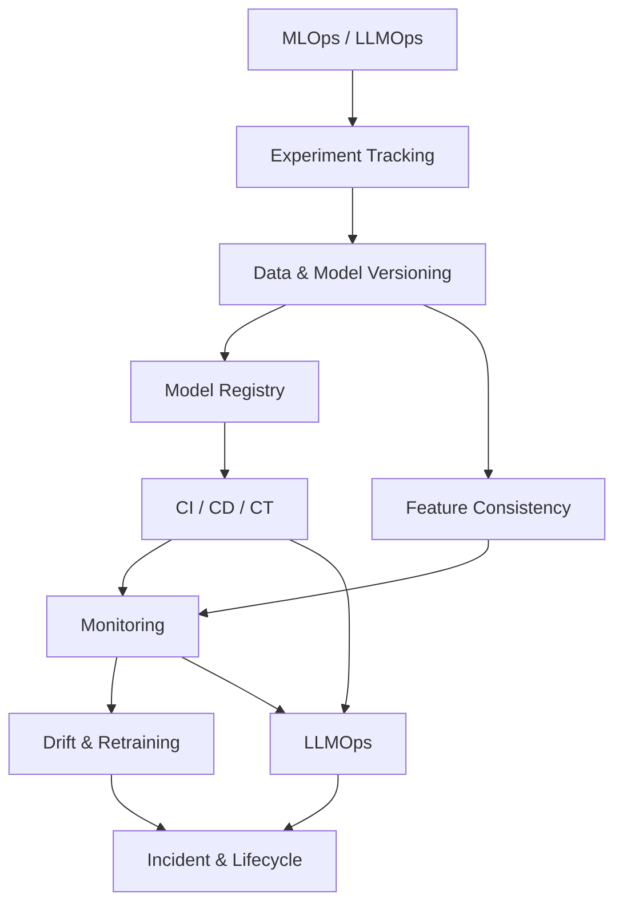

# MLOps & LLMOps

Folder này giải thích cách quản lý **toàn bộ vòng đời của learned behavior**: experiment, data/model lineage, registry, CI/CD/CT, feature consistency, monitoring, drift, versioning của ứng dụng LLM và incident response.

## Thứ tự đọc

```text
00_mlops_and_llmops.md
01_experiment_tracking_and_reproducibility.md
02_data_and_model_versioning.md
03_model_registry.md
04_ci_cd_ct_for_ai.md
05_feature_pipelines_and_training_serving_consistency.md
06_monitoring_and_observability.md
07_drift_and_retraining.md
08_llmops.md
09_incident_response_and_lifecycle.md
```

## Bản đồ phụ thuộc



## Mô hình tư duy

```text
Xây evidence
→ version mọi dependency
→ đăng ký artifact / behavior bundle bất biến
→ promote qua các gate
→ deploy an toàn
→ quan sát behavior thật
→ phát hiện drift và incident
→ retrain / rollback / retire có chủ đích
```

## Những phân biệt cần giữ

```text
Khả năng tái lập (reproducibility) ≠ bit-for-bit determinism
Data drift                        ≠ model failure
Retraining                        ≠ promotion
Registry                          ≠ file storage
Continuous Training               ≠ Continuous Deployment
Monitoring                        ≠ observability
Hosted LLM                        ≠ không cần lifecycle management
Prompt version                    ≠ toàn bộ LLM app version
HTTP 200                          ≠ AI task success
```

## Liên kết kiến thức

Layer này phụ thuộc [Data for AI](../14_data_for_ai/README.md) và [AI Engineering](../15_ai_engineering/README.md). Sau đây nên đọc [AI Compute & Infrastructure](../17_ai_compute_and_infrastructure/README.md), [Evaluation & Reliability](../18_evaluation_reliability_interpretability/README.md) và [Safety & Security](../19_ai_safety_security_alignment/README.md).