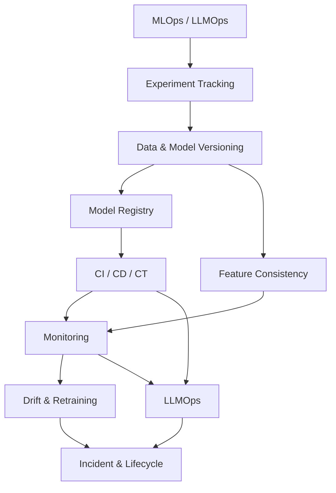

# MLOps & LLMOps

> **Mạch đọc:** Đọc **MLOps & LLMOps** như một mắt xích của lộ trình học (learning path / 학습 경로) hiện tại, không như một ghi chú tách rời. Nội dung đi từ **Thứ tự đọc** sang **Bản đồ phụ thuộc**; điểm nối này chuẩn bị câu hỏi cho các mục sau thay vì dừng ở định nghĩa đầu tiên.


Folder này giải thích cách quản lý **toàn bộ vòng đời của learned hành vi (behavior / 동작)**: experiment, dữ liệu (data / 데이터)/mô hình (model / 모델) lineage, registry, CI/CD/CT, tính năng (feature / 기능) consistency, monitoring, drift, versioning của ứng dụng LLM và sự cố (incident / 인시던트) phản hồi (response / 응답).

## Thứ tự đọc

Phần này chuyển khái niệm Computer Science thành cấu trúc, ví dụ hoặc quy trình có thể kiểm tra. Hãy xác định câu hỏi mà mục trả lời rồi nối kết luận với phần kế tiếp.

```text
00_mlops_and_llmops.md
01_experiment_tracking_and_reproducibility.md
02_data_and_model_versioning.md
03_model_registry.md
04_ci_cd_ct_for_ai.md
05_feature_pipelines_and_training_serving_consistency.md
06_monitoring_and_observability.md
07_drift_and_retraining.md
08_llmops.md
09_incident_response_and_lifecycle.md
```


> **Chuyển mạch:** Từ **Thứ tự đọc**, ta sang **Bản đồ phụ thuộc** để mở rộng cùng câu hỏi và dùng kết quả đó để khép lại mạch giải thích.

## Bản đồ phụ thuộc

Sơ đồ hoặc danh sách này mô tả thứ tự phụ thuộc của các khái niệm. Hãy đọc theo mũi tên để biết phần nào là prerequisite, phần nào là ứng dụng và khi nào cần quay lại nền tảng.


```mermaid
flowchart TD
    A[MLOps / LLMOps] --> E[Experiment Tracking]
    E --> V[Data & Model Versioning]
    V --> R[Model Registry]
    R --> C[CI / CD / CT]
    V --> F[Feature Consistency]
    C --> M[Monitoring]
    F --> M
    M --> D[Drift & Retraining]
    C --> L[LLMOps]
    M --> L
    D --> I[Incident & Lifecycle]
    L --> I
```


> **Chuyển mạch:** Từ **Bản đồ phụ thuộc**, ta sang **Mô hình tư duy** để mở rộng cùng câu hỏi và dùng kết quả đó để khép lại mạch giải thích.

## Mô hình tư duy

Phần này chốt mental model thành một chuỗi có thể dùng lại: bối cảnh → cơ chế → quan sát → giới hạn → quyết định. Hãy đọc sơ đồ như công cụ suy luận, không như một khẩu hiệu tách khỏi chapter.

```text
Xây evidence
→ version mọi dependency
→ đăng ký artifact / behavior bundle bất biến
→ promote qua các gate
→ deploy an toàn
→ quan sát behavior thật
→ phát hiện drift và incident
→ retrain / rollback / retire có chủ đích
```


> **Chuyển mạch:** Từ **Mô hình tư duy**, ta sang **Những phân biệt cần giữ** để mở rộng cùng câu hỏi và dùng kết quả đó để khép lại mạch giải thích.

## Những phân biệt cần giữ

Phần này chuyển khái niệm Computer Science thành cấu trúc, ví dụ hoặc quy trình có thể kiểm tra. Hãy xác định câu hỏi mà mục trả lời rồi nối kết luận với phần kế tiếp.

```text
Khả năng tái lập (reproducibility) ≠ bit-for-bit determinism
Data drift                        ≠ model failure
Retraining                        ≠ promotion
Registry                          ≠ file storage
Continuous Training               ≠ Continuous Deployment
Monitoring                        ≠ observability
Hosted LLM                        ≠ không cần lifecycle management
Prompt version                    ≠ toàn bộ LLM app version
HTTP 200                          ≠ AI task success
```


> **Chuyển mạch:** Từ **Những phân biệt cần giữ**, ta sang **Liên kết kiến thức** để mở rộng cùng câu hỏi và dùng kết quả đó để khép lại mạch giải thích.

## Liên kết kiến thức

Layer này phụ thuộc [Data for AI](../14_data_for_ai/README.md) và [AI Engineering](../15_ai_engineering/README.md). Sau đây nên đọc [AI Compute & Infrastructure](../17_ai_compute_and_infrastructure/README.md), [Evaluation & Reliability](../18_evaluation_reliability_interpretability/README.md) và [Safety & Security](../19_ai_safety_security_alignment/README.md).
