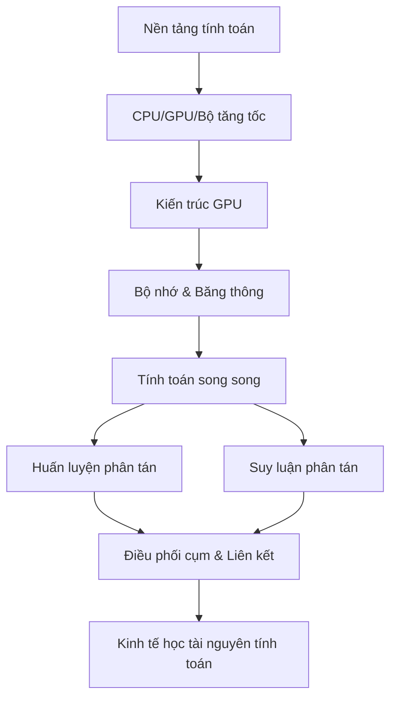

# Tính toán và Hạ tầng AI

Folder này giải thích **nền tảng vật lý (physical substrate)** của AI: bộ tăng tốc (accelerator), kiến trúc GPU, phân cấp bộ nhớ, tính toán song song, huấn luyện/suy luận phân tán, topology của cụm máy và kinh tế học tài nguyên tính toán. Mục tiêu không phải học phần cứng như một domain tách rời mà hiểu **vì sao hành vi của mô hình và runtime bị giới hạn bởi năng lực tính toán, bộ nhớ và giao tiếp**.

## Thứ tự đọc

```text
00_compute_foundations.md
01_cpu_gpu_tpu_and_accelerators.md
02_gpu_architecture.md
03_memory_and_bandwidth.md
04_parallel_computing.md
05_distributed_training.md
06_distributed_inference.md
07_cluster_scheduling_and_interconnect.md
08_compute_economics_capacity_and_energy.md
```

## Bản đồ phụ thuộc



## Mô hình tư duy

```text
Toán học của mô hình
→ phép toán tensor
→ kernel
→ tính toán trên accelerator
→ di chuyển dữ liệu trong bộ nhớ
→ giao tiếp giữa các device
→ điều phối cụm máy
→ độ trễ / throughput / chi phí
```

## Những phân biệt cần giữ

```text
Dung lượng (capacity)             ≠ băng thông (bandwidth)
Băng thông                        ≠ độ trễ
Peak FLOPs                        ≠ hiệu năng thực tế
GPU bận                           ≠ GPU hoạt động hiệu quả
Song song dữ liệu                 ≠ song song tensor
Song song mô hình                 ≠ song song request
Nhiều GPU hơn                    ≠ speedup tuyến tính
Mô hình vừa VRAM                  ≠ đủ bộ nhớ cho serving concurrency
Unified memory                   ≠ mọi vùng bộ nhớ có cùng tốc độ
Accelerator rẻ hơn               ≠ chi phí trên mỗi tác vụ thành công thấp hơn
```

## Liên kết kiến thức

Layer này nối [Numerical Computation](../01_mathematical_foundations/07_numerical_computation.md), [Deep Learning](../06_deep_learning_architectures/README.md), [AI Engineering](../15_ai_engineering/README.md) và [MLOps/LLMOps](../16_mlops_and_llmops/README.md). Sau đây nên đọc [Evaluation / Reliability / Interpretability](../18_evaluation_reliability_interpretability/README.md).