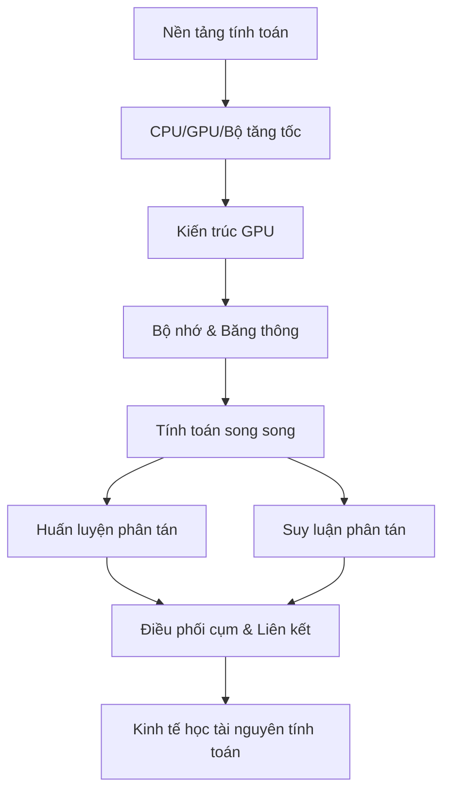

# Tính toán và Hạ tầng AI

> **Mạch đọc:** Đọc **Tính toán và Hạ tầng AI** như một mắt xích của lộ trình học (learning path / 학습 경로) hiện tại, không như một ghi chú tách rời. Nội dung đi từ **Thứ tự đọc** sang **Bản đồ phụ thuộc**; điểm nối này chuẩn bị câu hỏi cho các mục sau thay vì dừng ở định nghĩa đầu tiên.


Folder này giải thích **nền tảng vật lý (physical substrate)** của AI: bộ tăng tốc (accelerator), kiến trúc GPU, phân cấp bộ nhớ, tính toán song song, huấn luyện/suy luận phân tán, topology của cụm máy và kinh tế học tài nguyên tính toán. Mục tiêu không phải học phần cứng như một lĩnh vực (domain / 도메인) tách rời mà hiểu **vì sao hành vi của mô hình và thời gian chạy (runtime / 런타임) bị giới hạn bởi năng lực tính toán, bộ nhớ và giao tiếp**.

## Thứ tự đọc

```text
00_compute_foundations.md
01_cpu_gpu_tpu_and_accelerators.md
02_gpu_architecture.md
03_memory_and_bandwidth.md
04_parallel_computing.md
05_distributed_training.md
06_distributed_inference.md
07_cluster_scheduling_and_interconnect.md
08_compute_economics_capacity_and_energy.md
```


> **Chuyển mạch:** Từ **Thứ tự đọc**, ta sang **Bản đồ phụ thuộc** để mở rộng cùng câu hỏi và dùng kết quả đó để khép lại mạch giải thích.

## Bản đồ phụ thuộc


```mermaid
flowchart TD
    C[Nền tảng tính toán] --> A[CPU/GPU/Bộ tăng tốc]
    A --> G[Kiến trúc GPU]
    G --> M[Bộ nhớ & Băng thông]
    M --> P[Tính toán song song]
    P --> T[Huấn luyện phân tán]
    P --> I[Suy luận phân tán]
    T --> S[Điều phối cụm & Liên kết]
    I --> S
    S --> E[Kinh tế học tài nguyên tính toán]
```


> **Chuyển mạch:** Từ **Bản đồ phụ thuộc**, ta sang **Mô hình tư duy** để mở rộng cùng câu hỏi và dùng kết quả đó để khép lại mạch giải thích.

## Mô hình tư duy

```text
Toán học của mô hình
→ phép toán tensor
→ kernel
→ tính toán trên accelerator
→ di chuyển dữ liệu trong bộ nhớ
→ giao tiếp giữa các device
→ điều phối cụm máy
→ độ trễ / throughput / chi phí
```


> **Chuyển mạch:** Từ **Mô hình tư duy**, ta sang **Những phân biệt cần giữ** để mở rộng cùng câu hỏi và dùng kết quả đó để khép lại mạch giải thích.

## Những phân biệt cần giữ

```text
Dung lượng (capacity)             ≠ băng thông (bandwidth)
Băng thông                        ≠ độ trễ
Peak FLOPs                        ≠ hiệu năng thực tế
GPU bận                           ≠ GPU hoạt động hiệu quả
Song song dữ liệu                 ≠ song song tensor
Song song mô hình                 ≠ song song request
Nhiều GPU hơn                    ≠ speedup tuyến tính
Mô hình vừa VRAM                  ≠ đủ bộ nhớ cho serving concurrency
Unified memory                   ≠ mọi vùng bộ nhớ có cùng tốc độ
Accelerator rẻ hơn               ≠ chi phí trên mỗi tác vụ thành công thấp hơn
```


> **Chuyển mạch:** Từ **Những phân biệt cần giữ**, ta sang **Liên kết kiến thức** để mở rộng cùng câu hỏi và dùng kết quả đó để khép lại mạch giải thích.

## Liên kết kiến thức

Tầng (layer / 계층) này nối [Numerical Computation](../01_mathematical_foundations/07_numerical_computation.md), [Deep Learning](../06_deep_learning_architectures/README.md), [AI Engineering](../15_ai_engineering/README.md) và [MLOps/LLMOps](../16_mlops_and_llmops/README.md). Sau đây nên đọc [Evaluation / Reliability / Interpretability](../18_evaluation_reliability_interpretability/README.md).

> **Bàn giao:** Sau **Liên kết kiến thức**, hãy chốt bất biến (invariant / 불변식) và giới hạn của mục này trước khi nối sang kiến thức kế tiếp. Có thể đọc tiếp [00 compute foundations](./00_compute_foundations.md) để đối chiếu ranh giới (boundary / 경계) gần nhất.
