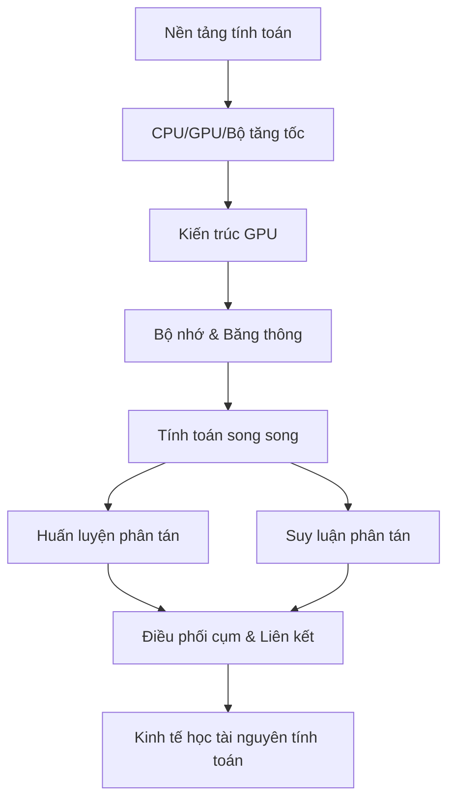

# Tính toán và Hạ tầng AI

> **Mạch đọc:** Đây là README owner của **Tính toán và hạ tầng AI**. Route đọc đi từ compute/memory foundations → accelerator architecture → parallel/distributed execution → scheduling/interconnect → economics/energy, để phần cứng nối với workload, SLO và ngân sách.

Folder này giải thích **nền tảng vật lý (physical substrate)** của AI: bộ tăng tốc (accelerator), kiến trúc GPU, phân cấp bộ nhớ, tính toán song song, huấn luyện/suy luận phân tán, topology của cụm máy và kinh tế học tài nguyên tính toán. Mục tiêu không phải học phần cứng như một lĩnh vực (domain / 도메인) tách rời mà hiểu **vì sao hành vi của mô hình và thời gian chạy (runtime / 런타임) bị giới hạn bởi năng lực tính toán, bộ nhớ và giao tiếp**.

## Thứ tự đọc

Phần này chuyển khái niệm Computer Science thành cấu trúc, ví dụ hoặc quy trình có thể kiểm tra. Hãy xác định câu hỏi mà mục trả lời rồi nối kết luận với phần kế tiếp.

```text
00_compute_foundations.md
01_cpu_gpu_tpu_and_accelerators.md
02_gpu_architecture.md
03_memory_and_bandwidth.md
04_parallel_computing.md
05_distributed_training.md
06_distributed_inference.md
07_cluster_scheduling_and_interconnect.md
08_compute_economics_capacity_and_energy.md
```

> **Chuyển mạch:** Trong **Tính toán và Hạ tầng AI**, **Bản đồ phụ thuộc** tiếp nhận điểm tựa từ **Thứ tự đọc** nhưng đổi góc nhìn sang câu hỏi của chính nó; đọc liền hai mục để thấy mối quan hệ đó. Từ đây, **Mô hình tư duy** sẽ cho biết hệ quả hoặc giới hạn ấy hiện ra ở đâu.

## Bản đồ phụ thuộc

Sơ đồ hoặc danh sách này mô tả thứ tự phụ thuộc của các khái niệm. Hãy đọc theo mũi tên để biết phần nào là prerequisite, phần nào là ứng dụng và khi nào cần quay lại nền tảng.


```mermaid
flowchart TD
    C[Nền tảng tính toán] --> A[CPU/GPU/Bộ tăng tốc]
    A --> G[Kiến trúc GPU]
    G --> M[Bộ nhớ & Băng thông]
    M --> P[Tính toán song song]
    P --> T[Huấn luyện phân tán]
    P --> I[Suy luận phân tán]
    T --> S[Điều phối cụm & Liên kết]
    I --> S
    S --> E[Kinh tế học tài nguyên tính toán]
```

> **Chuyển mạch:** Ở chặng này của **Tính toán và Hạ tầng AI**, **Mô hình tư duy** gom các mảnh từ **Bản đồ phụ thuộc** thành một kết luận có thể mang sang phần kế tiếp. Từ đây, **Những phân biệt cần giữ** sẽ cho biết hệ quả hoặc giới hạn ấy hiện ra ở đâu.

## Mô hình tư duy

Phần này chốt mental model thành một chuỗi có thể dùng lại: bối cảnh → cơ chế → quan sát → giới hạn → quyết định. Hãy đọc sơ đồ như công cụ suy luận, không như một khẩu hiệu tách khỏi chapter.

```text
Toán học của mô hình
→ phép toán tensor
→ kernel
→ tính toán trên accelerator
→ di chuyển dữ liệu trong bộ nhớ
→ giao tiếp giữa các device
→ điều phối cụm máy
→ độ trễ / throughput / chi phí
```

> **Chuyển mạch:** Đặt trong câu hỏi lớn của **Tính toán và Hạ tầng AI**, **Những phân biệt cần giữ** gom các mảnh từ **Mô hình tư duy** thành một kết luận có thể mang sang phần kế tiếp. Từ đây, **Liên kết kiến thức** sẽ cho biết hệ quả hoặc giới hạn ấy hiện ra ở đâu.

## Những phân biệt cần giữ

Phần này chuyển khái niệm Computer Science thành cấu trúc, ví dụ hoặc quy trình có thể kiểm tra. Hãy xác định câu hỏi mà mục trả lời rồi nối kết luận với phần kế tiếp.

```text
Dung lượng (capacity)             ≠ băng thông (bandwidth)
Băng thông                        ≠ độ trễ
Peak FLOPs                        ≠ hiệu năng thực tế
GPU bận                           ≠ GPU hoạt động hiệu quả
Song song dữ liệu                 ≠ song song tensor
Song song mô hình                 ≠ song song request
Nhiều GPU hơn                    ≠ speedup tuyến tính
Mô hình vừa VRAM                  ≠ đủ bộ nhớ cho serving concurrency
Unified memory                   ≠ mọi vùng bộ nhớ có cùng tốc độ
Accelerator rẻ hơn               ≠ chi phí trên mỗi tác vụ thành công thấp hơn
```

> **Chuyển mạch:** Trong **Tính toán và Hạ tầng AI**, sau nội dung của **Những phân biệt cần giữ**, **Liên kết kiến thức** chỉ rõ tài liệu chuẩn và vị trí sở hữu để người học biết phần nào cần quay lại khi muốn đào sâu. Phần còn lại của file dùng kết quả này để khép lại mạch giải thích.

## Liên kết kiến thức

Layer này nối [Numerical Computation](../01_mathematical_foundations/07_numerical_computation.md), [Deep Learning](../06_deep_learning_architectures/README.md), [AI Engineering](../15_ai_engineering/README.md) và [MLOps/LLMOps](../16_mlops_and_llmops/README.md). Sau đây nên đọc [Evaluation / Reliability / Interpretability](../18_evaluation_reliability_interpretability/README.md).

> **Bàn giao:** Sau **Liên kết kiến thức**, hãy giữ lại kết luận và ranh giới của mục này; quay về [README](./README.md) khi cần định vị owner hoặc chọn nhánh học tiếp theo.
