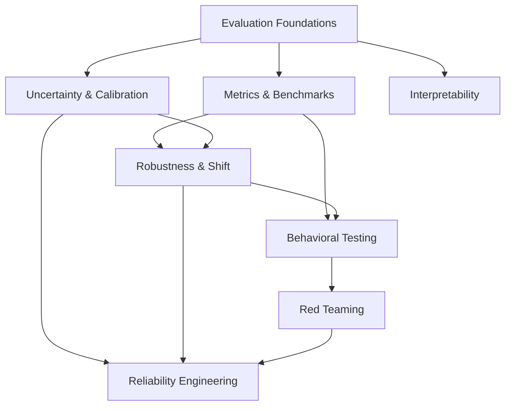

# Evaluation, Reliability & Interpretability

Folder này trả lời câu hỏi: **làm sao biết một AI system thực sự tốt, ổn định, có thể giải thích và đáng tin trong use case cụ thể?** Nội dung đi từ evaluation design tới calibration, robustness, interpretability, behavioral testing, red teaming và reliability engineering.

## Reading order

```text
00_evaluation_foundations.md
01_metrics_benchmarks_and_test_design.md
02_uncertainty_and_calibration.md
03_robustness_and_distribution_shift.md
04_explainability_and_interpretability.md
05_ai_testing_and_behavioral_evaluation.md
06_red_teaming_and_adversarial_evaluation.md
07_reliability_engineering.md
```

## Dependency map



## Mental model

```text
Define contract
→ design representative tests
→ measure quality + uncertainty
→ stress distribution/perturbations
→ inspect model/system behavior
→ adversarially search failures
→ engineer bounded failure and recovery
```

## Distinctions cần giữ

```text
Accuracy             ≠ Calibration
Benchmark Score      ≠ Production Quality
Data Drift           ≠ Model Failure
Explanation          ≠ Causal Truth
Attention Weight     ≠ Explanation
Generated Rationale  ≠ Faithful Internal Reasoning
Robustness           ≠ Security
Red Teaming          ≠ One-Time Jailbreak Test
HTTP Availability    ≠ Task Reliability
Fallback             ≠ Always Safer
```

## Cross-links

Layer này phụ thuộc [Machine Learning Evaluation](../04_machine_learning/15_model_evaluation.md), [RAG Evaluation](../09_retrieval_and_rag/09_rag_evaluation.md), [Agent Evaluation](../10_agents_and_ai_systems/09_agent_evaluation.md), [Monitoring](../16_mlops_and_llmops/06_monitoring_and_observability.md) và [Compute Infrastructure](../17_ai_compute_and_infrastructure/README.md). Tiếp theo là [AI Safety, Security & Alignment](../19_ai_safety_security_alignment/README.md).