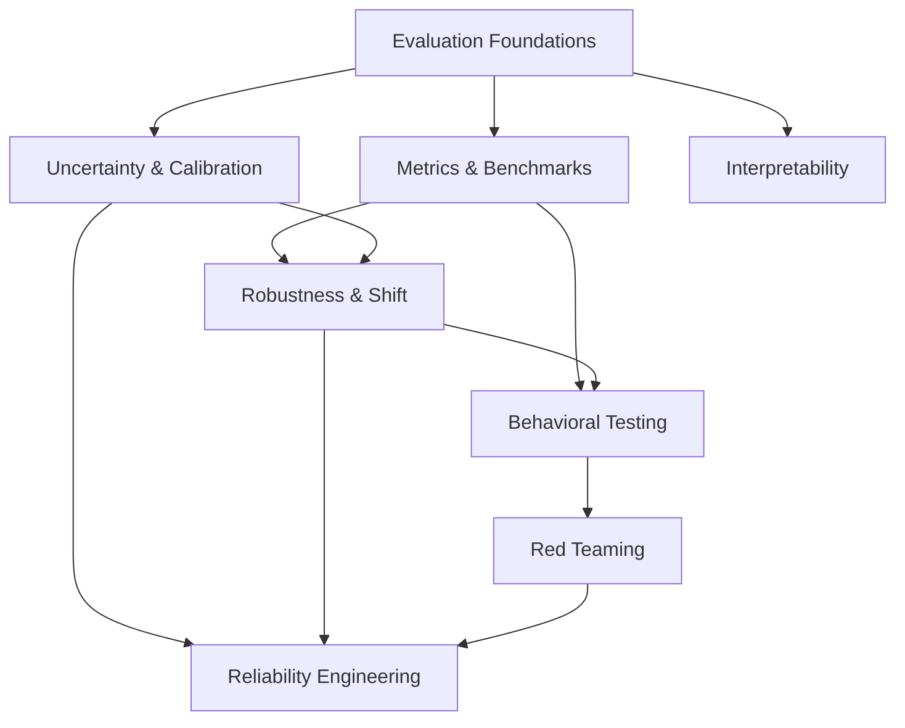

# Evaluation, độ tin cậy (reliability / 신뢰성) & Interpretability

> **Mạch đọc:** Đây là README owner của **Evaluation, reliability và interpretability**. Route đọc đi từ evaluation foundations → metrics/uncertainty → robustness/explainability → behavioral/adversarial testing → reliability engineering, để bằng chứng chất lượng nối với quyết định vận hành.

Folder này trả lời câu hỏi: **làm sao biết một AI hệ thống (system / 시스템) thực sự tốt, ổn định, có thể giải thích và đáng tin trong use trường hợp (case / 사례) cụ thể?** Nội dung đi từ evaluation thiết kế (design / 설계) tới calibration, robustness, interpretability, behavioral testing, red teaming và độ tin cậy (reliability / 신뢰성) kỹ thuật (engineering / 엔지니어링).

## Reading thứ tự (order / 순서)

Sơ đồ hoặc danh sách này mô tả thứ tự phụ thuộc của các khái niệm. Hãy đọc theo mũi tên để biết phần nào là prerequisite, phần nào là ứng dụng và khi nào cần quay lại nền tảng.

```text
00_evaluation_foundations.md
01_metrics_benchmarks_and_test_design.md
02_uncertainty_and_calibration.md
03_robustness_and_distribution_shift.md
04_explainability_and_interpretability.md
05_ai_testing_and_behavioral_evaluation.md
06_red_teaming_and_adversarial_evaluation.md
07_reliability_engineering.md
```

> **Chuyển mạch:** Reading order đi từ task/metric đến uncertainty, calibration, interpretability và red teaming; dependency map biến thứ tự đó thành prerequisite, còn mental model nối metric với failure mode.

## Phụ thuộc (dependency / 의존성) map

Sơ đồ hoặc danh sách này mô tả thứ tự phụ thuộc của các khái niệm. Hãy đọc theo mũi tên để biết phần nào là prerequisite, phần nào là ứng dụng và khi nào cần quay lại nền tảng.


```mermaid
flowchart TD
    E[Evaluation Foundations] --> M[Metrics & Benchmarks]
    E --> U[Uncertainty & Calibration]
    M --> R[Robustness & Shift]
    U --> R
    E --> I[Interpretability]
    M --> T[Behavioral Testing]
    R --> T
    T --> RT[Red Teaming]
    U --> REL[Reliability Engineering]
    R --> REL
    RT --> REL
```

> **Chuyển mạch:** Ở chặng này của **Evaluation, độ tin cậy (reliability / 신뢰성) & Interpretability**, **Mô hình tư duy (mental model / 사고 모델)** gom các mảnh từ **Phụ thuộc (dependency / 의존성) map** thành một kết luận có thể mang sang phần kế tiếp. Từ đây, **Distinctions cần giữ** sẽ cho biết hệ quả hoặc giới hạn ấy hiện ra ở đâu.

## Mô hình tư duy (mental model / 사고 모델)

Phần này chốt mental model thành một chuỗi có thể dùng lại: bối cảnh → cơ chế → quan sát → giới hạn → quyết định. Hãy đọc sơ đồ như công cụ suy luận, không như một khẩu hiệu tách khỏi chapter.

```text
Define contract
→ design representative tests
→ measure quality + uncertainty
→ stress distribution/perturbations
→ inspect model/system behavior
→ adversarially search failures
→ engineer bounded failure and recovery
```

> **Chuyển mạch:** Đặt trong câu hỏi lớn của **Evaluation, độ tin cậy (reliability / 신뢰성) & Interpretability**, **Distinctions cần giữ** gom các mảnh từ **Mô hình tư duy (mental model / 사고 모델)** thành một kết luận có thể mang sang phần kế tiếp. Từ đây, **Cross-links** sẽ cho biết hệ quả hoặc giới hạn ấy hiện ra ở đâu.

## Distinctions cần giữ

Phần này kiểm tra ranh giới và failure mode của cơ chế vừa học. Hãy dùng nó để biết khi nào mô hình còn đúng, khi nào cần đổi chiến lược và bằng chứng nào phải thu thập.

```text
Accuracy             ≠ Calibration
Benchmark Score      ≠ Production Quality
Data Drift           ≠ Model Failure
Explanation          ≠ Causal Truth
Attention Weight     ≠ Explanation
Generated Rationale  ≠ Faithful Internal Reasoning
Robustness           ≠ Security
Red Teaming          ≠ One-Time Jailbreak Test
HTTP Availability    ≠ Task Reliability
Fallback             ≠ Always Safer
```

> **Chuyển mạch:** Trong **Evaluation, độ tin cậy (reliability / 신뢰성) & Interpretability**, **Cross-links** tiếp nhận điểm tựa từ **Distinctions cần giữ** nhưng đổi góc nhìn sang câu hỏi của chính nó; đọc liền hai mục để thấy mối quan hệ đó. Phần còn lại của file dùng kết quả này để khép lại mạch giải thích.

## Cross-links

Layer này phụ thuộc [Machine Learning Evaluation](../04_machine_learning/15_model_evaluation.md), [RAG Evaluation](../09_retrieval_and_rag/09_rag_evaluation.md), [Agent Evaluation](../10_agents_and_ai_systems/09_agent_evaluation.md), [Monitoring](../16_mlops_and_llmops/06_monitoring_and_observability.md) và [Compute Infrastructure](../17_ai_compute_and_infrastructure/README.md). Tiếp theo là [AI Safety, Security & Alignment](../19_ai_safety_security_alignment/README.md).

> **Bàn giao:** Sau **Cross-links**, hãy giữ lại kết luận và ranh giới của mục này; quay về [README](./README.md) khi cần định vị owner hoặc chọn nhánh học tiếp theo.
