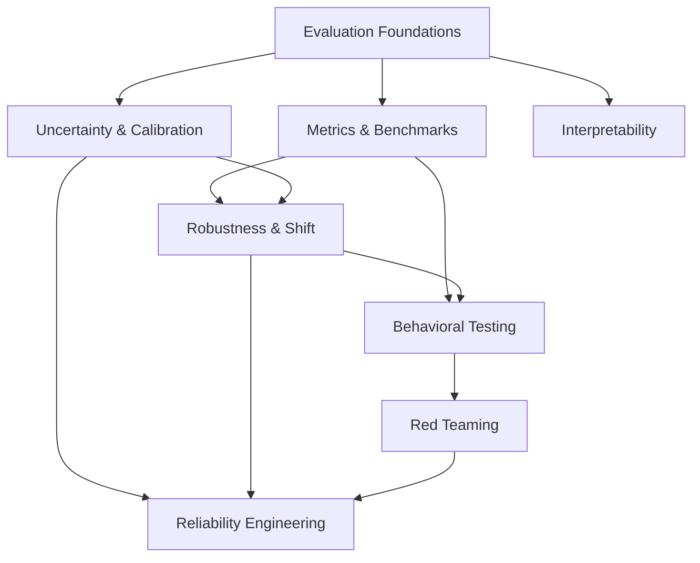

# Evaluation, Reliability & Interpretability

Folder này trả lời câu hỏi: **làm sao biết một AI system thực sự tốt, ổn định, có thể giải thích và đáng tin trong use case cụ thể?** Nội dung đi từ evaluation design tới calibration, robustness, interpretability, behavioral testing, red teaming và reliability engineering.

## Reading order

Sơ đồ hoặc danh sách này mô tả thứ tự phụ thuộc của các khái niệm. Hãy đọc theo mũi tên để biết phần nào là prerequisite, phần nào là ứng dụng và khi nào cần quay lại nền tảng.

```text
00_evaluation_foundations.md
01_metrics_benchmarks_and_test_design.md
02_uncertainty_and_calibration.md
03_robustness_and_distribution_shift.md
04_explainability_and_interpretability.md
05_ai_testing_and_behavioral_evaluation.md
06_red_teaming_and_adversarial_evaluation.md
07_reliability_engineering.md
```

## Dependency map

Sơ đồ hoặc danh sách này mô tả thứ tự phụ thuộc của các khái niệm. Hãy đọc theo mũi tên để biết phần nào là prerequisite, phần nào là ứng dụng và khi nào cần quay lại nền tảng.


```mermaid
flowchart TD
    E[Evaluation Foundations] --> M[Metrics & Benchmarks]
    E --> U[Uncertainty & Calibration]
    M --> R[Robustness & Shift]
    U --> R
    E --> I[Interpretability]
    M --> T[Behavioral Testing]
    R --> T
    T --> RT[Red Teaming]
    U --> REL[Reliability Engineering]
    R --> REL
    RT --> REL
```

## Mental model

Phần này chốt mental model thành một chuỗi có thể dùng lại: bối cảnh → cơ chế → quan sát → giới hạn → quyết định. Hãy đọc sơ đồ như công cụ suy luận, không như một khẩu hiệu tách khỏi chapter.

```text
Define contract
→ design representative tests
→ measure quality + uncertainty
→ stress distribution/perturbations
→ inspect model/system behavior
→ adversarially search failures
→ engineer bounded failure and recovery
```

## Distinctions cần giữ

Phần này kiểm tra ranh giới và failure mode của cơ chế vừa học. Hãy dùng nó để biết khi nào mô hình còn đúng, khi nào cần đổi chiến lược và bằng chứng nào phải thu thập.

```text
Accuracy             ≠ Calibration
Benchmark Score      ≠ Production Quality
Data Drift           ≠ Model Failure
Explanation          ≠ Causal Truth
Attention Weight     ≠ Explanation
Generated Rationale  ≠ Faithful Internal Reasoning
Robustness           ≠ Security
Red Teaming          ≠ One-Time Jailbreak Test
HTTP Availability    ≠ Task Reliability
Fallback             ≠ Always Safer
```

## Cross-links

Layer này phụ thuộc [Machine Learning Evaluation](../04_machine_learning/15_model_evaluation.md), [RAG Evaluation](../09_retrieval_and_rag/09_rag_evaluation.md), [Agent Evaluation](../10_agents_and_ai_systems/09_agent_evaluation.md), [Monitoring](../16_mlops_and_llmops/06_monitoring_and_observability.md) và [Compute Infrastructure](../17_ai_compute_and_infrastructure/README.md). Tiếp theo là [AI Safety, Security & Alignment](../19_ai_safety_security_alignment/README.md).
