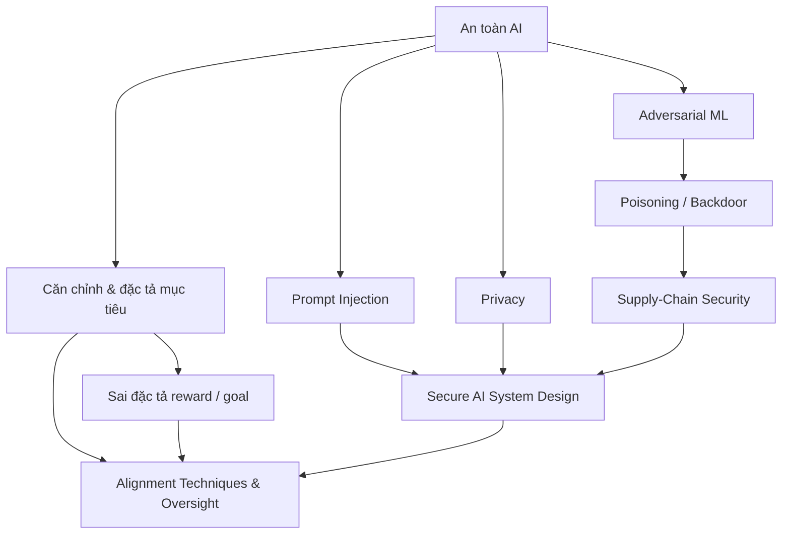

# An toàn, Bảo mật và Căn chỉnh AI

Layer này nối ba bài toán thường bị trộn lẫn: **an toàn (safety)**, **bảo mật (security)** và **căn chỉnh (alignment)**. An toàn hỏi hệ thống có thể gây hậu quả nguy hiểm bằng cách nào; bảo mật hỏi attacker có thể khai thác hệ thống bằng cách nào; căn chỉnh hỏi mục tiêu và hành vi có phù hợp ý định, ràng buộc và quyền hạn mong muốn hay không.

Đây là điểm cuối của tuyến production ưu tiên trong AI Knowledge Library:

```text
Transformer
→ LLM
→ Retrieval
→ Vector Search
→ RAG
→ Tool Calling
→ Agents
→ Evaluation
→ AI Engineering
→ LLMOps
→ Reliability
→ Security
```

## Kiến thức cần có trước

Trước layer này nên nắm:

- [LLM](../08_large_language_models/README.md);
- [RAG](../09_retrieval_and_rag/README.md);
- [Agents](../10_agents_and_ai_systems/README.md);
- [AI Engineering](../15_ai_engineering/README.md);
- [MLOps / LLMOps](../16_mlops_and_llmops/README.md);
- [Evaluation / Reliability](../18_evaluation_reliability_interpretability/README.md).

Không nên đọc Security như một chủ đề tách khỏi architecture production, vì nhiều rủi ro chỉ xuất hiện khi model được nối với retrieval, memory, tool và quyền thực thi.

## Thứ tự đọc

```text
00_ai_safety_foundations.md
01_alignment_and_objective_specification.md
02_reward_misspecification_and_goal_misgeneralization.md
03_prompt_injection_and_jailbreaks.md
04_adversarial_machine_learning.md
05_data_poisoning_backdoors_and_model_attacks.md
06_privacy_attacks_and_data_protection.md
07_model_and_supply_chain_security.md
08_secure_ai_system_design.md
09_alignment_techniques_and_oversight.md
```

## Bản đồ phụ thuộc



## Checklist cho mỗi chapter

Mỗi chapter trong layer này phải trả lời đủ tám câu hỏi:

```text
1. prerequisite là gì?
2. cơ chế hoạt động như thế nào?
3. trực giác toán học nào cần thiết?
4. mô hình triển khai thực tế là gì?
5. trade-off nằm ở đâu?
6. failure mode thường gặp là gì?
7. production usage/control là gì?
8. internal links nối sang chapter nào?
```

Nếu chỉ mô tả tên attack hoặc tên kỹ thuật mà không nối tới architecture và recovery thì chưa đủ cho production-level understanding.

## Mô hình tư duy xuyên suốt

```text
xác định hazard / attacker / objective gap
→ xác định trust boundary
→ giới hạn capability và authority
→ định hình hành vi mô hình
→ kiểm tra input / action / output
→ xác minh outcome
→ giám sát production
→ thu hồi / rollback / phục hồi
```

## Những phân biệt phải giữ

```text
An toàn                         ≠ Bảo mật
Bảo mật                         ≠ Căn chỉnh
Căn chỉnh                       ≠ Tuân lệnh tuyệt đối
Reward                          ≠ Mục tiêu thật
Preference data                 ≠ Giá trị con người phổ quát
Prompt hierarchy                ≠ Authorization
Model refusal                   ≠ Security boundary
Embedding                       ≠ Dữ liệu ẩn danh
Checkpoint                      ≠ Artifact đáng tin mặc định
Robustness                      ≠ Adversarial security
Model safety                    ≠ Application safety
Human approval                  ≠ Bảo đảm tự động
Model alignment                 ≠ Access control
```

## Cơ chế kiểm soát theo lớp

Một production AI system an toàn hơn thường kết hợp:

```text
model behavior
+ retrieval authorization
+ input/output validation
+ scoped tools
+ policy engine
+ sandbox
+ verifier
+ human approval theo risk
+ logging / tracing
+ incident response
```

Không có một control đơn lẻ nào đủ bao phủ toàn bộ failure surface.

## Từ mô hình đe dọa tới control

Trước khi chọn defense, cần xác định:

```text
asset nào cần bảo vệ?
attacker có quyền gì?
input nào không đáng tin?
component nào có authority?
side effect nào không thể đảo ngược?
failure nào phải fail closed?
```

Từ đó mới chọn rate limit, sandbox, ACL, verifier, approval hoặc isolation phù hợp.

## Production release gate

Một thay đổi liên quan Security/Alignment nên được kiểm qua nhiều lớp:

```text
unit / schema test
→ behavioral evaluation
→ adversarial / red-team cases
→ permission regression
→ privacy / tenant-isolation test
→ supply-chain verification
→ shadow / canary nếu phù hợp
→ monitoring + rollback plan
```

Một điểm benchmark tăng không đủ để promote nếu attack surface hoặc authority boundary bị mở rộng.

## Internal links chính

Security layer nối trực tiếp với:

- [Tool Calling](../10_agents_and_ai_systems/01_tools_and_function_calling.md);
- [Reliable Agent Design](../10_agents_and_ai_systems/10_reliable_agent_design.md);
- [RAG Evaluation](../09_retrieval_and_rag/09_rag_evaluation.md);
- [AI System Design](../15_ai_engineering/10_ai_system_design.md);
- [LLMOps](../16_mlops_and_llmops/08_llmops.md);
- [Incident Response](../16_mlops_and_llmops/09_incident_response_and_lifecycle.md);
- [Reliability Engineering](../18_evaluation_reliability_interpretability/07_reliability_engineering.md).

Đây là điểm kết thúc của tuyến production hiện đã hoàn thiện. `20_ethics_governance_and_society/` và `90_connections/` là phần mở rộng dự kiến của roadmap tổng nhưng chưa được đưa vào branch hiện tại, vì vậy README này không tạo liên kết tới các đường dẫn chưa tồn tại.