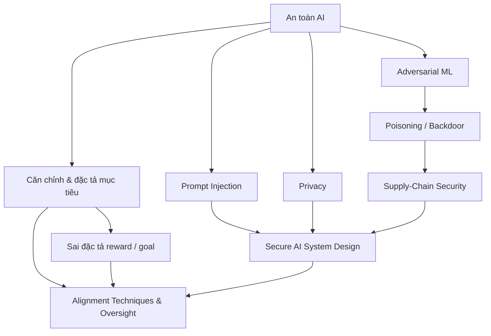

# An toàn, Bảo mật và Căn chỉnh AI

> **Mạch đọc:** [README](./README.md) là bản đồ owner của **An toàn, Bảo mật và Căn chỉnh AI**; nhìn vào vị trí đó trước để biết file này đang phục vụ nhánh kiến thức nào. **Kiến thức cần có trước** mở đối tượng chính của file và câu hỏi cần theo dõi; sau đó sang **Thứ tự đọc** để mở rộng đối tượng sang phạm vi kế cận. Cách đi này giữ lại điểm tựa của section đầu và cho biết kết luận sẽ được dùng ở đâu, thay vì dừng ở định nghĩa đầu tiên.

Tầng (layer / 계층) này nối ba bài toán thường bị trộn lẫn: **an toàn (safety / 안전)**, **bảo mật (security / 보안)** và **căn chỉnh (alignment)**. An toàn hỏi hệ thống có thể gây hậu quả nguy hiểm bằng cách nào; bảo mật hỏi attacker có thể khai thác hệ thống bằng cách nào; căn chỉnh hỏi mục tiêu và hành vi có phù hợp ý định, ràng buộc và quyền hạn mong muốn hay không.

Đây là điểm cuối của tuyến môi trường vận hành (production / 운영 환경) ưu tiên trong AI thư viện kiến thức (knowledge library / 지식 라이브러리):

```text
Transformer
→ LLM
→ Retrieval
→ Vector Search
→ RAG
→ Tool Calling
→ Agents
→ Evaluation
→ AI Engineering
→ LLMOps
→ Reliability
→ Security
```

## Kiến thức cần có trước

Trước tầng (layer / 계층) này nên nắm:

- [LLM](../08_large_language_models/README.md);
- [RAG](../09_retrieval_and_rag/README.md);
- [Agents](../10_agents_and_ai_systems/README.md);
- [AI Engineering](../15_ai_engineering/README.md);
- [MLOps / LLMOps](../16_mlops_and_llmops/README.md);
- [Evaluation / Reliability](../18_evaluation_reliability_interpretability/README.md).

Không nên đọc bảo mật (security / 보안) như một chủ đề tách khỏi kiến trúc (architecture / 아키텍처) môi trường vận hành (production / 운영 환경), vì nhiều rủi ro chỉ xuất hiện khi mô hình (model / 모델) được nối với retrieval, bộ nhớ (memory / 메모리), công cụ (tool / 도구) và quyền thực thi.

> **Chuyển mạch:** Trong **An toàn, Bảo mật và Căn chỉnh AI**, **Thứ tự đọc** tiếp nhận điểm tựa từ **Kiến thức cần có trước** nhưng đổi góc nhìn sang câu hỏi của chính nó; đọc liền hai mục để thấy mối quan hệ đó. Từ đây, **Bản đồ phụ thuộc** sẽ cho biết hệ quả hoặc giới hạn ấy hiện ra ở đâu.

## Thứ tự đọc

Phần này chuyển khái niệm Computer Science thành cấu trúc, ví dụ hoặc quy trình có thể kiểm tra. Hãy xác định câu hỏi mà mục trả lời rồi nối kết luận với phần kế tiếp.

```text
00_ai_safety_foundations.md
01_alignment_and_objective_specification.md
02_reward_misspecification_and_goal_misgeneralization.md
03_prompt_injection_and_jailbreaks.md
04_adversarial_machine_learning.md
05_data_poisoning_backdoors_and_model_attacks.md
06_privacy_attacks_and_data_protection.md
07_model_and_supply_chain_security.md
08_secure_ai_system_design.md
09_alignment_techniques_and_oversight.md
```

> **Chuyển mạch:** Ở chặng này của **An toàn, Bảo mật và Căn chỉnh AI**, **Bản đồ phụ thuộc** tiếp nhận điểm tựa từ **Thứ tự đọc** nhưng đổi góc nhìn sang câu hỏi của chính nó; đọc liền hai mục để thấy mối quan hệ đó. Từ đây, **Checklist cho mỗi chapter** sẽ cho biết hệ quả hoặc giới hạn ấy hiện ra ở đâu.

## Bản đồ phụ thuộc

Sơ đồ hoặc danh sách này mô tả thứ tự phụ thuộc của các khái niệm. Hãy đọc theo mũi tên để biết phần nào là prerequisite, phần nào là ứng dụng và khi nào cần quay lại nền tảng.


```mermaid
flowchart TD
    S[An toàn AI] --> A[Căn chỉnh & đặc tả mục tiêu]
    A --> R[Sai đặc tả reward / goal]
    S --> P[Prompt Injection]
    S --> AML[Adversarial ML]
    AML --> D[Poisoning / Backdoor]
    S --> PRIV[Privacy]
    D --> SC[Supply-Chain Security]
    P --> SEC[Secure AI System Design]
    PRIV --> SEC
    SC --> SEC
    A --> O[Alignment Techniques & Oversight]
    R --> O
    SEC --> O
```

> **Chuyển mạch:** Đặt trong câu hỏi lớn của **An toàn, Bảo mật và Căn chỉnh AI**, **Checklist cho mỗi chapter** tiếp nhận điểm tựa từ **Bản đồ phụ thuộc** nhưng đổi góc nhìn sang câu hỏi của chính nó; đọc liền hai mục để thấy mối quan hệ đó. Từ đây, **Mô hình tư duy xuyên suốt** sẽ cho biết hệ quả hoặc giới hạn ấy hiện ra ở đâu.

## Checklist cho mỗi chapter

Mỗi chapter trong tầng (layer / 계층) này phải trả lời đủ tám câu hỏi:

```text
1. prerequisite là gì?
2. cơ chế hoạt động như thế nào?
3. trực giác toán học nào cần thiết?
4. mô hình triển khai thực tế là gì?
5. trade-off nằm ở đâu?
6. failure mode thường gặp là gì?
7. production usage/control là gì?
8. internal links nối sang chapter nào?
```

Nếu chỉ mô tả tên attack hoặc tên kỹ thuật mà không nối tới kiến trúc (architecture / 아키텍처) và khôi phục (recovery / 복구) thì chưa đủ cho production-level understanding.

> **Chuyển mạch:** Trong **An toàn, Bảo mật và Căn chỉnh AI**, **Mô hình tư duy xuyên suốt** gom các mảnh từ **Checklist cho mỗi chapter** thành một kết luận có thể mang sang phần kế tiếp. Từ đây, **Những phân biệt phải giữ** sẽ cho biết hệ quả hoặc giới hạn ấy hiện ra ở đâu.

## Mô hình tư duy xuyên suốt

Phần này chốt mental model thành một chuỗi có thể dùng lại: bối cảnh → cơ chế → quan sát → giới hạn → quyết định. Hãy đọc sơ đồ như công cụ suy luận, không như một khẩu hiệu tách khỏi chapter.

```text
xác định hazard / attacker / objective gap
→ xác định trust boundary
→ giới hạn capability và authority
→ định hình hành vi mô hình
→ kiểm tra input / action / output
→ xác minh outcome
→ giám sát production
→ thu hồi / rollback / phục hồi
```

> **Chuyển mạch:** Ở chặng này của **An toàn, Bảo mật và Căn chỉnh AI**, **Những phân biệt phải giữ** gom các mảnh từ **Mô hình tư duy xuyên suốt** thành một kết luận có thể mang sang phần kế tiếp. Từ đây, **Cơ chế kiểm soát theo lớp** sẽ cho biết hệ quả hoặc giới hạn ấy hiện ra ở đâu.

## Những phân biệt phải giữ

Phần này chuyển khái niệm Computer Science thành cấu trúc, ví dụ hoặc quy trình có thể kiểm tra. Hãy xác định câu hỏi mà mục trả lời rồi nối kết luận với phần kế tiếp.

```text
An toàn                         ≠ Bảo mật
Bảo mật                         ≠ Căn chỉnh
Căn chỉnh                       ≠ Tuân lệnh tuyệt đối
Reward                          ≠ Mục tiêu thật
Preference data                 ≠ Giá trị con người phổ quát
Prompt hierarchy                ≠ Authorization
Model refusal                   ≠ Security boundary
Embedding                       ≠ Dữ liệu ẩn danh
Checkpoint                      ≠ Artifact đáng tin mặc định
Robustness                      ≠ Adversarial security
Model safety                    ≠ Application safety
Human approval                  ≠ Bảo đảm tự động
Model alignment                 ≠ Access control
```

> **Chuyển mạch:** Đặt trong câu hỏi lớn của **An toàn, Bảo mật và Căn chỉnh AI**, **Những phân biệt phải giữ** xác định đầu vào; **Cơ chế kiểm soát theo lớp** giải thích bước vận hành tạo ra kết quả kế tiếp. Từ đây, **Từ mô hình đe dọa tới điều khiển (control / 제어)** sẽ cho biết hệ quả hoặc giới hạn ấy hiện ra ở đâu.

## Cơ chế kiểm soát theo lớp

Một môi trường vận hành (production / 운영 환경) AI hệ thống (system / 시스템) an toàn hơn thường kết hợp:

```text
model behavior
+ retrieval authorization
+ input/output validation
+ scoped tools
+ policy engine
+ sandbox
+ verifier
+ human approval theo risk
+ logging / tracing
+ incident response
```

Không có một điều khiển (control / 제어) đơn lẻ nào đủ bao phủ toàn bộ thất bại (failure / 실패) surface.

> **Chuyển mạch:** Trong **An toàn, Bảo mật và Căn chỉnh AI**, **Cơ chế kiểm soát theo lớp** xác định đầu vào; **Từ mô hình đe dọa tới điều khiển (control / 제어)** giải thích bước vận hành tạo ra kết quả kế tiếp. Từ đây, **Môi trường vận hành (production / 운영 환경) bản phát hành (release / 릴리스) gate** sẽ cho biết hệ quả hoặc giới hạn ấy hiện ra ở đâu.

## Từ mô hình đe dọa tới điều khiển (control / 제어)

Trước khi chọn defense, cần xác định:

```text
asset nào cần bảo vệ?
attacker có quyền gì?
input nào không đáng tin?
component nào có authority?
side effect nào không thể đảo ngược?
failure nào phải fail closed?
```

Từ đó mới chọn tỷ lệ (rate / 비율) limit, sandbox, ACL, verifier, approval hoặc isolation phù hợp.

> **Chuyển mạch:** Ở chặng này của **An toàn, Bảo mật và Căn chỉnh AI**, **Môi trường vận hành (production / 운영 환경) bản phát hành (release / 릴리스) gate** tiếp nhận điểm tựa từ **Từ mô hình đe dọa tới điều khiển (control / 제어)** nhưng đổi góc nhìn sang câu hỏi của chính nó; đọc liền hai mục để thấy mối quan hệ đó. Từ đây, **Nội bộ (internal / 내부) links chính** sẽ cho biết hệ quả hoặc giới hạn ấy hiện ra ở đâu.

## Môi trường vận hành (production / 운영 환경) bản phát hành (release / 릴리스) gate

Một thay đổi liên quan bảo mật (security / 보안)/Alignment nên được kiểm qua nhiều lớp:

```text
unit / schema test
→ behavioral evaluation
→ adversarial / red-team cases
→ permission regression
→ privacy / tenant-isolation test
→ supply-chain verification
→ shadow / canary nếu phù hợp
→ monitoring + rollback plan
```

Một điểm benchmark tăng không đủ để promote nếu attack surface hoặc authority ranh giới (boundary / 경계) bị mở rộng.

> **Chuyển mạch:** Đặt trong câu hỏi lớn của **An toàn, Bảo mật và Căn chỉnh AI**, **Nội bộ (internal / 내부) links chính** tiếp nhận điểm tựa từ **Môi trường vận hành (production / 운영 환경) bản phát hành (release / 릴리스) gate** nhưng đổi góc nhìn sang câu hỏi của chính nó; đọc liền hai mục để thấy mối quan hệ đó. Phần còn lại của file dùng kết quả này để khép lại mạch giải thích.

## Nội bộ (internal / 내부) links chính

Bảo mật (security / 보안) tầng (layer / 계층) nối trực tiếp với:

- [Tool Calling](../10_agents_and_ai_systems/01_tools_and_function_calling.md);
- [Reliable Agent Design](../10_agents_and_ai_systems/10_reliable_agent_design.md);
- [RAG Evaluation](../09_retrieval_and_rag/09_rag_evaluation.md);
- [AI System Design](../15_ai_engineering/10_ai_system_design.md);
- [LLMOps](../16_mlops_and_llmops/08_llmops.md);
- [Incident Response](../16_mlops_and_llmops/09_incident_response_and_lifecycle.md);
- [Reliability Engineering](../18_evaluation_reliability_interpretability/07_reliability_engineering.md).

Đây là điểm kết thúc của tuyến production hiện đã hoàn thiện. `20_ethics_governance_and_society/` và `90_connections/` là phần mở rộng dự kiến của roadmap tổng nhưng chưa được đưa vào branch hiện tại, vì vậy README này không tạo liên kết tới các đường dẫn chưa tồn tại.

> **Bàn giao:** Sau **Nội bộ (internal / 내부) links chính**, hãy giữ lại kết luận và ranh giới của mục này; quay về [README](./README.md) khi cần định vị owner hoặc chọn nhánh học tiếp theo.
