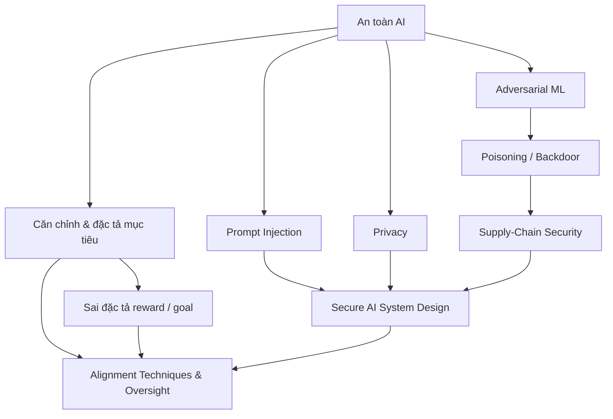

# An toàn, Bảo mật và Căn chỉnh AI

> **Mạch đọc:** Đọc **An toàn, Bảo mật và Căn chỉnh AI** như một mắt xích của lộ trình học (learning path / 학습 경로) hiện tại, không như một ghi chú tách rời. Nội dung đi từ **Kiến thức cần có trước** sang **Thứ tự đọc**; điểm nối này chuẩn bị câu hỏi cho các mục sau thay vì dừng ở định nghĩa đầu tiên.


Tầng (layer / 계층) này nối ba bài toán thường bị trộn lẫn: **an toàn (safety / 안전)**, **bảo mật (security / 보안)** và **căn chỉnh (alignment)**. An toàn hỏi hệ thống có thể gây hậu quả nguy hiểm bằng cách nào; bảo mật hỏi attacker có thể khai thác hệ thống bằng cách nào; căn chỉnh hỏi mục tiêu và hành vi có phù hợp ý định, ràng buộc và quyền hạn mong muốn hay không.

Đây là điểm cuối của tuyến môi trường vận hành (production / 운영 환경) ưu tiên trong AI thư viện kiến thức (knowledge library / 지식 라이브러리):

```text
Transformer
→ LLM
→ Retrieval
→ Vector Search
→ RAG
→ Tool Calling
→ Agents
→ Evaluation
→ AI Engineering
→ LLMOps
→ Reliability
→ Security
```

## Kiến thức cần có trước

Trước tầng (layer / 계층) này nên nắm:

- [LLM](../08_large_language_models/README.md);
- [RAG](../09_retrieval_and_rag/README.md);
- [Agents](../10_agents_and_ai_systems/README.md);
- [AI Engineering](../15_ai_engineering/README.md);
- [MLOps / LLMOps](../16_mlops_and_llmops/README.md);
- [Evaluation / Reliability](../18_evaluation_reliability_interpretability/README.md).

Không nên đọc bảo mật (security / 보안) như một chủ đề tách khỏi kiến trúc (architecture / 아키텍처) môi trường vận hành (production / 운영 환경), vì nhiều rủi ro chỉ xuất hiện khi mô hình (model / 모델) được nối với retrieval, bộ nhớ (memory / 메모리), công cụ (tool / 도구) và quyền thực thi.


> **Chuyển mạch:** Từ **Kiến thức cần có trước**, ta sang **Thứ tự đọc** để mở rộng cùng câu hỏi và dùng kết quả đó để khép lại mạch giải thích.

## Thứ tự đọc

```text
00_ai_safety_foundations.md
01_alignment_and_objective_specification.md
02_reward_misspecification_and_goal_misgeneralization.md
03_prompt_injection_and_jailbreaks.md
04_adversarial_machine_learning.md
05_data_poisoning_backdoors_and_model_attacks.md
06_privacy_attacks_and_data_protection.md
07_model_and_supply_chain_security.md
08_secure_ai_system_design.md
09_alignment_techniques_and_oversight.md
```


> **Chuyển mạch:** Từ **Thứ tự đọc**, ta sang **Bản đồ phụ thuộc** để mở rộng cùng câu hỏi và dùng kết quả đó để khép lại mạch giải thích.

## Bản đồ phụ thuộc


```mermaid
flowchart TD
    S[An toàn AI] --> A[Căn chỉnh & đặc tả mục tiêu]
    A --> R[Sai đặc tả reward / goal]
    S --> P[Prompt Injection]
    S --> AML[Adversarial ML]
    AML --> D[Poisoning / Backdoor]
    S --> PRIV[Privacy]
    D --> SC[Supply-Chain Security]
    P --> SEC[Secure AI System Design]
    PRIV --> SEC
    SC --> SEC
    A --> O[Alignment Techniques & Oversight]
    R --> O
    SEC --> O
```


> **Chuyển mạch:** Từ **Bản đồ phụ thuộc**, ta sang **Checklist cho mỗi chapter** để mở rộng cùng câu hỏi và dùng kết quả đó để khép lại mạch giải thích.

## Checklist cho mỗi chapter

Mỗi chapter trong tầng (layer / 계층) này phải trả lời đủ tám câu hỏi:

```text
1. prerequisite là gì?
2. cơ chế hoạt động như thế nào?
3. trực giác toán học nào cần thiết?
4. mô hình triển khai thực tế là gì?
5. trade-off nằm ở đâu?
6. failure mode thường gặp là gì?
7. production usage/control là gì?
8. internal links nối sang chapter nào?
```

Nếu chỉ mô tả tên attack hoặc tên kỹ thuật mà không nối tới kiến trúc (architecture / 아키텍처) và khôi phục (recovery / 복구) thì chưa đủ cho production-level understanding.


> **Chuyển mạch:** Từ **Checklist cho mỗi chapter**, ta sang **Mô hình tư duy xuyên suốt** để mở rộng cùng câu hỏi và dùng kết quả đó để khép lại mạch giải thích.

## Mô hình tư duy xuyên suốt

```text
xác định hazard / attacker / objective gap
→ xác định trust boundary
→ giới hạn capability và authority
→ định hình hành vi mô hình
→ kiểm tra input / action / output
→ xác minh outcome
→ giám sát production
→ thu hồi / rollback / phục hồi
```


> **Chuyển mạch:** Từ **Mô hình tư duy xuyên suốt**, ta sang **Những phân biệt phải giữ** để mở rộng cùng câu hỏi và dùng kết quả đó để khép lại mạch giải thích.

## Những phân biệt phải giữ

```text
An toàn                         ≠ Bảo mật
Bảo mật                         ≠ Căn chỉnh
Căn chỉnh                       ≠ Tuân lệnh tuyệt đối
Reward                          ≠ Mục tiêu thật
Preference data                 ≠ Giá trị con người phổ quát
Prompt hierarchy                ≠ Authorization
Model refusal                   ≠ Security boundary
Embedding                       ≠ Dữ liệu ẩn danh
Checkpoint                      ≠ Artifact đáng tin mặc định
Robustness                      ≠ Adversarial security
Model safety                    ≠ Application safety
Human approval                  ≠ Bảo đảm tự động
Model alignment                 ≠ Access control
```


> **Chuyển mạch:** Từ **Những phân biệt phải giữ**, ta sang **Cơ chế kiểm soát theo lớp** để mở rộng cùng câu hỏi và dùng kết quả đó để khép lại mạch giải thích.

## Cơ chế kiểm soát theo lớp

Một môi trường vận hành (production / 운영 환경) AI hệ thống (system / 시스템) an toàn hơn thường kết hợp:

```text
model behavior
+ retrieval authorization
+ input/output validation
+ scoped tools
+ policy engine
+ sandbox
+ verifier
+ human approval theo risk
+ logging / tracing
+ incident response
```

Không có một điều khiển (control / 제어) đơn lẻ nào đủ bao phủ toàn bộ thất bại (failure / 실패) surface.


> **Chuyển mạch:** Từ **Cơ chế kiểm soát theo lớp**, ta sang **Từ mô hình đe dọa tới điều khiển (control / 제어)** để mở rộng cùng câu hỏi và dùng kết quả đó để khép lại mạch giải thích.

## Từ mô hình đe dọa tới điều khiển (control / 제어)

Trước khi chọn defense, cần xác định:

```text
asset nào cần bảo vệ?
attacker có quyền gì?
input nào không đáng tin?
component nào có authority?
side effect nào không thể đảo ngược?
failure nào phải fail closed?
```

Từ đó mới chọn tỷ lệ (rate / 비율) limit, sandbox, ACL, verifier, approval hoặc isolation phù hợp.


> **Chuyển mạch:** Từ **Từ mô hình đe dọa tới điều khiển (control / 제어)**, ta sang **môi trường vận hành (production / 운영 환경) bản phát hành (release / 릴리스) gate** để mở rộng cùng câu hỏi và dùng kết quả đó để khép lại mạch giải thích.

## Môi trường vận hành (production / 운영 환경) bản phát hành (release / 릴리스) gate

Một thay đổi liên quan bảo mật (security / 보안)/Alignment nên được kiểm qua nhiều lớp:

```text
unit / schema test
→ behavioral evaluation
→ adversarial / red-team cases
→ permission regression
→ privacy / tenant-isolation test
→ supply-chain verification
→ shadow / canary nếu phù hợp
→ monitoring + rollback plan
```

Một điểm benchmark tăng không đủ để promote nếu attack surface hoặc authority ranh giới (boundary / 경계) bị mở rộng.


> **Chuyển mạch:** Từ **môi trường vận hành (production / 운영 환경) bản phát hành (release / 릴리스) gate**, ta sang **nội bộ (internal / 내부) links chính** để mở rộng cùng câu hỏi và dùng kết quả đó để khép lại mạch giải thích.

## Nội bộ (internal / 내부) links chính

Bảo mật (security / 보안) tầng (layer / 계층) nối trực tiếp với:

- [Tool Calling](../10_agents_and_ai_systems/01_tools_and_function_calling.md);
- [Reliable Agent Design](../10_agents_and_ai_systems/10_reliable_agent_design.md);
- [RAG Evaluation](../09_retrieval_and_rag/09_rag_evaluation.md);
- [AI System Design](../15_ai_engineering/10_ai_system_design.md);
- [LLMOps](../16_mlops_and_llmops/08_llmops.md);
- [Incident Response](../16_mlops_and_llmops/09_incident_response_and_lifecycle.md);
- [Reliability Engineering](../18_evaluation_reliability_interpretability/07_reliability_engineering.md).

Đây là điểm kết thúc của tuyến môi trường vận hành (production / 운영 환경) hiện đã hoàn thiện. `20_ethics_governance_and_society/` và `90_connections/` là phần mở rộng dự kiến của roadmap tổng nhưng chưa được đưa vào branch hiện tại, vì vậy README này không tạo liên kết tới các đường dẫn chưa tồn tại.

> **Bàn giao:** Sau **nội bộ (internal / 내부) links chính**, hãy chốt bất biến (invariant / 불변식) và giới hạn của mục này trước khi nối sang kiến thức kế tiếp. Có thể đọc tiếp [00 ai safety foundations](./00_ai_safety_foundations.md) để đối chiếu ranh giới (boundary / 경계) gần nhất.
