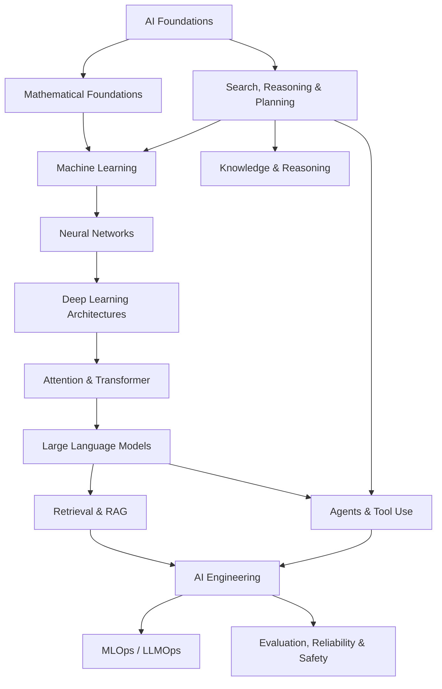

# Artificial Intelligence Knowledge Library

> **Artificial Intelligence (AI / Trí tuệ nhân tạo / 인공지능)** không chỉ là ChatGPT, Large Language Model hay Machine Learning. Đây là lĩnh vực nghiên cứu cách xây dựng những hệ thống có thể **biểu diễn thông tin, suy luận, học từ dữ liệu, dự đoán, lập kế hoạch, ra quyết định và hành động** trong một môi trường để đạt mục tiêu.

Library này được tổ chức theo **conceptual dependency** thay vì Beginner → Intermediate → Advanced. Mỗi chapter cố gắng trả lời một câu hỏi nền tảng, giải thích từ bản chất, sau đó kết nối sang Mathematics, Computer Science, Software Engineering và các hệ thống AI hiện đại.

## Cách đọc library

Không cần học mọi folder theo thứ tự tuyệt đối. Tuy nhiên, một số dependency là thật: muốn hiểu vì sao Transformer hoạt động thì cần hiểu vector, matrix, probability, optimization và neural network; muốn hiểu RAG đúng bản chất thì cần hiểu information retrieval, embedding và language model; muốn hiểu Agent thì cần nối classical agent, planning, state, tool use và feedback loop.

Reading path trung tâm:



## Mental model xuyên suốt

```text
Environment / Problem
        ↓
Observation / Data
        ↓
Representation
        ↓
Model / Knowledge
        ↓
Inference / Learning / Search
        ↓
Decision / Prediction
        ↓
Action / Output
        ↓
Feedback
```

Không phải system nào cũng có đủ mọi bước. Một classifier có thể chỉ nhận input và trả prediction. Một reinforcement-learning agent có feedback trực tiếp từ environment. Một LLM application có thể thêm retrieval, tools, memory và orchestration. Mental model này giúp nối các nhánh AI thành một knowledge graph thay vì collection buzzwords.

## Structure

```text
02_artificial_intelligence/
├── README.md
├── 00_foundations/
│   ├── 00_what_is_artificial_intelligence.md
│   ├── 01_history_and_ai_paradigms.md
│   ├── 02_intelligence_agents_and_environments.md
│   ├── 03_problem_representation.md
│   ├── 04_ai_system_architecture.md
│   └── 05_ai_vs_ml_vs_dl_vs_generative_ai.md
├── 01_mathematical_foundations/
│   ├── README.md
│   ├── 00_mathematics_for_ai.md
│   ├── 01_linear_algebra_for_ai.md
│   ├── 02_probability_for_ai.md
│   ├── 03_statistics_for_ai.md
│   ├── 04_calculus_for_ai.md
│   ├── 05_information_theory.md
│   ├── 06_optimization.md
│   └── 07_numerical_computation.md
├── 02_search_reasoning_and_planning/
│   ├── README.md
│   ├── 00_state_space_and_search.md
│   ├── 01_uninformed_search.md
│   ├── 02_heuristic_search.md
│   ├── 03_adversarial_search_and_games.md
│   ├── 04_constraint_satisfaction.md
│   ├── 05_planning.md
│   └── 06_decision_making_under_uncertainty.md
├── 03_knowledge_and_reasoning/                # next
├── 04_machine_learning/                       # planned
├── 05_neural_networks/                        # planned
├── 06_deep_learning_architectures/            # planned
├── 07_natural_language_processing/            # planned
├── 08_large_language_models/                  # planned
├── 09_retrieval_and_rag/                      # planned
├── 10_agents_and_ai_systems/                  # planned
├── 11_reinforcement_learning/                 # planned
├── 12_computer_vision/                        # planned
├── 13_speech_audio_and_multimodal/            # planned
├── 14_data_for_ai/                            # planned
├── 15_ai_engineering/                         # planned
├── 16_mlops_and_llmops/                       # planned
├── 17_ai_compute_and_infrastructure/          # planned
├── 18_evaluation_reliability_interpretability/ # planned
├── 19_ai_safety_security_alignment/           # planned
├── 20_ethics_governance_and_society/          # planned
└── 90_connections/                            # planned
```

## Layer 00 — Foundations

Foundation layer xây mental model chung: AI là gì, lịch sử các paradigm, agent/environment, problem representation, AI system architecture và taxonomy AI ↔ ML ↔ DL ↔ Generative AI.

Bắt đầu: [What is Artificial Intelligence?](./00_foundations/00_what_is_artificial_intelligence.md).

## Layer 01 — Mathematical Foundations

Mathematical layer gồm Linear Algebra, Probability, Statistics, Calculus, Information Theory, Optimization và Numerical Computation. Nội dung nối trực tiếp tới embeddings, attention, cross-entropy, backpropagation, AdamW, LoRA, mixed precision và quantization.

Bắt đầu: [Mathematical Foundations](./01_mathematical_foundations/README.md).

## Layer 02 — Search, Reasoning and Planning Foundations

Layer này đi từ state-space search tới BFS/DFS/UCS, A*, adversarial game search, CSP/SAT, formal planning và decision making under uncertainty với MDP/POMDP/bandits.

Điểm quan trọng là các concepts này sẽ được reuse trong modern Agents và Reinforcement Learning thay vì coi classical AI là lịch sử đã bị thay thế.

Bắt đầu: [Search, Reasoning and Planning](./02_search_reasoning_and_planning/README.md).

## Những câu hỏi cốt lõi library sẽ trả lời

AI không nên được học như một collection framework. Library tập trung vào những câu hỏi bền vững hơn: problem được biểu diễn thành state, vector hay probability distribution như thế nào; search space nổ theo combinatorics ra sao; learning có thể generalize từ finite data vì sao; loss/gradient mang ý nghĩa gì; attention giải quyết limitation nào; LLM lưu pattern gì trong parameters; retrieval bổ sung external information ra sao; agent khác workflow ở đâu; và vì sao production AI là bài toán software + data + model + infrastructure.

## Terminology convention

Khi thuật ngữ quan trọng xuất hiện lần đầu, chapter ưu tiên giữ **English term**, giải thích bằng tiếng Việt và thêm **한국어 용어** nếu hữu ích trong môi trường học tập/công việc tại Hàn Quốc, ví dụ `inference (추론 / suy luận)`, `training (학습 / huấn luyện)`, `heuristic (휴리스틱)`, `loss function (손실 함수)`, `embedding (임베딩)`.

## Nguyên tắc triển khai

Không tạo hàng loạt file placeholder chỉ để đủ taxonomy. Một folder chỉ được coi là bắt đầu khi có chapter đọc độc lập được. Mỗi chapter phải đi từ problem/phenomenon tới mechanism, assumptions, limitations, examples và connections.

Connections như `attention ↔ linear algebra`, `cross-entropy ↔ information theory`, `agent ↔ planning/MDP`, `RAG ↔ information retrieval`, `LLMOps ↔ distributed systems` được giải thích tại nơi chúng thật sự cần thiết.

## Trạng thái hiện tại

Đã hoàn thiện foundation layer, mathematical foundations và search/reasoning/planning foundations. Dependency tiếp theo là **Knowledge Representation & Reasoning**, sau đó mới mở rộng Machine Learning để nối symbolic/probabilistic AI với learning-based AI.